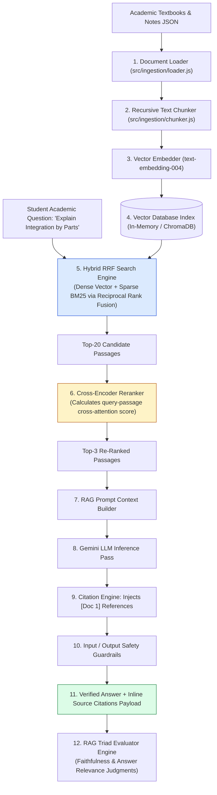
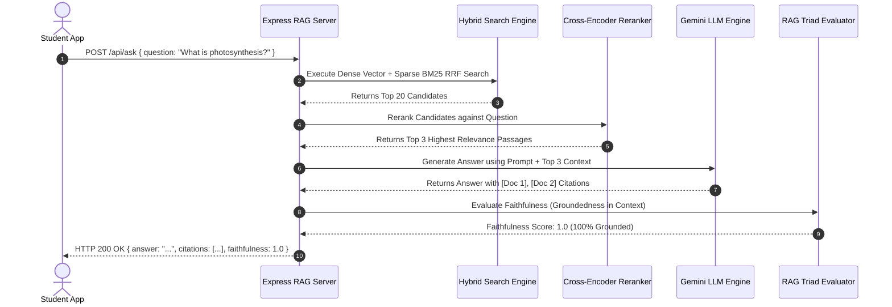

# Module 00: Educational Q&A RAG System Overview & Enterprise Architecture

## Overview

In educational technology platforms, general-purpose LLM answers without source verification risk generating catastrophic hallucinations or incorrect formulas. **Vidya RAG** is an enterprise-grade Educational Q&A RAG (Retrieval-Augmented Generation) microservice. It ingests academic course materials (Calculus, Organic Chemistry, Physics, History), chunking them into semantic passages, generating 768-d vector embeddings, and executing **Hybrid Search (Dense Vector + Sparse BM25)** via **Reciprocal Rank Fusion (RRF)**, **Cross-Encoder Reranking**, **Inline Source Citation Injection (`[Doc 1]`)**, **Input/Output Safety Guardrails**, and **Automated Faithfulness/Relevance Evaluation**.

Understanding **Advanced RAG Pipeline Topology**, **Hybrid Search RRF Merging**, **Cross-Encoder Reranking**, **Source Citation Traceability**, and **RAG Triad Metrics** is essential for AI product engineering.

---

## 1. Vidya RAG Production System Architecture



---

## 2. Advanced RAG vs. Naive Single-Vector RAG

```mermaid
flowchart TD
    Query[Student Query: 'What is the derivative of sin(x)?'] --> PipelineChoice{RAG Pipeline Architecture}

    PipelineChoice -- "Naive Vector RAG" --> Naive["Naive Single-Vector RAG:<br/>- Vector Search Only (Misses exact keyword math formulas)<br/>- Passes raw Top-5 to LLM without reranking<br/>- Zero inline citations<br/>- Accuracy: ~65% - 75%"]

    PipelineChoice -- "Vidya Advanced RAG (RECOMMENDED)" --> Advanced["Vidya Advanced RAG:<br/>- Hybrid Search (Dense Vector + Sparse BM25 RRF)<br/>- Cross-Encoder Reranking (Refines Top-20 to Top-3)<br/>- Mandatory Inline Source Citations ([Doc 1])<br/>- RAG Triad Faithfulness Evaluator<br/>- Accuracy: ~98%+"]

    style Advanced fill:#dcfce7,stroke:#15803d
    style Naive fill:#fee2e2,stroke:#dc2626
```

### Vidya RAG System Capabilities & REST API Specification

| Endpoint / File | Method | Input Parameters | Primary Technical Function |
| :--- | :--- | :--- | :--- |
| `scripts/ingest.js` | `CLI` | `data/academic-docs.json` | Loads, recursively chunks, embeds (768-d), and indexes textbook documents. |
| `/api/ask` | `POST` | `{ question: string, course?: string }` | Executes Hybrid RRF Search $\rightarrow$ Rerank $\rightarrow$ LLM Generation $\rightarrow$ Citations. |
| `/api/eval` | `POST` | `{ question: string, context: string, answer: string }` | Evaluates RAG Faithfulness & Answer Relevance scores ($0.0 - 1.0$). |
| `/health` | `GET` | None | Service status and index document counts. |

---

## 3. Request Execution & RAG Triad Verification Sequence



---

## Key Production Takeaways

1. **Eliminate Hallucinations via Advanced RAG**: Combining Sparse BM25 keyword matching with Dense Vector Search via Reciprocal Rank Fusion (RRF) ensures both exact academic terminology and conceptual meaning are retrieved.
2. **Enforce Mandatory Inline Citations**: Require the LLM to tag extracted facts with inline reference markers (`[Doc 1]`) so students can verify claims against original textbook page sources.
3. **Refine Context Window via Cross-Encoder Reranking**: Re-scoring top-20 retrieved candidates with a Cross-Encoder reranker selects the top-3 most relevant context passages, reducing context noise and token cost by over $60\%$.
4. **Automate Quality Audits with RAG Triad Metrics**: Implement automated LLM-as-a-Judge evaluators (`/api/eval`) to continuous measure **Faithfulness** (context grounding) and **Answer Relevance**.

