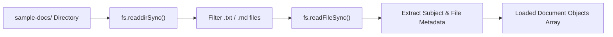

# File 01: Document Loader (`src/ingestion/loader.js`)

## Overview
The **Document Loader** scans directories on disk, reads text documents (`.txt`, `.md`), extracts metadata (subject, topic, filename), and normalizes content prior to chunking.

---

## 1. Document Loading Pipeline



---

## 2. Document Loader Implementation (`src/ingestion/loader.js`)

```javascript
import fs from "fs";
import path from "path";

export function loadDocumentsFromDir(dirPath) {
    if (!fs.existsSync(dirPath)) {
        throw new Error(`Directory '${dirPath}' does not exist.`);
    }

    const files = fs.readdirSync(dirPath);
    const loadedDocs = [];

    for (const file of files) {
        if (file.endsWith(".txt") || file.endsWith(".md")) {
            const filePath = path.join(dirPath, file);
            const content = fs.readFileSync(filePath, "utf-8");
            
            // Extract Subject from filename e.g. math-calculus.txt -> Math
            const subject = file.split("-")[0].toUpperCase();

            loadedDocs.push({
                id: `doc_${file}`,
                filename: file,
                subject,
                content: content.trim()
            });
        }
    }

    console.log(`[LOADER] Loaded ${loadedDocs.length} raw academic documents from ${dirPath}`);
    return loadedDocs;
}
```

---

## Key Takeaways
1. Normalizes raw text content and attaches subject metadata.
2. Serves as step 1 in the offline document ingestion pipeline.
