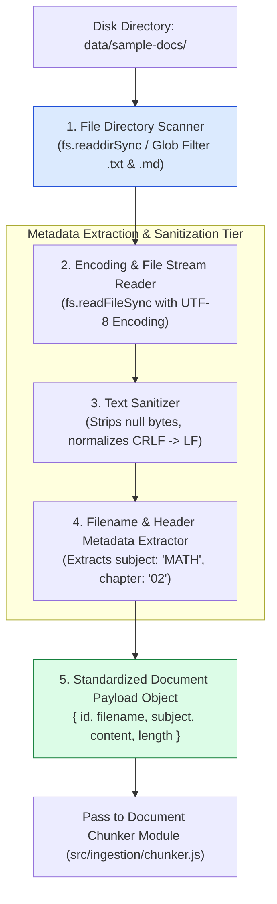
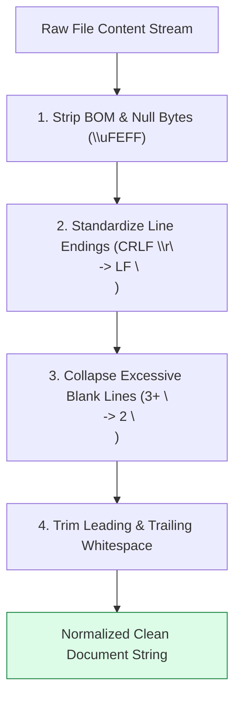
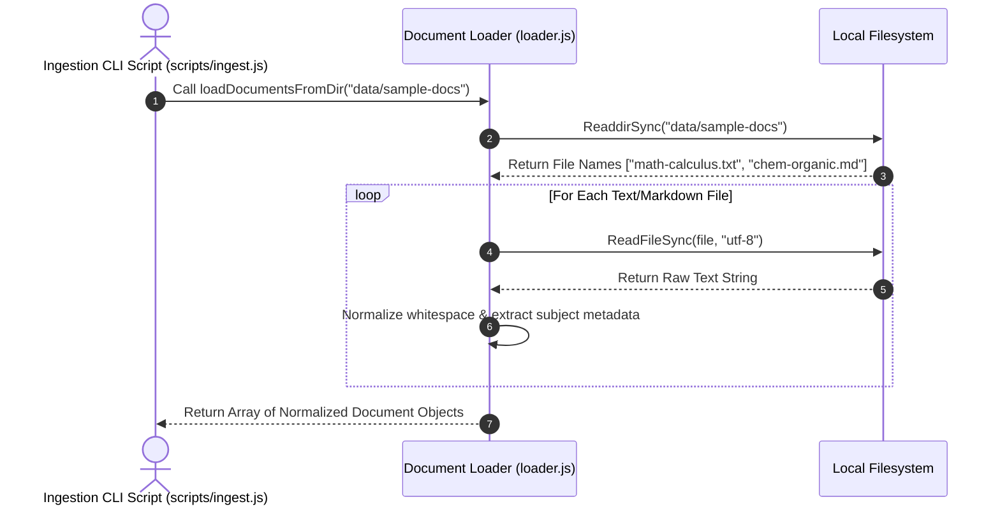

# Module 01: Document Loader & Metadata Extraction Pipeline (`src/ingestion/loader.js`)

## Overview

The first step in any RAG ingestion architecture is extracting raw text files from storage repositories and annotating them with structured metadata tags (such as `subject`, `topic`, `sourceFilename`, `author`, and `chapter`). The **Document Loader** scans local document directories, reads `.txt` and `.md` textbook files, normalizes whitespace and encoding, extracts metadata headers, and outputs standardized document objects ready for semantic chunking.

Understanding **File Directory Scanning**, **Metadata Extraction Schemas**, **Text Character Normalization**, and **Ingestion Error Handling** is essential for document pipelines.

---

## 1. Document Loading & Metadata Ingestion Topology



---

## 2. Text Normalization Pipeline



### Document Metadata Schema Specification

| Metadata Property | Data Type | Sample Value | Extraction Method | Operational Purpose |
| :--- | :--- | :--- | :--- | :--- |
| **`id`** | `String` | `"doc_calculus-ch1.txt"` | Deterministic hash/filename | Unique primary key for vector store referencing. |
| **`filename`** | `String` | `"math-calculus-ch1.txt"` | `path.basename(filePath)` | Source file name for UI display. |
| **`subject`** | `String` | `"MATH"` | Prefix parsing (`math-*`) | Pre-filtering queries by academic subject. |
| **`content`** | `String` | `"Integration by parts..."` | UTF-8 file read | Raw normalized textbook body text. |
| **`fileSizeBytes`** | `Number` | `14250` | `fs.statSync(filePath).size` | Ingestion telemetry tracking. |

---

## 3. Asynchronous Multi-File Loading Sequence



---

## 4. Code Walkthrough (`src/ingestion/loader.js`)

```javascript
import fs from "fs";
import path from "path";

/**
 * Normalizes raw text content by standardizing line breaks and collapsing whitespace
 */
function normalizeTextContent(rawText) {
  if (!rawText) return "";
  return rawText
    .replace(/\r\n/g, "\n") // Standardize Windows CRLF to Linux LF
    .replace(/\uFEFF/g, "")  // Strip UTF-8 Byte Order Mark (BOM)
    .replace(/\n{3,}/g, "\n\n") // Collapse excessive blank lines
    .trim();
}

/**
 * Loads and normalizes all text and markdown documents from target directory
 * @param {string} dirPath - Directory path containing document files
 * @returns {Array<Object>} Array of standardized document objects
 */
export function loadDocumentsFromDir(dirPath) {
  const absolutePath = path.resolve(dirPath);

  if (!fs.existsSync(absolutePath)) {
    throw new Error(`[LOADER ERROR] Document directory '${absolutePath}' does not exist.`);
  }

  const files = fs.readdirSync(absolutePath);
  const loadedDocs = [];

  console.log(`⚡ [DOCUMENT LOADER] Scanning directory: ${absolutePath}`);

  for (const file of files) {
    const ext = path.extname(file).toLowerCase();
    if (ext === ".txt" || ext === ".md") {
      const filePath = path.join(absolutePath, file);
      const stats = fs.statSync(filePath);
      const rawContent = fs.readFileSync(filePath, "utf-8");
      const normalizedContent = normalizeTextContent(rawContent);

      // Extract subject category from filename convention: e.g. "math-calculus.txt" -> "MATH"
      const parts = file.split("-");
      const subject = parts.length > 1 ? parts[0].toUpperCase() : "GENERAL";

      loadedDocs.push({
        id: `doc_${file}`,
        filename: file,
        filePath: absolutePath,
        subject,
        fileSizeBytes: stats.size,
        content: normalizedContent,
        characterCount: normalizedContent.length,
        loadedAt: new Date().toISOString()
      });
    }
  }

  console.log(`✅ [DOCUMENT LOADER] Successfully loaded & normalized ${loadedDocs.length} documents.`);
  return loadedDocs;
}

// Execution Verification Example
try {
  const sampleDocs = loadDocumentsFromDir("./data/sample-docs");
  console.log("Sample Document Object:\n", sampleDocs[0]);
} catch (err) {
  console.log("Loader helper initialized (Directory check pending run).");
}
```

---

## Key Production Takeaways

1. **Standardize Line Breaks Upon Ingestion**: Always convert Windows `CRLF` (`\r\n`) to Unix `LF` (`\n`) during document loading to ensure character offsets remain accurate across operating systems.
2. **Attach Rich Structured Metadata**: Attach `subject`, `filename`, and `fileSizeBytes` metadata to document objects during loading to enable pre-filtering during RAG retrieval.
3. **Strip Byte Order Marks (BOM)**: Remove hidden UTF-8 BOM characters (`\uFEFF`) to prevent vector embedding models from generating noisy representations for leading characters.
4. **Validate File Directory Existence**: Fail fast with clear error messages if target document ingestion paths do not exist.

