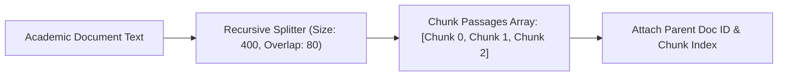

# File 02: Academic Document Chunker (`src/ingestion/chunker.js`)

## Overview
The **Academic Document Chunker** splits long academic documents into smaller passages using **Recursive Character Splitting** with configurable character size limits and sliding overlap windows.

---

## 1. Document Chunking Mechanism



---

## 2. Document Chunker Implementation (`src/ingestion/chunker.js`)

```javascript
export function chunkDocument(doc, chunkSize = 400, overlap = 80) {
    const text = doc.content;
    const chunks = [];
    const separators = ["\n\n", "\n", ". ", " "];

    let start = 0;
    let chunkIndex = 0;

    while (start < text.length) {
        let end = Math.min(start + chunkSize, text.length);

        if (end < text.length) {
            for (const sep of separators) {
                const sepIdx = text.lastIndexOf(sep, end);
                if (sepIdx > start) {
                    end = sepIdx + sep.length;
                    break;
                }
            }
        }

        const chunkText = text.substring(start, end).trim();
        if (chunkText) {
            chunks.push({
                chunkId: `${doc.id}_chunk_${chunkIndex}`,
                docId: doc.id,
                filename: doc.filename,
                subject: doc.subject,
                chunkIndex,
                text: chunkText
            });
            chunkIndex++;
        }

        start = end - overlap;
        if (start >= text.length || end === text.length) break;
    }

    return chunks;
}

export function chunkAllDocuments(docs, chunkSize = 400, overlap = 80) {
    let allChunks = [];
    for (const doc of docs) {
        const chunks = chunkDocument(doc, chunkSize, overlap);
        allChunks = allChunks.concat(chunks);
    }
    console.log(`[CHUNKER] Generated ${allChunks.length} total chunks from ${docs.length} documents.`);
    return allChunks;
}
```

---

## Key Takeaways
1. Preserves natural sentence and paragraph boundaries across academic textbooks.
2. Attaches **`docId`**, **`filename`**, and **`chunkIndex`** metadata for citation tracking.
