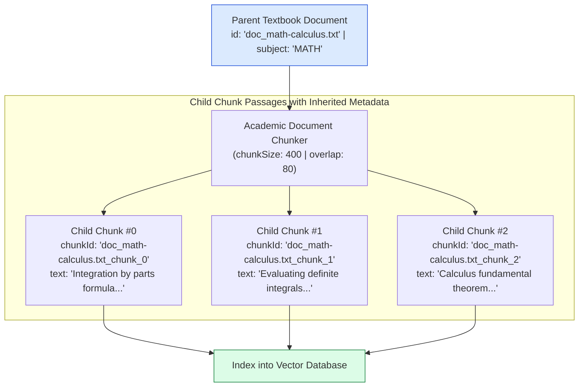
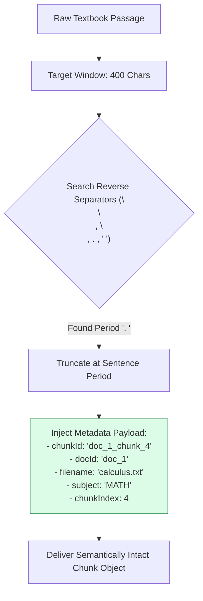
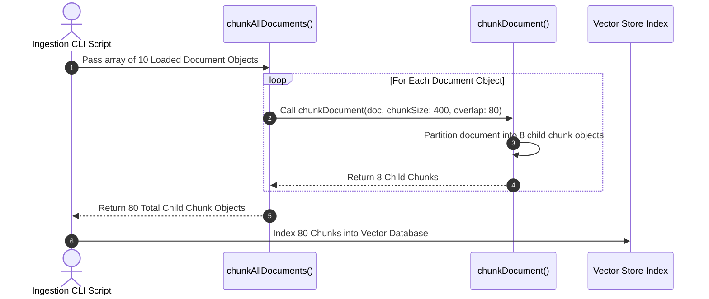

# Module 02: Academic Document Chunker & Metadata Propagation (`src/ingestion/chunker.js`)

## Overview

Textbook documents often contain dense mathematical formulas, definitions, and multi-paragraph theorems. Passing entire 50-page textbook files directly into RAG models dilutes search precision and exceeds context windows. The **Academic Document Chunker** partitions raw textbook documents into optimal semantic passage blocks (400 characters, 80 overlap) while inheriting parent metadata (`docId`, `filename`, `subject`, `chapter`) to ensure every extracted chunk is traceable back to its source origin.

Understanding **Linguistic Boundary Splitting**, **Parent-Child Chunk Relational Models**, **Metadata Propagation**, and **Batch Ingestion Splitting** is essential for educational RAG.

---

## 1. Parent Document to Child Chunk Hierarchy Topology



---

## 2. Sliding Overlap Preservation & Citation Metadata



### Academic Chunk Metadata Propagation Schema

| Property Name | Data Type | Sample Value | Inherited / Generated | Purpose in RAG Pipeline |
| :--- | :--- | :--- | :--- | :--- |
| **`chunkId`** | `String` | `"doc_calculus.txt_chunk_3"` | Generated | Primary vector ID in vector store index. |
| **`docId`** | `String` | `"doc_calculus.txt"` | Inherited | Groups child chunks back to parent textbook file. |
| **`filename`** | `String` | `"math-calculus-ch1.txt"` | Inherited | Displayed in student UI citation popups. |
| **`subject`** | `String` | `"MATH"` | Inherited | Fast metadata pre-filtering during search. |
| **`chunkIndex`** | `Number` | `3` | Generated | Enables sequential window fetching (chunks 2, 3, 4). |

---

## 3. Batch Multi-Document Processing Pipeline



---

## 4. Code Walkthrough (`src/ingestion/chunker.js`)

```javascript
/**
 * Partition a single loaded document object into child chunk objects with inherited metadata
 * @param {Object} doc - Document object from Document Loader
 * @param {number} chunkSize - Target max characters per chunk (default: 400)
 * @param {number} overlap - Overlap character buffer size (default: 80)
 * @returns {Array<Object>} Array of child chunk objects
 */
export function chunkDocument(doc, chunkSize = 400, overlap = 80) {
  if (!doc || !doc.content) return [];

  const text = doc.content;
  const chunks = [];
  const separators = ["\n\n", "\n", ". ", " "];

  let start = 0;
  let chunkIndex = 0;

  while (start < text.length) {
    let end = Math.min(start + chunkSize, text.length);

    // Truncate at highest priority separator before reaching window boundary
    if (end < text.length) {
      for (const sep of separators) {
        const sepIdx = text.lastIndexOf(sep, end);
        if (sepIdx > start) {
          end = sepIdx + sep.length;
          break;
        }
      }
    }

    const chunkText = text.substring(start, end).trim();

    if (chunkText) {
      chunks.push({
        chunkId: `${doc.id}_chunk_${chunkIndex}`,
        docId: doc.id,
        filename: doc.filename,
        subject: doc.subject,
        chunkIndex,
        startChar: start,
        endChar: end,
        text: chunkText,
        characterCount: chunkText.length
      });
      chunkIndex++;
    }

    start = end - overlap;
    if (start >= text.length || end === text.length) break;
  }

  return chunks;
}

/**
 * Batch processes an array of loaded document objects into child chunks
 */
export function chunkAllDocuments(docs, chunkSize = 400, overlap = 80) {
  let allChunks = [];
  console.log(`⚡ [CHUNKER] Batch partitioning ${docs.length} document files...`);

  for (const doc of docs) {
    const chunks = chunkDocument(doc, chunkSize, overlap);
    allChunks = allChunks.concat(chunks);
  }

  console.log(`✅ [CHUNKER] Generated ${allChunks.length} total child passages from ${docs.length} documents.`);
  return allChunks;
}

// Execution Verification Example
const mockDoc = {
  id: "doc_math-calculus.txt",
  filename: "math-calculus.txt",
  subject: "MATH",
  content: "Integration by parts is a technique for evaluating integrals of products. The formula is integral(u dv) = u v - integral(v du)."
};

const resultChunks = chunkDocument(mockDoc, 100, 20);
console.log("Generated Child Chunk Objects:\n", resultChunks);
```

---

## Key Production Takeaways

1. **Inherit Metadata on All Child Chunks**: Ensure child chunk objects inherit `docId`, `filename`, and `subject` from parent document objects during splitting so citation engines can trace sources.
2. **Optimal Chunk Sizes for Academic Text (400-600 Chars)**: Use a 400-600 character window for academic textbooks; smaller chunks miss mathematical proof steps, while larger chunks dilute vector similarity.
3. **Include `chunkIndex` for Neighbor Window Retrieval**: Track `chunkIndex` on every chunk object so RAG systems can fetch adjacent chunks (e.g. `chunkIndex - 1` and `chunkIndex + 1`) to provide expanded context.
4. **Use Reverse Separator Scans (`lastIndexOf`)**: Search backwards from window boundaries using `text.lastIndexOf(sep, end)` to split cleanly at periods without exceeding max character limits.


## Learn from the implementation

Use the matching source file as an executable example, not just something to copy. Before running it, state in your own words what data enters the module, what it returns, and which values it changes. Then trace one realistic request from the caller through each function.

Pay special attention to these questions:

- **Data flow:** Which object, array, string, or state value moves between functions? What shape must it have?
- **Control flow:** Which branch, loop, early return, or retry changes the outcome? What condition selects it?
- **Async boundaries:** Where does the code wait for an LLM, database, network, file system, or tool? What should happen if that operation rejects or returns no result?
- **Side effects:** Which lines log information, make an external request, store data, or mutate in-memory state? Keep those distinct from pure calculations.
- **Production limits:** Which assumptions are only safe for a tutorial—for example, in-memory storage, fixed thresholds, approximate token counts, mock data, or a hard-coded batch size?

A useful practice is to change one input at a time and predict the result before executing it. If you can explain why the output changed, when the module should be used, and one way it could fail, you understand the concept rather than only the syntax.
