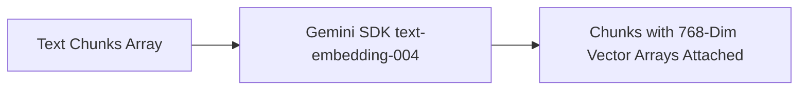

# File 03: Document Embedder (`src/ingestion/embedder.js`)

## Overview
The **Document Embedder** calls the Google Gemini SDK (`text-embedding-004`) to generate 768-dimensional float embeddings for academic passage chunks.

---

## 1. Batch Vector Embedder Pipeline



---

## 2. Document Embedder Implementation (`src/ingestion/embedder.js`)

```javascript
import { GoogleGenerativeAI } from "@google/generative-ai";

const apiKey = process.env.GEMINI_API_KEY;
const genAI = apiKey ? new GoogleGenerativeAI(apiKey) : null;

export async function generateEmbedding(text) {
    if (!genAI) {
        return generateMockVector(text);
    }
    const model = genAI.getGenerativeModel({ model: "text-embedding-004" });
    const result = await model.embedContent(text);
    return result.embedding.values;
}

export async function embedChunksBatch(chunks) {
    console.log(`[EMBEDDER] Generating embeddings for ${chunks.length} chunks...`);
    const embeddedChunks = [];

    for (const chunk of chunks) {
        const vector = await generateEmbedding(chunk.text);
        embeddedChunks.push({
            ...chunk,
            vector
        });
    }

    return embeddedChunks;
}

function generateMockVector(text) {
    const vec = new Array(768).fill(0);
    for (let i = 0; i < text.length; i++) {
        vec[i % 768] += (text.charCodeAt(i) / 255) * 0.1;
    }
    const norm = Math.sqrt(vec.reduce((s, v) => s + v * v, 0)) || 1;
    return vec.map(v => v / norm);
}
```

---

## Key Takeaways
1. Attaches 768-dimensional float arrays to chunk objects.
2. Supports graceful offline deterministic vector fallback for local testing.
