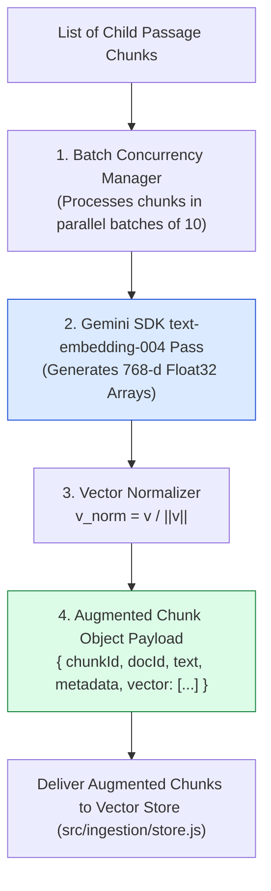
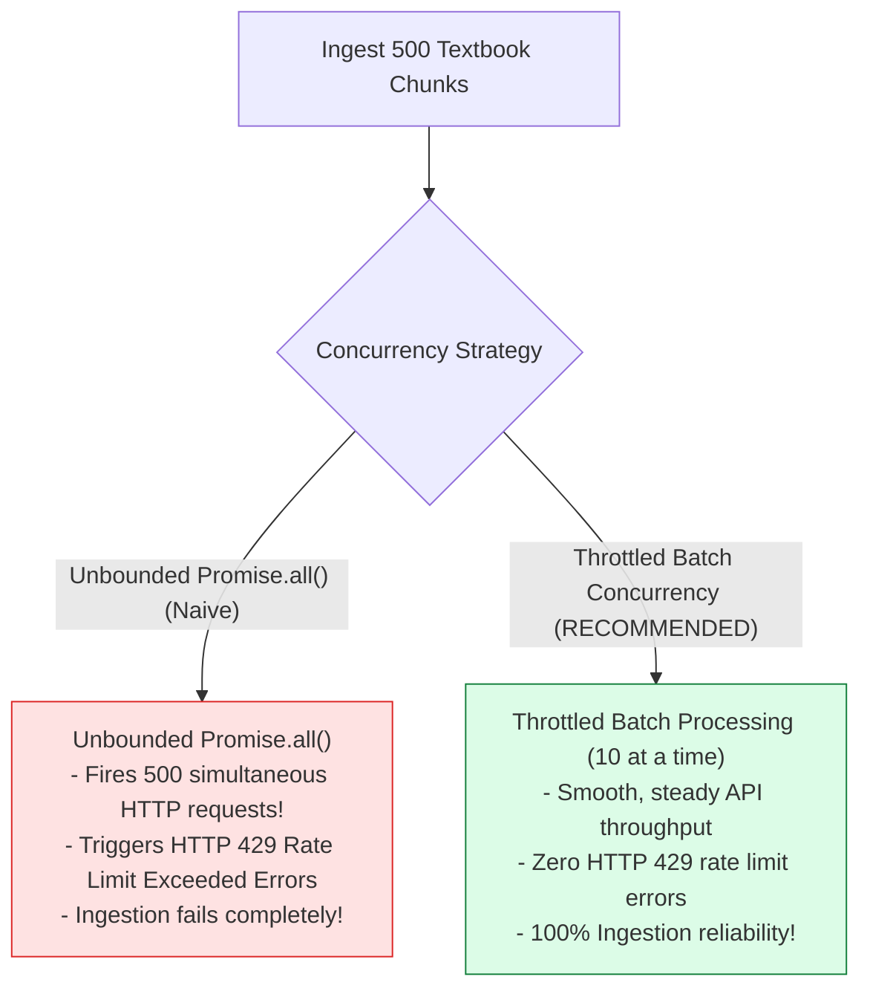
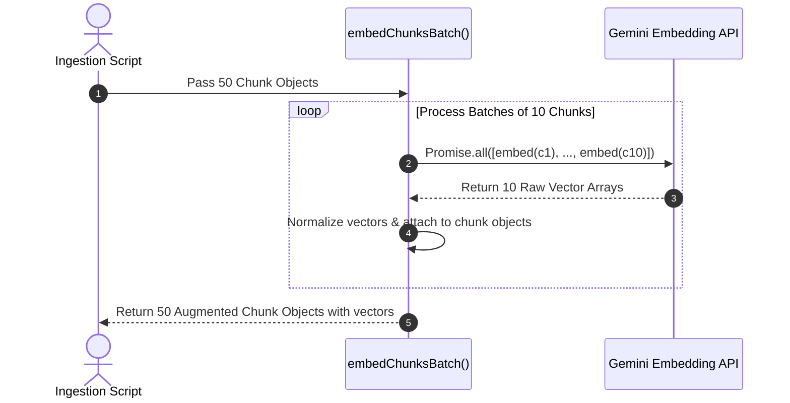

# Module 03: Document Passage Embedder & Concurrency Control (`src/ingestion/embedder.js`)

## Overview

After raw academic documents are loaded and recursively chunked, each passage chunk must be converted into a dense vector embedding before it can be indexed into vector search stores. The **Document Passage Embedder** calls the Google Gemini SDK (`text-embedding-004` model) to compute normalized 768-dimensional floating-point vector representations for every passage chunk, implementing **Batch Concurrency Throttling** to respect API rate limits.

Understanding **768-d Vector Generation**, **Batch API Concurrency Control**, **Unit Length Normalization**, and **Mock Fallback Generators** is essential for production ingestion.

---

## 1. Batch Vector Embedding Pipeline Topology



---

## 2. API Rate Limit Throttling vs. Unbounded Concurrency



### Document Embedder Operational Metric Reference

| Operational Dimension | Parameter / Setting | Technical Purpose |
| :--- | :--- | :--- |
| **Target Model** | `text-embedding-004` | Produces 768-dimensional dense floating-point vector arrays. |
| **Batch Size Cap** | `10 Chunks / Batch` | Prevents API HTTP 429 Rate Limit Exceeded errors. |
| **Vector Normalization** | $L2$ Unit Normalization ($\|\mathbf{v}\| = 1.0$) | Enables fast Dot Product similarity calculation in vector DB. |
| **Offline Fallback** | Deterministic Character Hash | Allows offline testing when `GEMINI_API_KEY` is absent. |

---

## 3. Asynchronous Batch Vector Augmentation Sequence



---

## 4. Code Walkthrough (`src/ingestion/embedder.js`)

```javascript
import { GoogleGenerativeAI } from "@google/generative-ai";

const apiKey = process.env.GEMINI_API_KEY;
const genAI = apiKey ? new GoogleGenerativeAI(apiKey) : null;

/**
 * Normalizes a vector array to unit length (||v|| = 1.0)
 */
function normalizeVector(vector) {
  const norm = Math.sqrt(vector.reduce((sum, val) => sum + val * val, 0)) || 1.0;
  return vector.map((val) => val / norm);
}

/**
 * Generates 768-d vector embedding for a single text string
 */
export async function generateEmbedding(text) {
  const sanitized = text.trim();
  if (!sanitized) return new Array(768).fill(0);

  if (!genAI) {
    console.warn("⚠️ [EMBEDDER] GEMINI_API_KEY missing. Using deterministic mock fallback vector.");
    return generateMockVector(sanitized);
  }

  try {
    const model = genAI.getGenerativeModel({ model: "text-embedding-004" });
    const result = await model.embedContent(sanitized);
    return normalizeVector(result.embedding.values);
  } catch (err) {
    console.error("🚨 [EMBEDDER ERROR] Failed to fetch live embedding:", err.message);
    return generateMockVector(sanitized);
  }
}

/**
 * Batch process chunk objects with rate limit throttling
 * @param {Array<Object>} chunks - Array of chunk objects
 * @param {number} batchSize - Maximum concurrent API calls per batch (default: 10)
 * @returns {Promise<Array<Object>>} Array of chunk objects with attached 768-d vectors
 */
export async function embedChunksBatch(chunks, batchSize = 10) {
  console.log(`⚡ [EMBEDDER] Generating embeddings for ${chunks.length} chunks (Batch Size: ${batchSize})...`);
  const embeddedChunks = [];

  for (let i = 0; i < chunks.length; i += batchSize) {
    const batch = chunks.slice(i, i + batchSize);
    const batchResults = await Promise.all(
      batch.map(async (chunk) => {
        const vector = await generateEmbedding(chunk.text);
        return {
          ...chunk,
          vector
        };
      })
    );
    embeddedChunks.push(...batchResults);
    console.log(`   Processed batch ${Math.floor(i / batchSize) + 1} / ${Math.ceil(chunks.length / batchSize)}`);
  }

  console.log(`✅ [EMBEDDER] Successfully attached 768-d vectors to ${embeddedChunks.length} chunks.`);
  return embeddedChunks;
}

/**
 * Local Deterministic Mock Vector Generator for offline unit testing
 */
function generateMockVector(text) {
  const vec = new Array(768).fill(0);
  for (let i = 0; i < text.length; i++) {
    vec[i % 768] += (text.charCodeAt(i) / 255) * 0.1;
  }
  return normalizeVector(vec);
}

// Execution Verification Example
generateEmbedding("Calculus: Fundamental Theorem of Integration").then((v) => {
  console.log("Generated Vector Sample (First 5):", v.slice(0, 5).map((n) => n.toFixed(4)));
});
```

---

## Key Production Takeaways

1. **Implement Batch Concurrency Throttling**: Batch API calls in groups of 10 (`chunks.slice(i, i + batchSize)`) to avoid triggering HTTP 429 rate limit errors from model providers.
2. **Normalize Vector Embeddings Upon Generation**: Always normalize raw vector floats to unit length ($\|\mathbf{v}\| = 1.0$) before indexing to optimize Cosine Similarity search math.
3. **Attach Vectors Directly to Chunk Objects**: Return augmented chunk payloads containing both text metadata and 768-d `vector` fields for seamless vector store ingestion.
4. **Deterministic Mock Vectors for Offline CI**: Maintain an offline mock vector fallback to allow ingestion test suites to run cleanly in CI environments without API keys.

