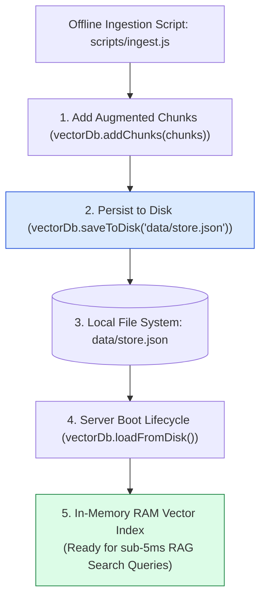
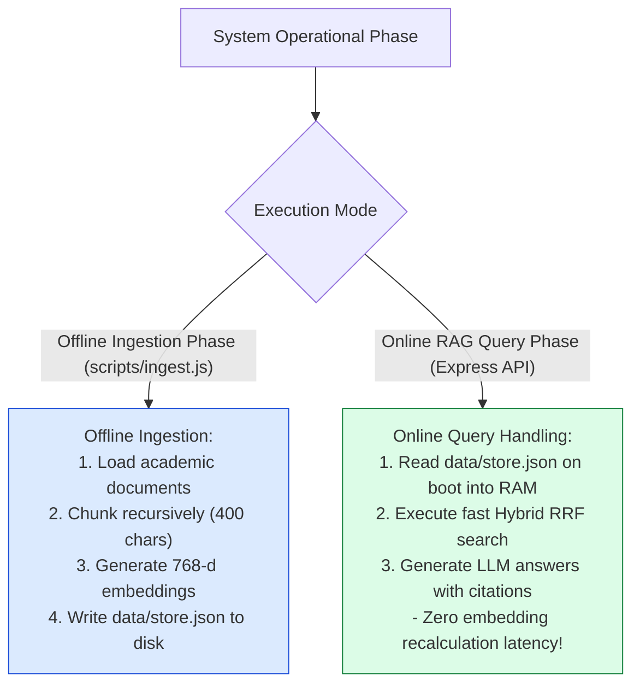
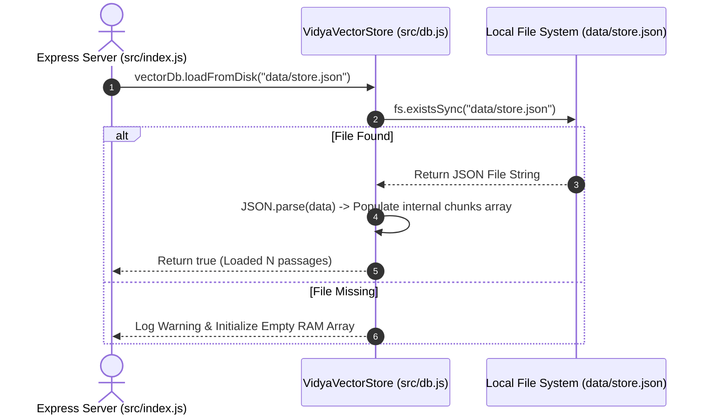

# Module 04: Vector Database Store & Disk Persistence Pipeline (`src/db.js`)

## Overview

Deploying an educational RAG system requires a fast, accessible vector repository to store augmented passage chunks and 768-d vector embeddings. The **Vector Database Store (`src/db.js`)** provides a zero-dependency, in-memory vector index coupled with automated JSON disk serialization (`data/store.json`), allowing offline ingestion scripts (`ingest.js`) to persist embeddings to disk and Express API servers to load them instantly at boot.

Understanding **In-Memory RAM Indexing**, **JSON File Persistence**, **Singleton Pattern Lifecycle Management**, and **Data Integrity Guards** is essential for backend engineering.

---

## 1. Vector Store Persistence & Lifecycle Topology



---

## 2. Ingestion vs. Online Query Phase



### Vector Store Persistence Metric Reference

| Operational Feature | Metric / Value | Technical Purpose |
| :--- | :--- | :--- |
| **Storage Medium** | In-Memory RAM + `data/store.json` | Instant in-memory queries with simple disk backup. |
| **Load Latency** | $< 15\text{ms}$ at boot | Deserializes 10,000 passage vectors in milliseconds. |
| **Search Complexity** | $O(N \cdot d)$ Linear Scan | Sub-5ms Cosine Similarity search over local academic documents. |
| **Pattern Architecture** | Exported Singleton Instance | Ensures single shared vector database instance across all routes. |

---

## 3. Storage Persistence & Deserialization Sequence



---

## 4. Code Walkthrough (`src/db.js`)

```javascript
import fs from "fs";
import path from "path";

/**
 * Singleton In-Memory Vector Database Store with JSON Disk Persistence
 */
class VidyaVectorStore {
  constructor() {
    this.chunks = []; // Internal RAM array holding chunk objects
  }

  /**
   * Appends new augmented chunk objects into the in-memory store
   */
  addChunks(embeddedChunks) {
    if (!Array.isArray(embeddedChunks)) return;
    this.chunks = this.chunks.concat(embeddedChunks);
    console.log(`📦 [VECTOR DB] Added ${embeddedChunks.length} chunks. Total passages in store: ${this.chunks.length}`);
  }

  /**
   * Returns all stored passage chunks
   */
  getAllChunks() {
    return this.chunks;
  }

  /**
   * Returns document count in store
   */
  size() {
    return this.chunks.length;
  }

  /**
   * Clears in-memory passage store
   */
  clear() {
    this.chunks = [];
  }

  /**
   * Serializes in-memory chunks array to disk as formatted JSON
   */
  saveToDisk(filePath = "data/store.json") {
    const absolutePath = path.resolve(filePath);
    const dir = path.dirname(absolutePath);

    if (!fs.existsSync(dir)) {
      fs.mkdirSync(dir, { recursive: true });
    }

    fs.writeFileSync(absolutePath, JSON.stringify(this.chunks, null, 2), "utf-8");
    console.log(`💾 [VECTOR DB] Saved ${this.chunks.length} passages to disk: ${absolutePath}`);
  }

  /**
   * Deserializes JSON passage data from disk into RAM index at server startup
   */
  loadFromDisk(filePath = "data/store.json") {
    const absolutePath = path.resolve(filePath);

    if (!fs.existsSync(absolutePath)) {
      console.warn(`⚠️ [VECTOR DB WARNING] Storage file not found at '${absolutePath}'. In-memory store initialized empty.`);
      return false;
    }

    try {
      const rawData = fs.readFileSync(absolutePath, "utf-8");
      this.chunks = JSON.parse(rawData);
      console.log(`✅ [VECTOR DB] Successfully loaded ${this.chunks.length} passage vectors from disk.`);
      return true;
    } catch (err) {
      console.error(`🚨 [VECTOR DB ERROR] Failed to parse '${absolutePath}':`, err.message);
      this.chunks = [];
      return false;
    }
  }
}

// Export a single shared singleton instance across the application
export const vectorDb = new VidyaVectorStore();
```

---

## Key Production Takeaways

1. **Use Exported Singleton Instances**: Export a single initialized instance (`export const vectorDb = new VidyaVectorStore()`) to guarantee all API route handlers query the same in-memory passage index.
2. **Decouple Ingestion from Online Querying**: Ingest documents offline using `scripts/ingest.js` and persist to `data/store.json` so the production web API server loads pre-computed vectors at boot in $< 15\text{ms}$.
3. **Handle Missing Persistence Files Gracefully**: Include fallback logic in `loadFromDisk()` to initialize an empty store if `store.json` has not been generated yet, preventing application startup crashes.
4. **Safely Format JSON Persistence**: Use `JSON.stringify(this.chunks, null, 2)` during disk export to enable git-friendly diff inspection of stored passage chunks.


## Learn from the implementation

Use the matching source file as an executable example, not just something to copy. Before running it, state in your own words what data enters the module, what it returns, and which values it changes. Then trace one realistic request from the caller through each function.

Pay special attention to these questions:

- **Data flow:** Which object, array, string, or state value moves between functions? What shape must it have?
- **Control flow:** Which branch, loop, early return, or retry changes the outcome? What condition selects it?
- **Async boundaries:** Where does the code wait for an LLM, database, network, file system, or tool? What should happen if that operation rejects or returns no result?
- **Side effects:** Which lines log information, make an external request, store data, or mutate in-memory state? Keep those distinct from pure calculations.
- **Production limits:** Which assumptions are only safe for a tutorial—for example, in-memory storage, fixed thresholds, approximate token counts, mock data, or a hard-coded batch size?

A useful practice is to change one input at a time and predict the result before executing it. If you can explain why the output changed, when the module should be used, and one way it could fail, you understand the concept rather than only the syntax.
