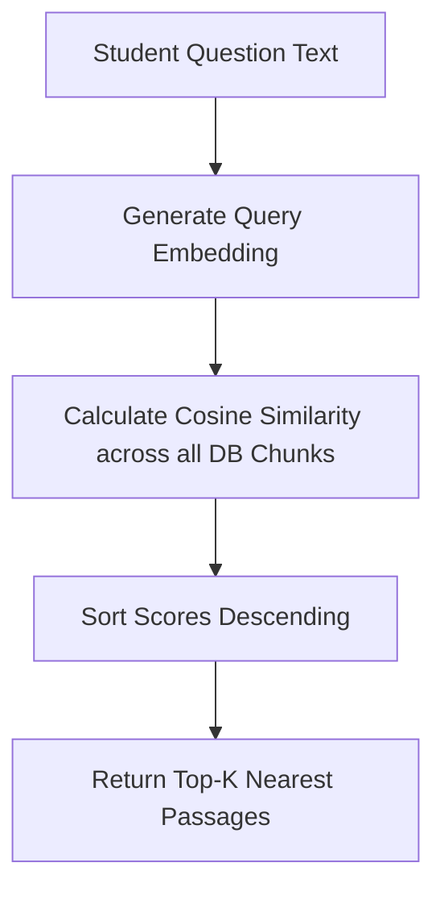

# File 05: Dense Vector K-NN Search (`src/retrieval/vector-search.js`)

## Overview
**Dense Vector K-NN Search** evaluates student question embeddings against stored academic passage vectors using Cosine Similarity ranking.

---

## 1. Dense Vector Search Pipeline



---

## 2. Vector Search Implementation (`src/retrieval/vector-search.js`)

```javascript
import { generateEmbedding } from "../ingestion/embedder.js";
import { vectorDb } from "../db.js";

function cosineSimilarity(vecA, vecB) {
    let dot = 0, normA = 0, normB = 0;
    for (let i = 0; i < vecA.length; i++) {
        dot += vecA[i] * vecB[i];
        normA += vecA[i] * vecA[i];
        normB += vecB[i] * vecB[i];
    }
    if (normA === 0 || normB === 0) return 0;
    return dot / (Math.sqrt(normA) * Math.sqrt(normB));
}

export async function searchDenseVector(queryText, topK = 10) {
    const queryVector = await generateEmbedding(queryText);
    const chunks = vectorDb.getAllChunks();

    const scored = chunks.map(chunk => ({
        ...chunk,
        score: cosineSimilarity(queryVector, chunk.vector)
    }));

    scored.sort((a, b) => b.score - a.score);
    return scored.slice(0, topK);
}
```

---

## Key Takeaways
1. Performs semantic concept matching ($O(N)$ Cosine Similarity).
2. Serves as one of the two inputs to the Hybrid Search RRF engine.
