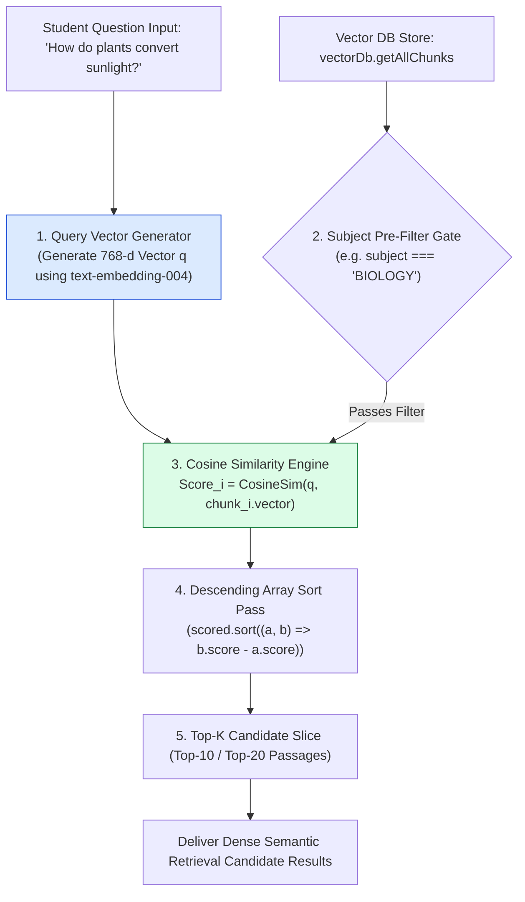
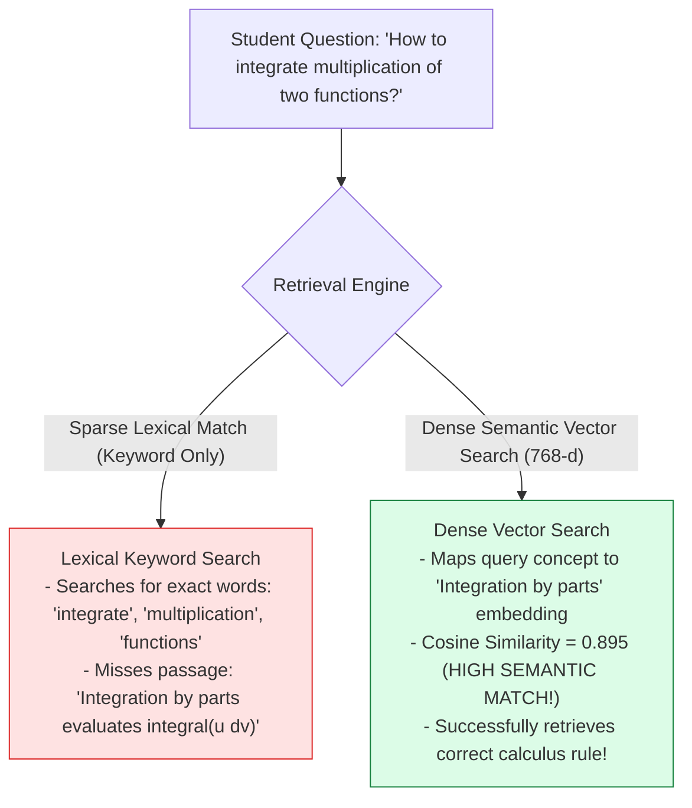
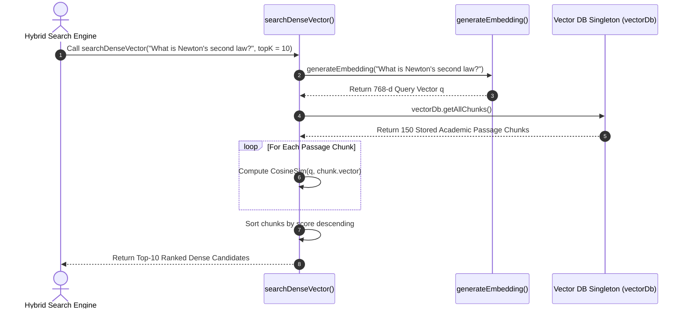

# Module 05: Dense Vector kNN Search & Semantic Query Vectorization (`src/retrieval/vector-search.js`)

## Overview

Keyword search engines often miss relevant textbook passages when a student asks a conceptual question using different vocabulary than the author (for example, asking *"How do plants turn sunlight into food?"* instead of searching for *"photosynthetic carbon fixation"*). **Dense Vector $k\text{NN}$ Search** converts student questions into **768-dimensional query vectors** and calculates exact Cosine Similarity scores against all stored academic passage vectors.

Understanding **Query Vectorization**, **Dense Embedding Space Retrieval**, **Subject Category Pre-Filtering**, and **Vector Scoring Tops** is essential for educational retrieval.

---

## 1. Dense Vector $k\text{NN}$ Search Pipeline Topology



---

## 2. Conceptual Vector Matching vs. Lexical Keyword Matching



### Dense Vector Retrieval Parameter Matrix

| Parameter Name | Target Setting | Operational Purpose |
| :--- | :--- | :--- |
| **`queryText`** | Raw Student Question String | Input academic question to embed. |
| **`topK`** | $10 - 20$ Candidates | Number of nearest dense vector matches passed downstream to Hybrid RRF. |
| **`subject`** | Optional Metadata Filter (`"MATH"`, `"CHEM"`) | Isolates retrieval search space to relevant academic discipline. |
| **`similarityMetric`** | Cosine Similarity ($\cos \theta$) | Directional orientation similarity in 768-d vector space. |

---

## 3. Asynchronous Vector Retrieval Sequence



---

## 4. Code Walkthrough (`src/retrieval/vector-search.js`)

```javascript
import { generateEmbedding } from "../ingestion/embedder.js";
import { vectorDb } from "../db.js";

/**
 * Calculates Cosine Similarity between two 768-dimensional vectors
 */
function cosineSimilarity(vecA, vecB) {
  if (!vecA || !vecB || vecA.length !== vecB.length) return 0.0;

  let dot = 0.0;
  let normA = 0.0;
  let normB = 0.0;

  for (let i = 0; i < vecA.length; i++) {
    const a = vecA[i];
    const b = vecB[i];
    dot += a * b;
    normA += a * a;
    normB += b * b;
  }

  if (normA === 0 || normB === 0) return 0.0;
  return dot / (Math.sqrt(normA) * Math.sqrt(normB));
}

/**
 * Performs Dense Vector kNN Search over stored academic passage vectors
 * @param {string} queryText - Student question string
 * @param {number} topK - Number of nearest matches to return (default: 10)
 * @param {string|null} subjectFilter - Optional subject metadata pre-filter
 * @returns {Promise<Array<Object>>} Ranked array of passage objects with Cosine Similarity scores
 */
export async function searchDenseVector(queryText, topK = 10, subjectFilter = null) {
  if (!queryText || typeof queryText !== "string") return [];

  console.log(`🔍 [DENSE VECTOR SEARCH] Generating query vector for: "${queryText}"`);
  const queryVector = await generateEmbedding(queryText);
  let chunks = vectorDb.getAllChunks();

  // Subject Metadata Pre-Filtering Gate
  if (subjectFilter) {
    const upperSubject = subjectFilter.toUpperCase();
    chunks = chunks.filter((c) => c.subject === upperSubject);
    console.log(`   Filtered search space to subject '${upperSubject}': ${chunks.length} candidate passages.`);
  }

  // Exact Cosine Similarity Scoring Pass
  const scoredChunks = chunks.map((chunk) => ({
    ...chunk,
    denseScore: cosineSimilarity(queryVector, chunk.vector)
  }));

  // Sort descending by dense score
  scoredChunks.sort((a, b) => b.denseScore - a.denseScore);
  const topMatches = scoredChunks.slice(0, topK);

  console.log(`✅ [DENSE VECTOR SEARCH] Top match: "${topMatches[0]?.filename}" (Score: ${topMatches[0]?.denseScore.toFixed(4)})`);
  return topMatches;
}

// Execution Verification Example
searchDenseVector("Explain integration by parts in calculus", 3).then((res) => {
  console.log("Dense Vector Retrieval Results:\n", res);
});
```

---

## Key Production Takeaways

1. **Captures Conceptual Meaning Beyond Vocabulary**: Dense vector search retrieves passages based on underlying conceptual semantics, even when students use conversational phrases.
2. **Serves as Branch A in Hybrid RRF Pipelines**: Use dense vector search as one branch of a hybrid search pipeline, feeding top candidate results into Reciprocal Rank Fusion (RRF) alongside BM25.
3. **Filter Search Space via Subject Metadata**: Use optional `subjectFilter` parameters to restrict linear scans to relevant academic course materials (`MATH`, `CHEM`, `PHYSICS`).
4. **Pre-Compute Query Vector Once**: Generate the 768-d query vector once per request before iterating through stored document chunks.


## Learn from the implementation

Use the matching source file as an executable example, not just something to copy. Before running it, state in your own words what data enters the module, what it returns, and which values it changes. Then trace one realistic request from the caller through each function.

Pay special attention to these questions:

- **Data flow:** Which object, array, string, or state value moves between functions? What shape must it have?
- **Control flow:** Which branch, loop, early return, or retry changes the outcome? What condition selects it?
- **Async boundaries:** Where does the code wait for an LLM, database, network, file system, or tool? What should happen if that operation rejects or returns no result?
- **Side effects:** Which lines log information, make an external request, store data, or mutate in-memory state? Keep those distinct from pure calculations.
- **Production limits:** Which assumptions are only safe for a tutorial—for example, in-memory storage, fixed thresholds, approximate token counts, mock data, or a hard-coded batch size?

A useful practice is to change one input at a time and predict the result before executing it. If you can explain why the output changed, when the module should be used, and one way it could fail, you understand the concept rather than only the syntax.
