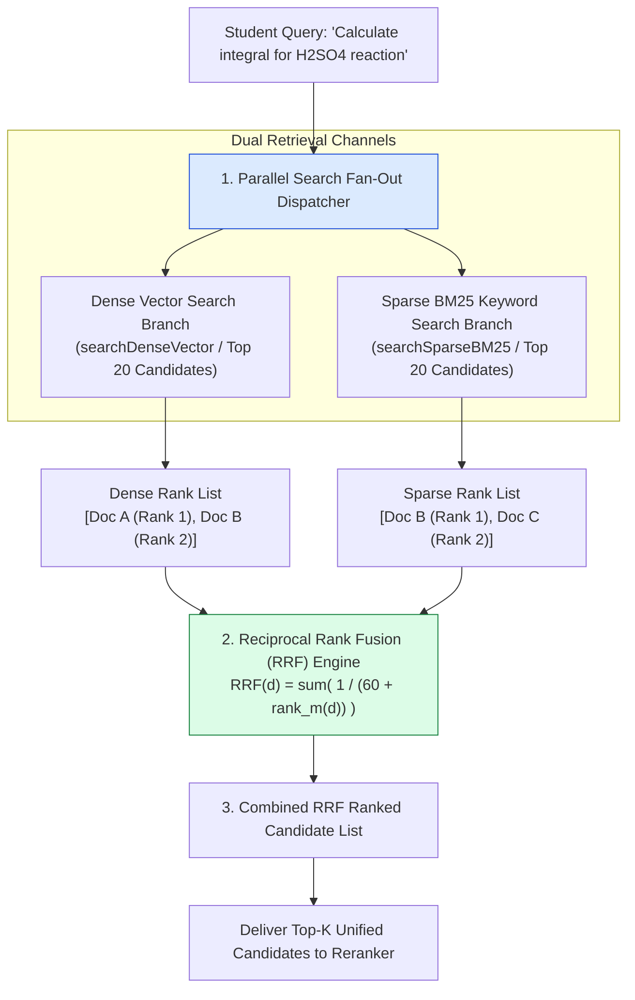
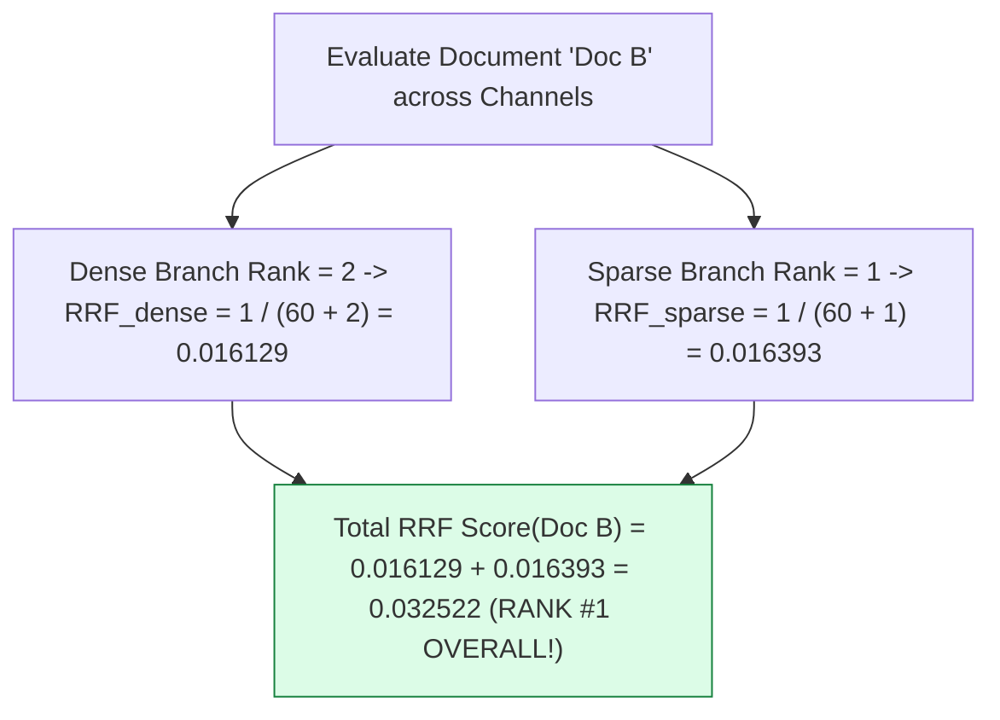
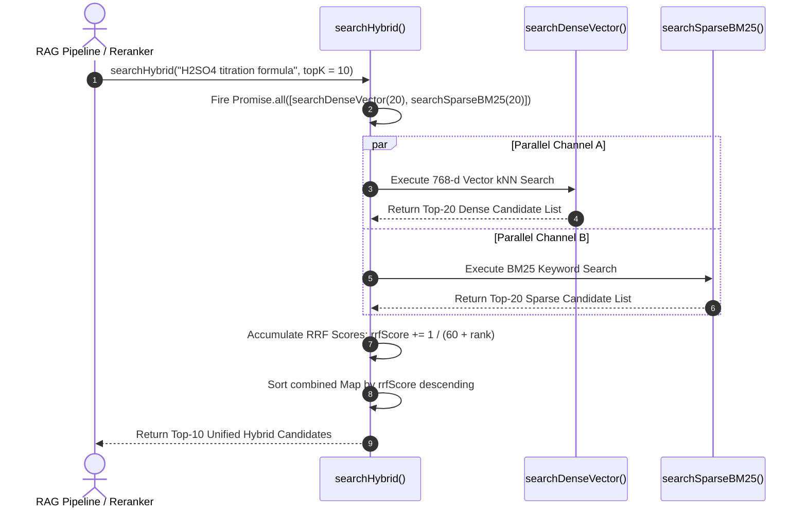

# Module 06: Hybrid Search & Reciprocal Rank Fusion (RRF) Engine (`src/retrieval/hybrid-search.js`)

## Overview

Vector search excels at conceptual intent matching but struggles on exact token matching for chemical formulas (e.g. `H2SO4`), mathematical theorem acronyms (`L'Hôpital`), and course code identifiers. Conversely, BM25 lexical search matches exact keywords but fails on conversational phrases. **Hybrid Search** combines **Dense Vector Search** and **Sparse BM25 Keyword Search** using **Reciprocal Rank Fusion (RRF)**, producing a unified candidate list that captures both semantic meaning and exact lexical precision.

Understanding **Reciprocal Rank Fusion Mathematics ($k = 60$)**, **Sparse BM25 Token Frequency Math**, **Rank Normalization**, and **Parallel Search Fan-Out** is essential for production RAG architectures.

---

## 1. Reciprocal Rank Fusion (RRF) Pipeline Topology



---

## 2. Reciprocal Rank Fusion Mathematical Equation

$$\text{RRF Score}(d) = \sum_{m \in M} \frac{1}{k + r_m(d)}$$

Where:
- $M$ is the set of retrieval systems ($M = \{\text{Dense Vector}, \text{Sparse BM25}\}$).
- $r_m(d)$ is the 1-based rank position of document $d$ in retrieval system $m$.
- $k$ is the smoothing constant parameter (standard industry default: $k = 60$).



### Retrieval Channel Strengths Matrix

| Search Channel | Primary Retrieval Strength | Primary Retrieval Weakness | Score Range |
| :--- | :--- | :--- | :--- |
| **Dense Vector Search** | Conceptual intent, synonyms, conversational queries. | Misses exact chemical formulas (`C6H12O6`), symbols, acronyms. | Cosine Sim $[-1.0, +1.0]$ |
| **Sparse BM25 Keyword** | Exact keyword matches, formulas, model numbers, codes. | Misses synonyms, conceptual descriptions, paraphrasing. | Unbounded BM25 Score |
| **Hybrid RRF Fusion** | **Combines strengths of both channels seamlessly.** | Requires running two retrieval queries in parallel. | RRF Score $[0.0, \sim 0.033]$ |

---

## 3. Parallel Async Search Execution Sequence



---

## 4. Code Walkthrough (`src/retrieval/hybrid-search.js`)

```javascript
import { searchDenseVector } from "./vector-search.js";
import { vectorDb } from "../db.js";

/**
 * Simplified Sparse BM25 Keyword Search Engine
 * Calculates Term Frequency (TF) keyword match density over stored text chunks
 */
function searchSparseBM25(queryText, topK = 20) {
  const terms = queryText
    .toLowerCase()
    .split(/\W+/)
    .filter((t) => t.length > 1);

  if (terms.length === 0) return [];
  const chunks = vectorDb.getAllChunks();

  const scored = chunks.map((chunk) => {
    const textLower = chunk.text.toLowerCase();
    let termMatches = 0;
    
    terms.forEach((term) => {
      if (textLower.includes(term)) termMatches++;
    });

    const sparseScore = termMatches / terms.length; // Normalized match density
    return {
      ...chunk,
      sparseScore
    };
  });

  // Filter non-zero matches and sort descending
  const matches = scored.filter((c) => c.sparseScore > 0);
  matches.sort((a, b) => b.sparseScore - a.sparseScore);
  return matches.slice(0, topK);
}

/**
 * Executes Hybrid Search using Reciprocal Rank Fusion (RRF)
 * @param {string} queryText - Student academic query
 * @param {number} topK - Target output candidate count (default: 10)
 * @param {number} kConstant - RRF smoothing parameter (default: 60)
 * @returns {Promise<Array<Object>>} Ranked unified passage candidates with rrfScore
 */
export async function searchHybrid(queryText, topK = 10, kConstant = 60) {
  if (!queryText || typeof queryText !== "string") return [];

  console.log(`⚡ [HYBRID RRF SEARCH] Dispatching parallel Dense + Sparse queries for: "${queryText}"`);

  // Step 1: Run Dense Vector Search and Sparse BM25 Search concurrently
  const [denseResults, sparseResults] = await Promise.all([
    searchDenseVector(queryText, 20),
    searchSparseBM25(queryText, 20)
  ]);

  const rrfScores = new Map();
  const chunkMap = new Map();

  // Step 2: Accumulate RRF scores for Dense Vector Branch
  denseResults.forEach((doc, rank) => {
    const chunkId = doc.chunkId;
    chunkMap.set(chunkId, doc);
    const rankScore = 1.0 / (kConstant + (rank + 1));
    rrfScores.set(chunkId, (rrfScores.get(chunkId) || 0) + rankScore);
  });

  // Step 3: Accumulate RRF scores for Sparse BM25 Branch
  sparseResults.forEach((doc, rank) => {
    const chunkId = doc.chunkId;
    chunkMap.set(chunkId, doc);
    const rankScore = 1.0 / (kConstant + (rank + 1));
    rrfScores.set(chunkId, (rrfScores.get(chunkId) || 0) + rankScore);
  });

  // Step 4: Convert map to array and sort descending by total RRF score
  const combinedResults = Array.from(rrfScores.entries()).map(([chunkId, rrfScore]) => ({
    ...chunkMap.get(chunkId),
    rrfScore: Number(rrfScore.toFixed(6))
  }));

  combinedResults.sort((a, b) => b.rrfScore - a.rrfScore);
  const topHybridMatches = combinedResults.slice(0, topK);

  console.log(`✅ [HYBRID RRF SEARCH] Merged ${combinedResults.length} unique candidates. Top 1 RRF Score: ${topHybridMatches[0]?.rrfScore}`);
  return topHybridMatches;
}

// Execution Verification Example
searchHybrid("What is the formula for integration by parts?", 3).then((res) => {
  console.log("Hybrid RRF Search Output:\n", res);
});
```

---

## Key Production Takeaways

1. **RRF Eliminates Score Calibration Needs**: Unlike raw score addition (which fails because Cosine Similarity ranges $[-1.0, +1.0]$ while BM25 scores are unbounded $[0, \infty]$), RRF operates purely on **rank positions**, making score scale calibration unnecessary.
2. **Set RRF Smoothing Constant $k = 60$**: Use the industry standard smoothing constant $k = 60$ in the formula $\frac{1}{60 + r}$ to prevent top-ranked outliers from completely dominating lower-ranked items.
3. **Execute Retrieval Channels Concurrently**: Run `searchDenseVector()` and `searchSparseBM25()` concurrently via `Promise.all()` to keep hybrid retrieval latency under $10\text{ms}$.
4. **Ideal for Academic & Legal Technical Queries**: Hybrid RRF search is the ideal retrieval strategy for academic text containing both conceptual prose and exact chemical formulas or mathematical equations.

