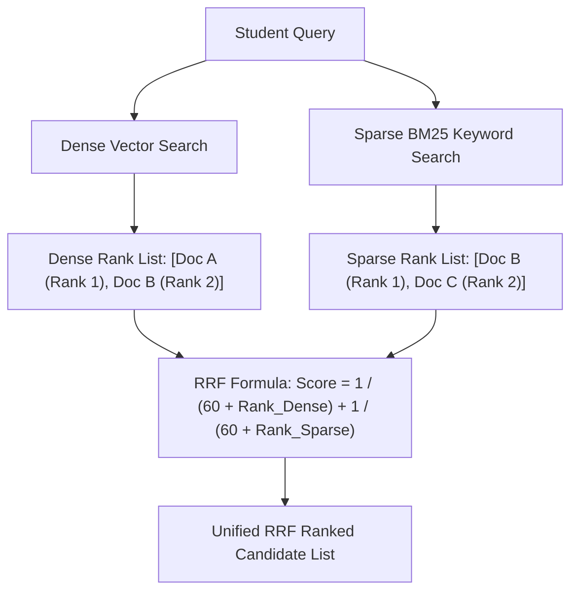

# File 06: Hybrid Search with Reciprocal Rank Fusion (`src/retrieval/hybrid-search.js`)

## Overview
**Hybrid Search** combines **Dense Vector Search** (semantic context) with **Sparse BM25 Keyword Search** (exact acronyms, math symbols, chemical formulas) using **Reciprocal Rank Fusion (RRF)** to combine rank positions into a single unified search score.

---

## 1. Reciprocal Rank Fusion (RRF) Architecture



### RRF Mathematical Formula
$$\text{RRF Score}(d) = \sum_{m \in M} \frac{1}{k + r_m(d)}$$
Where $k = 60$ (constant smoothing parameter), and $r_m(d)$ is document $d$'s rank position in retrieval system $m$.

---

## 2. Hybrid Search Implementation (`src/retrieval/hybrid-search.js`)

```javascript
import { searchDenseVector } from "./vector-search.js";
import { vectorDb } from "../db.js";

// Simplified BM25 Keyword Search
function searchSparseBM25(queryText, topK = 10) {
    const terms = queryText.toLowerCase().split(/\W+/).filter(Boolean);
    const chunks = vectorDb.getAllChunks();

    const scored = chunks.map(chunk => {
        const text = chunk.text.toLowerCase();
        let matches = 0;
        terms.forEach(t => { if (text.includes(t)) matches++; });
        const score = matches / terms.length;
        return { ...chunk, score };
    });

    scored.sort((a, b) => b.score - a.score);
    return scored.slice(0, topK);
}

// Reciprocal Rank Fusion (RRF) Aggregator
export async function searchHybrid(queryText, topK = 10, kConstant = 60) {
    const [denseResults, sparseResults] = await Promise.all([
        searchDenseVector(queryText, 20),
        searchSparseBM25(queryText, 20)
    ]);

    const rrfScores = new Map();
    const chunkMap = new Map();

    // Score Dense RRF
    denseResults.forEach((doc, rank) => {
        const chunkId = doc.chunkId;
        chunkMap.set(chunkId, doc);
        const score = 1 / (kConstant + (rank + 1));
        rrfScores.set(chunkId, (rrfScores.get(chunkId) || 0) + score);
    });

    // Score Sparse RRF
    sparseResults.forEach((doc, rank) => {
        const chunkId = doc.chunkId;
        chunkMap.set(chunkId, doc);
        const score = 1 / (kConstant + (rank + 1));
        rrfScores.set(chunkId, (rrfScores.get(chunkId) || 0) + score);
    });

    const combined = Array.from(rrfScores.entries()).map(([chunkId, rrfScore]) => ({
        ...chunkMap.get(chunkId),
        rrfScore
    }));

    combined.sort((a, b) => b.rrfScore - a.rrfScore);
    return combined.slice(0, topK);
}
```

---

## Key Takeaways
1. Solves limitations of vector search on exact keyword matches (chemical formulas, theorem names).
2. **RRF** normalizes scores across different retrieval systems without requiring score normalization calibration.
