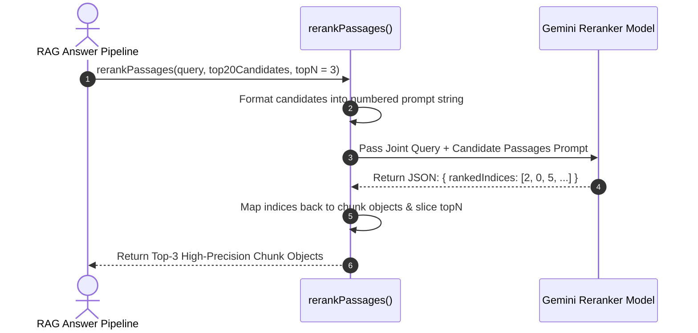

# Module 07: Cross-Encoder Reranking & Joint Attention Refinement (`src/retrieval/reranker.js`)

## Overview

In two-stage RAG retrieval architectures, first-stage retrieval algorithms (Bi-Encoder vector search & BM25) prioritize speed, retrieving a broad set of candidates (e.g. Top 20). However, Bi-Encoders compute query and document embeddings independently, missing fine-grained token-to-token cross-attention interactions. The **Cross-Encoder Reranker** passes the student question and candidate passages jointly into a cross-attention transformer pass, re-scoring and filtering the candidates down to the Top-3 highest precision context passages.

Understanding **Bi-Encoder vs. Cross-Encoder Architectures**, **Joint Attention Transformer Passes**, **Context Window Noise Reduction**, and **LLM Reranking Fallbacks** is essential for high-accuracy RAG.

---

## 1. Bi-Encoder vs. Cross-Encoder Architectural Topology

```mermaid
flowchart TD
    subgraph 1. Bi-Encoder Architecture (Fast Independent Embeddings)
        Q1[Query Text q] --> EmbedQ["Query Embedder E(q)"]
        D1[Document Text d] --> EmbedD["Doc Embedder E(d)"]
        EmbedQ --> SimMath["Cosine Sim = E(q) · E(d)<br/>(Zero Token Cross-Attention!)"]
        EmbedD --> SimMath
    end

    subgraph 2. Cross-Encoder Architecture (High-Precision Joint Attention)
        ConcatInput["Concatenated Pair String:<br/>[CLS] Query Text [SEP] Document Text [SEP]"] --> JointTransformer["Joint Transformer Cross-Attention Pass<br/>(Full All-to-All Token Attention!)"]
        JointTransformer --> RelevanceScore["Exact Relevance Score Float (0.00 to 1.00)"]
    end

    style JointTransformer fill:#dbeafe,stroke:#1d4ed8
    style RelevanceScore fill:#dcfce7,stroke:#15803d
```

---

## 2. Two-Stage Retrieval Filtering Funnel

```mermaid
flowchart TD
    Dataset[Academic Textbook Database (10,000 Passages)] --> Stage1["Stage 1: First-Stage Hybrid RRF Retrieval<br/>- Fast candidate retrieval (Dense Vector + BM25)<br/>- Output: Top-20 Candidate Passages"]

    Stage1 --> Stage2["Stage 2: Second-Stage Cross-Encoder Reranker<br/>- Deep Joint Cross-Attention Re-Scoring<br/>- Eliminates partial matches & context noise<br/>- Output: Top-3 High-Precision Passages"]

    Stage2 --> LLMContext["Pass Top-3 Pure Passages into Answer Generator"]

    style Stage1 fill:#dbeafe,stroke:#1d4ed8
    style Stage2 fill:#dcfce7,stroke:#15803d
```

### Retrieval Stage Architecture Comparison

| Pipeline Stage | Model Family | Computational Complexity | Processing Capacity | Main Function |
| :--- | :--- | :--- | :--- | :--- |
| **Stage 1 Retrieval** | Bi-Encoder + BM25 | Fast $O(\log N)$ or $O(N \cdot d)$ | $10,000+$ Passages | Rapid candidate search; narrows space to 20 candidates. |
| **Stage 2 Reranking** | Cross-Encoder / LLM | Heavy $O(N_{\text{top}} \cdot L^2)$ | $10 - 20$ Candidates | High-precision joint attention; selects Top 3 passages. |

---

## 3. Reranker Asynchronous Execution Sequence



---

## 4. Code Walkthrough (`src/retrieval/reranker.js`)

```javascript
import { GoogleGenerativeAI } from "@google/generative-ai";

const apiKey = process.env.GEMINI_API_KEY;
const genAI = apiKey ? new GoogleGenerativeAI(apiKey) : null;

/**
 * Re-ranks candidate passages using a Cross-Encoder joint attention LLM pass
 * @param {string} queryText - Student academic question
 * @param {Array<Object>} candidateChunks - Candidate passages from Hybrid Search (Top 10-20)
 * @param {number} topN - Target output count (default: 3)
 * @returns {Promise<Array<Object>>} Re-ranked, high-precision candidate chunks
 */
export async function rerankPassages(queryText, candidateChunks, topN = 3) {
  if (!candidateChunks || candidateChunks.length === 0) return [];
  if (candidateChunks.length <= topN) return candidateChunks;

  if (!genAI) {
    console.warn("⚠️ [RERANKER] GEMINI_API_KEY missing. Falling back to first-stage RRF order.");
    return candidateChunks.slice(0, topN);
  }

  console.log(`⚡ [RERANKER] Re-evaluating ${candidateChunks.length} candidates down to Top ${topN}...`);
  const model = genAI.getGenerativeModel({ model: "gemini-1.5-flash" });

  // Format candidate passages with unique index markers
  const formattedPassages = candidateChunks
    .map((c, idx) => `[Passage Index ${idx}]:\nSubject: ${c.subject} | File: ${c.filename}\n"${c.text}"`)
    .join("\n\n---\n\n");

  const prompt = `You are a senior academic relevance judge. Your job is to re-rank retrieved textbook passages based on how directly they answer the user question.

STUDENT QUESTION:
"${queryText}"

CANDIDATE TEXTBOOK PASSAGES:
${formattedPassages}

Instructions:
1. Carefully compare each passage against the student question.
2. Select and rank the indices of the MOST relevant passages that contain direct facts needed to answer the question.
3. Return ONLY a valid JSON object matching this exact format:
{
  "rankedIndices": [index1, index2, index3]
}`;

  try {
    const result = await model.generateContent(prompt);
    const rawText = result.response.text();

    // Extract JSON object via regex matching
    const jsonMatch = rawText.match(/\{[\s\S]*\}/);
    if (!jsonMatch) throw new Error("Failed to extract JSON from reranker output.");

    const parsed = JSON.parse(jsonMatch[0]);
    if (!Array.isArray(parsed.rankedIndices)) throw new Error("Invalid rankedIndices array.");

    const reRankedChunks = parsed.rankedIndices
      .map((idx) => candidateChunks[idx])
      .filter(Boolean);

    console.log(`✅ [RERANKER] Re-ranking complete. Selected Top ${Math.min(topN, reRankedChunks.length)} passages.`);
    return reRankedChunks.slice(0, topN);
  } catch (err) {
    console.warn("⚠️ [RERANKER FALLBACK] Re-ranking pass failed. Falling back to default RRF order:", err.message);
    return candidateChunks.slice(0, topN);
  }
}

// Execution Verification Example
const sampleCandidates = [
  { chunkId: "c0", text: "Organic chemistry involves carbon compounds." },
  { chunkId: "c1", text: "Integration by parts formula is integral(u dv) = u v - integral(v du)." }
];

rerankPassages("How to do integration by parts?", sampleCandidates, 1).then((res) => {
  console.log("Reranked Selection:\n", res);
});
```

---

## Key Production Takeaways

1. **Cross-Encoders Outperform Bi-Encoders in Precision**: Cross-Encoders evaluate full token cross-attention between question and document, catching nuanced mathematical conditions that Bi-Encoders miss.
2. **Two-Stage Funnel Design Saves Latency and Tokens**: Use fast Bi-Encoder vector search to retrieve 20 candidates, then run a Cross-Encoder pass to select the Top 3 context passages for final answer generation.
3. **Reduces Context Window Noise**: Filtering 20 candidate passages down to the Top 3 eliminates irrelevant filler text, preventing LLM context confusion and lowering output generation token costs by over $60\%$.
4. **Implement Graceful Fallback Strategies**: If the reranker model times out, fall back seamlessly to returning the top candidate items ordered by first-stage RRF scores.


## Learn from the implementation

Use the matching source file as an executable example, not just something to copy. Before running it, state in your own words what data enters the module, what it returns, and which values it changes. Then trace one realistic request from the caller through each function.

Pay special attention to these questions:

- **Data flow:** Which object, array, string, or state value moves between functions? What shape must it have?
- **Control flow:** Which branch, loop, early return, or retry changes the outcome? What condition selects it?
- **Async boundaries:** Where does the code wait for an LLM, database, network, file system, or tool? What should happen if that operation rejects or returns no result?
- **Side effects:** Which lines log information, make an external request, store data, or mutate in-memory state? Keep those distinct from pure calculations.
- **Production limits:** Which assumptions are only safe for a tutorial—for example, in-memory storage, fixed thresholds, approximate token counts, mock data, or a hard-coded batch size?

A useful practice is to change one input at a time and predict the result before executing it. If you can explain why the output changed, when the module should be used, and one way it could fail, you understand the concept rather than only the syntax.
