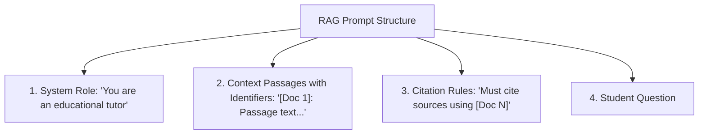

# File 08: RAG Prompt Builder (`src/generation/prompt-builder.js`)

## Overview
The **RAG Prompt Builder** combines system instructions, re-ranked context passages (with document IDs), and the student's question into a structured prompt that forces the LLM to ground its response in the provided text.

---

## 1. RAG Prompt Construction Pipeline



---

## 2. RAG Prompt Builder Implementation (`src/generation/prompt-builder.js`)

```javascript
export function buildRAGPrompt(question, rerankedPassages) {
    const formattedContext = rerankedPassages
        .map((doc, idx) => `[Doc ${idx + 1}] (File: ${doc.filename}, Subject: ${doc.subject}):\n${doc.text}`)
        .join("\n\n---\n\n");

    return `
You are Vidya AI, an expert academic tutor. Your task is to answer the student's question using ONLY the provided course context passages below.

RULES:
1. Base your answer strictly on facts present in the provided context.
2. Cite your sources inline using [Doc 1], [Doc 2] notation corresponding to the context passages.
3. If the answer cannot be determined from the context, respond clearly: "I cannot answer this question based on the available course materials."
4. Provide step-by-step explanations for mathematical or scientific concepts.

COURSE CONTEXT:
${formattedContext}

STUDENT QUESTION:
${question}

ANSWER WITH CITATIONS:`;
}
```

---

## Key Takeaways
1. Includes document index tags (`[Doc 1]`, `[Doc 2]`) to enable inline source citation generation.
2. Instructs the LLM to explicitly state when information is missing, preventing hallucinated answers.
