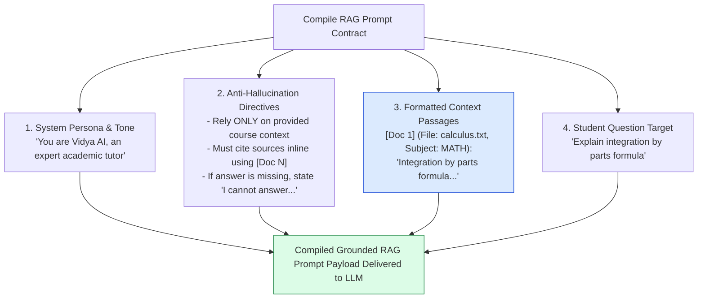
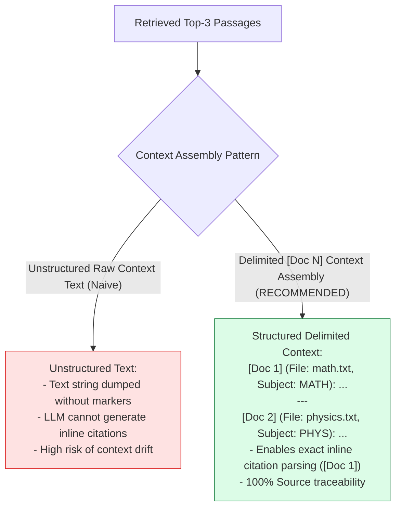
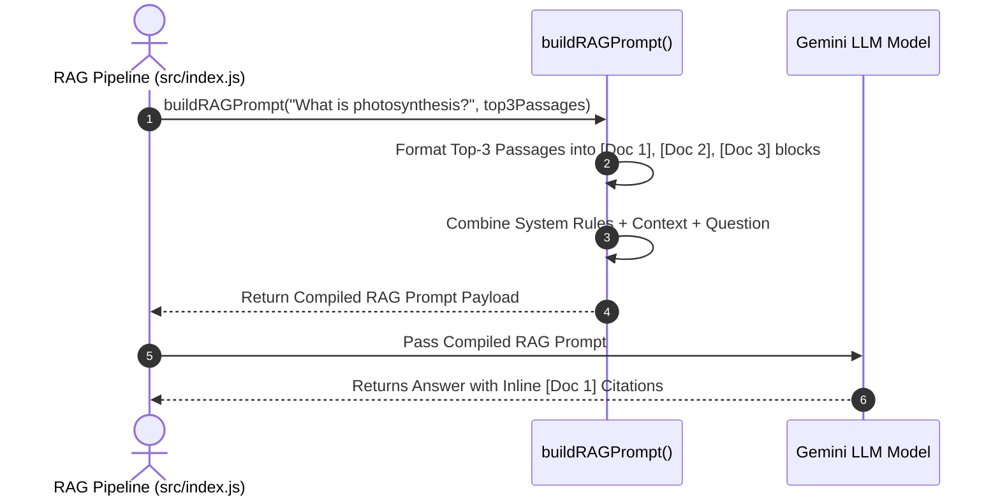

# Module 08: RAG Context Prompt Builder & Grounding Contracts (`src/generation/prompt-builder.js`)

## Overview

A critical cause of hallucinations in RAG systems is poorly formatted context injection where LLMs cannot distinguish between system instructions, retrieved reference passages, and user questions. The **RAG Prompt Builder** compiles system tutor personas, re-ranked context passages (formatted with explicit `[Doc N]` index markers), strict anti-hallucination boundary rules, and student questions into a structured prompt contract that forces the LLM to ground its response exclusively in the provided text.

Understanding **Context Delimiter Isolation**, **Inline Citation Instruction Prompts**, **Strict Grounding Directives**, and **Prompt Compilation Engineering** is essential for high-fidelity RAG.

---

## 1. RAG Prompt Contract Construction Topology



---

## 2. Unstructured Context vs. Delimited `[Doc N]` Context Assembly



### RAG Prompt Contract Section Specification

| Prompt Section | Architectural Function | Key Operational Constraint |
| :--- | :--- | :--- |
| **System Persona** | Assigns domain tutor role (`Vidya AI`). | Establishes professional, pedagogical tone. |
| **Grounding Directives** | Forces answer grounding in context. | `"Rely ONLY on facts in provided context. Do NOT extrapolate."` |
| **Citation Instructions** | Directs model to insert reference tags. | `"Cite sources using [Doc 1], [Doc 2] inline markers."` |
| **Context Block** | Delimits re-ranked passages. | Formatted with `[Doc N]` markers and file metadata headers. |
| **User Question** | Appends student target query. | Wrapped in XML tags or distinct markdown headers. |

---

## 3. Asynchronous Prompt Assembly Sequence



---

## 4. Code Walkthrough (`src/generation/prompt-builder.js`)

```javascript
/**
 * Compiles a grounded RAG prompt contract combining system rules, context passages, and student question
 * @param {string} question - Student academic question
 * @param {Array<Object>} rerankedPassages - Top re-ranked passage chunk objects (Top 3)
 * @returns {string} Compiled prompt contract string ready for LLM generation
 */
export function buildRAGPrompt(question, rerankedPassages) {
  if (!question || typeof question !== "string") {
    throw new Error("[PROMPT BUILDER ERROR] Question string is required.");
  }

  // Step 1: Format context passages with explicit [Doc N] index markers
  const formattedContext = rerankedPassages && rerankedPassages.length > 0
    ? rerankedPassages
        .map((doc, idx) => `[Doc ${idx + 1}] (Filename: ${doc.filename}, Subject: ${doc.subject}):\n${doc.text}`)
        .join("\n\n---\n\n")
    : "NO_CONTEXT_PASSAGES_AVAILABLE";

  const sanitizedQuestion = question.trim();

  // Step 2: Build injection-resistant prompt contract
  return `You are Vidya AI, an expert academic tutor. Your task is to answer the student's question using ONLY the provided course context passages below.

STRICT OPERATIONAL RULES:
1. Base your answer strictly on facts explicitly present in the provided COURSE CONTEXT.
2. Do NOT extrapolate, assume, or bring in external knowledge not stated in the context.
3. Cite your sources inline using [Doc 1], [Doc 2] notation corresponding to the context passage used.
4. If the answer cannot be completely determined from the context, respond clearly: "I cannot answer this question based on the available course materials."
5. Provide step-by-step mathematical calculations or scientific explanations when required.

COURSE CONTEXT PASSAGES:
${formattedContext}

STUDENT QUESTION:
<student_question>
${sanitizedQuestion}
</student_question>

VERIFIED TUTOR RESPONSE WITH INLINE CITATIONS:`;
}

// Execution Verification Example
const samplePassages = [
  { filename: "math-calculus.txt", subject: "MATH", text: "Integration by parts formula: integral(u dv) = u v - integral(v du)." }
];

const compiledPrompt = buildRAGPrompt("What is integration by parts?", samplePassages);
console.log("Compiled RAG Prompt Contract:\n", compiledPrompt);
```

---

## Key Production Takeaways

1. **Tag Context Passages with Explicit `[Doc N]` Identifiers**: Numbering retrieved passages (`[Doc 1]`, `[Doc 2]`) enables the LLM to cite exact source references inline within its output answer.
2. **Explicit Fallback Directives for Missing Information**: Require the LLM to output `"I cannot answer this question based on the available course materials."` if information is missing, preventing hallucinated answers.
3. **Use Structural Delimiters for User Questions**: Wrap student queries inside `<student_question>` XML tags to isolate user input from system instructions.
4. **Pass Only Re-Ranked High-Precision Context**: Inject only top-3 re-ranked passages into the `COURSE CONTEXT PASSAGES` block to keep prompt context clean and token costs low.

