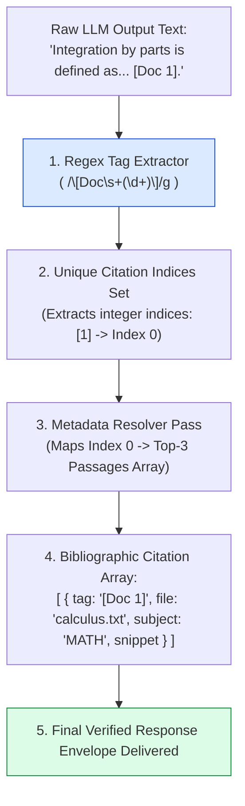
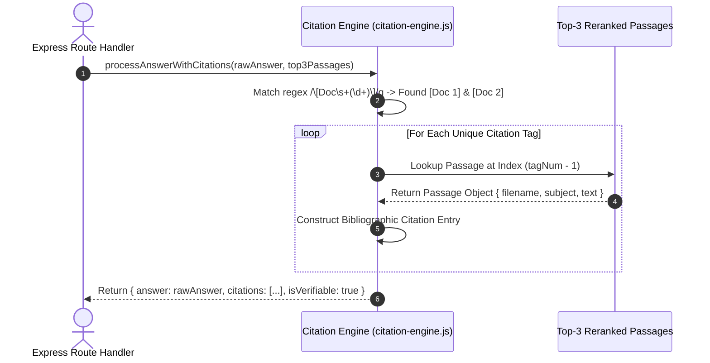
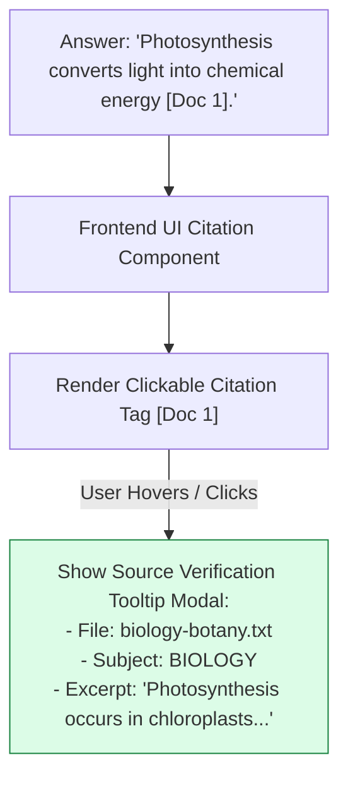

# Module 09: Inline Source Citation Engine & Metadata Resolution (`src/generation/citation-engine.js`)

## Overview

In academic and enterprise Q&A systems, unverified AI answers are unusable without clear attribution. The **Source Citation Engine** parses inline citation markers (`[Doc 1]`, `[Doc 2]`) from raw LLM output text using Regular Expressions, mapping them back to original document filenames, subject categories, and source text snippets to construct a verifiable bibliographic reference array.

Understanding **Regular Expression Marker Extraction**, **Index-to-Metadata Mapping**, **Source Deduplication**, and **Response Envelope Structuring** is essential for transparent RAG systems.

---

## 1. Citation Parsing & Metadata Mapping Topology



---

## 2. Citation Mapping & Verification Lifecycle



### Citation Engine Metadata Mapping Matrix

| Output Key | Data Type | Sample Extracted Value | Operational Purpose |
| :--- | :--- | :--- | :--- |
| **`citationTag`** | `String` | `"[Doc 1]"` | Exact inline reference marker present in answer text. |
| **`filename`** | `String` | `"math-calculus.txt"` | Target source textbook filename for UI hyperlink rendering. |
| **`subject`** | `String` | `"MATH"` | Course discipline associated with source text. |
| **`snippet`** | `String` | `"Integration by parts formula: ..."` | 150-character source excerpt for preview tooltips. |
| **`isVerifiable`** | `Boolean` | `true` | Indicates whether all cited tags resolved to valid passage sources. |

---

## 3. Inline Citation Resolution & UI Tooltip Rendering Flow



---

## 4. Code Walkthrough (`src/generation/citation-engine.js`)

```javascript
/**
 * Parses inline citation tags ([Doc 1], [Doc 2]) from raw LLM output text and maps them to passage metadata
 * @param {string} rawAnswerText - Raw LLM completion text containing inline tags
 * @param {Array<Object>} rerankedPassages - Top-3 passage chunk objects used during prompt compilation
 * @returns {Object} Structured object containing clean answer, citation array, and verifiability flag
 */
export function processAnswerWithCitations(rawAnswerText, rerankedPassages = []) {
  if (!rawAnswerText || typeof rawAnswerText !== "string") {
    return { answer: "", citations: [], hasCitations: false, isVerifiable: false };
  }

  // Step 1: Regex extraction of all [Doc N] markers
  const citationRegex = /\[Doc\s+(\d+)\]/g;
  const matches = [...rawAnswerText.matchAll(citationRegex)];

  // Deduplicate cited document indices (convert 1-based tags to 0-based array indices)
  const citedIndices = new Set(matches.map((m) => parseInt(m[1], 10) - 1));
  const citations = [];
  let isVerifiable = true;

  // Step 2: Map cited indices back to document metadata
  citedIndices.forEach((idx) => {
    if (idx >= 0 && idx < rerankedPassages.length) {
      const passage = rerankedPassages[idx];
      citations.push({
        citationTag: `[Doc ${idx + 1}]`,
        filename: passage.filename || "unknown-source.txt",
        subject: passage.subject || "GENERAL",
        chunkId: passage.chunkId || `chunk_${idx}`,
        snippet: passage.text ? passage.text.substring(0, 150) + "..." : ""
      });
    } else {
      console.warn(`⚠️ [CITATION ENGINE] LLM cited invalid tag '[Doc ${idx + 1}]' out of passage bounds.`);
      isVerifiable = false;
    }
  });

  return {
    answer: rawAnswerText.trim(),
    citations,
    hasCitations: citations.length > 0,
    isVerifiable
  };
}

// Execution Verification Example
const sampleAnswer = "Integration by parts formula is integral(u dv) = u v - integral(v du) [Doc 1].";
const samplePassages = [
  { chunkId: "c1", filename: "calculus.txt", subject: "MATH", text: "Integration by parts formula is integral(u dv) = u v - integral(v du)." }
];

const resultPayload = processAnswerWithCitations(sampleAnswer, samplePassages);
console.log("Processed Citation Payload:\n", JSON.stringify(resultPayload, null, 2));
```

---

## Key Production Takeaways

1. **Guarantees Transparency for Educational Users**: Extracting citations automatically ensures every student answer is backed by verifiable textbook page references.
2. **Deduplicate Citation Tags**: Use a `Set` to collect unique cited indices, preventing duplicate bibliographic entries when an answer cites `[Doc 1]` multiple times.
3. **Truncate Preview Snippets for UI Tooltips**: Expose a clean 150-character `snippet` property on citation objects to enable interactive hover tooltips in frontend web applications.
4. **Flag Out-of-Bounds Citations (`isVerifiable`)**: Detect when an LLM cites a non-existent tag (e.g. `[Doc 9]` when only 3 context passages were provided) and mark `isVerifiable: false`.


## Learn from the implementation

Use the matching source file as an executable example, not just something to copy. Before running it, state in your own words what data enters the module, what it returns, and which values it changes. Then trace one realistic request from the caller through each function.

Pay special attention to these questions:

- **Data flow:** Which object, array, string, or state value moves between functions? What shape must it have?
- **Control flow:** Which branch, loop, early return, or retry changes the outcome? What condition selects it?
- **Async boundaries:** Where does the code wait for an LLM, database, network, file system, or tool? What should happen if that operation rejects or returns no result?
- **Side effects:** Which lines log information, make an external request, store data, or mutate in-memory state? Keep those distinct from pure calculations.
- **Production limits:** Which assumptions are only safe for a tutorial—for example, in-memory storage, fixed thresholds, approximate token counts, mock data, or a hard-coded batch size?

A useful practice is to change one input at a time and predict the result before executing it. If you can explain why the output changed, when the module should be used, and one way it could fail, you understand the concept rather than only the syntax.
