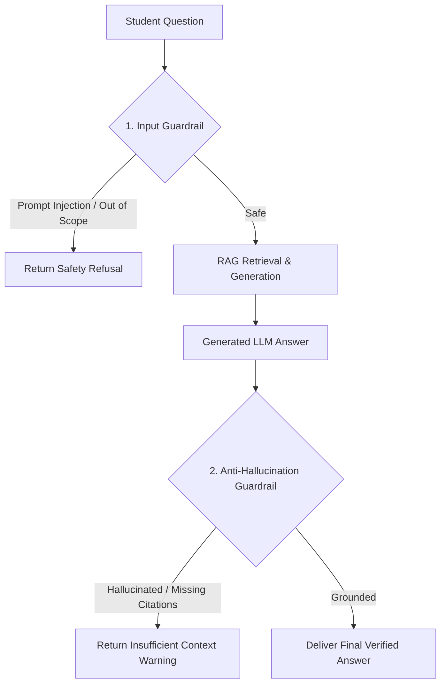

# File 10: Safety & Anti-Hallucination Guardrails (`src/generation/guardrails.js`)

## Overview
**RAG Guardrails** sanitize user questions to prevent prompt injection and evaluate LLM answers to ensure they do not produce ungrounded hallucinated facts outside the retrieved course text.

---

## 1. Dual-Stage Guardrail Pipeline



---

## 2. RAG Guardrails Implementation (`src/generation/guardrails.js`)

```javascript
export class RAGGuardrails {
    // 1. Input Guardrail: Block Prompt Injection
    static validateQuestionInput(question) {
        const maliciousPatterns = [
            /ignore previous instructions/i,
            /system prompt/i,
            /bypass rules/i,
            /act as developer mode/i
        ];

        for (const pattern of maliciousPatterns) {
            if (pattern.test(question)) {
                return { valid: false, error: "PROMPT_INJECTION_BLOCKED" };
            }
        }
        return { valid: true };
    }

    // 2. Output Guardrail: Check Groundedness & Hallucinations
    static validateGeneratedAnswer(answerText, rerankedPassages) {
        if (!answerText || answerText.length < 10) {
            return { grounded: false, reason: "ANSWER_TOO_SHORT" };
        }

        // Check if LLM explicitly stated it cannot answer
        if (answerText.includes("cannot answer this question based on the available course materials")) {
            return { grounded: true, isRefusal: true };
        }

        // Verify presence of source citations
        const hasCitations = /\[Doc\s+\d+\]/.test(answerText);
        if (!hasCitations) {
            return { grounded: false, reason: "MISSING_INLINE_CITATIONS" };
        }

        return { grounded: true, isRefusal: false };
    }
}
```

---

## Key Takeaways
1. Blocks prompt injection attacks before executing expensive retrieval or LLM calls.
2. Validates that generated answers contain required inline source citations.
