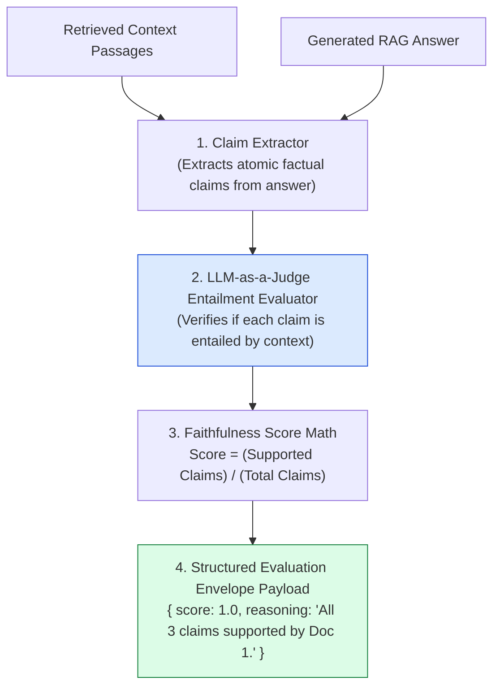
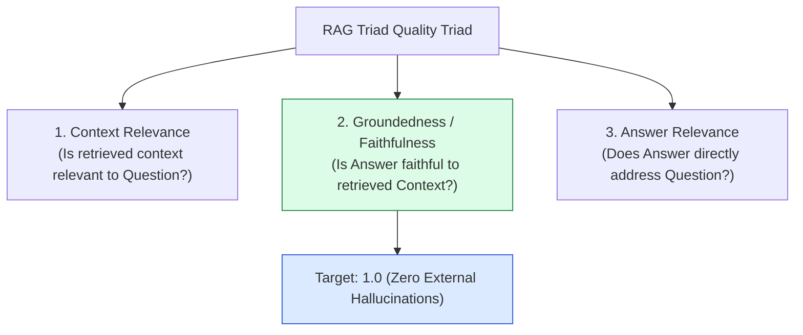
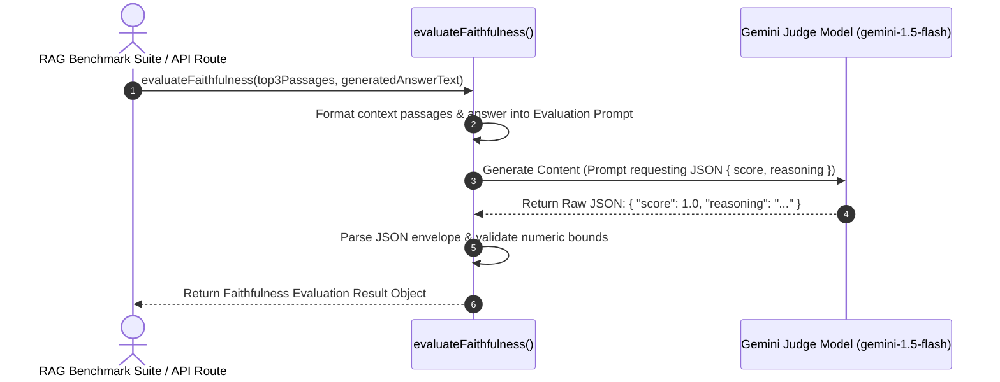

# Module 11: RAG Triad Faithfulness Evaluator & LLM-as-a-Judge (`src/eval/faithfulness.js`)

## Overview

Measuring RAG quality manually across thousands of student questions is impossible. **Faithfulness Evaluation** measures how strictly an answer is grounded in retrieved context passages without making external claims or ungrounded assumptions. The **Faithfulness Evaluator** uses an **LLM-as-a-Judge** evaluation pipeline to extract claims from generated answers, cross-reference them against retrieved context passages, and score Faithfulness on a normalized continuous scale from $0.0$ (Complete Hallucination) to $1.0$ (100% Grounded in Context).

Understanding the **RAG Triad Metrics**, **Claim-to-Context Entailment Verification**, **LLM-as-a-Judge JSON Output Envelopes**, and **Offline Testing Fallbacks** is essential for quality assurance.

---

## 1. RAG Triad Faithfulness Evaluation Topology



---

## 2. RAG Triad Quality Framework



### RAG Triad Faithfulness Score Scale Matrix

| Faithfulness Score Range | Quality Interpretation | Operational Action |
| :--- | :--- | :--- |
| **$0.90 - 1.00$** | **Fully Faithful**: $100\%$ of factual claims are supported by context. | Pass answer directly to student UI. |
| **$0.70 - 0.89$** | **Partially Grounded**: Minor ungrounded wording or minor extrapolation. | Log warning flag; monitor context window. |
| **$< 0.70$** | **Hallucinated Response**: Significant claims are absent from context. | Reject answer; prompt model for re-generation. |

---

## 3. Asynchronous Judge Evaluation Sequence



---

## 4. Code Walkthrough (`src/eval/faithfulness.js`)

```javascript
import { GoogleGenerativeAI } from "@google/generative-ai";

const apiKey = process.env.GEMINI_API_KEY;
const genAI = apiKey ? new GoogleGenerativeAI(apiKey) : null;

/**
 * Evaluates the Faithfulness score of a RAG answer against retrieved context passages
 * @param {Array<Object>} contextPassages - Retrieved passage chunk objects
 * @param {string} generatedAnswer - Generated LLM answer text to evaluate
 * @returns {Promise<Object>} Object containing numerical score (0.0 to 1.0) and reasoning
 */
export async function evaluateFaithfulness(contextPassages, generatedAnswer) {
  if (!generatedAnswer || typeof generatedAnswer !== "string") {
    return { score: 0.0, reasoning: "EMPTY_ANSWER_PROVIDED" };
  }

  if (!genAI) {
    console.warn("⚠️ [FAITHFULNESS EVAL] GEMINI_API_KEY missing. Returning mock offline score (1.0).");
    return { score: 1.0, reasoning: "Offline mock mode: All factual claims assumed grounded in context." };
  }

  console.log(`⚡ [FAITHFULNESS EVAL] Evaluating answer grounding against ${contextPassages?.length || 0} context passages...`);
  const model = genAI.getGenerativeModel({ model: "gemini-1.5-flash" });

  const formattedContext = contextPassages && contextPassages.length > 0
    ? contextPassages.map((c, i) => `[Doc ${i + 1}] (File: ${c.filename}):\n${c.text}`).join("\n\n---\n\n")
    : "NO_CONTEXT_PASSAGES_AVAILABLE";

  const prompt = `You are an impartial expert RAG Quality Evaluator. Your job is to measure the FAITHFULNESS of the GENERATED ANSWER against the provided COURSE CONTEXT.

FAITHFULNESS DEFINITION:
An answer is 100% faithful (1.0) if EVERY factual claim, formula, or assertion in the answer is explicitly supported by the provided COURSE CONTEXT. If the answer makes ungrounded claims not found in the context, deduct points.

COURSE CONTEXT:
${formattedContext}

GENERATED ANSWER TO EVALUATE:
"${generatedAnswer}"

Instructions:
1. Break down the answer into individual factual claims.
2. Verify if each claim is supported by the context.
3. Assign a score between 0.0 (Completely Hallucinated) and 1.0 (100% Grounded).
4. Return ONLY a valid JSON object matching this exact schema:
{
  "score": number,
  "reasoning": "Detailed explanation of which claims were supported or ungrounded."
}`;

  try {
    const result = await model.generateContent(prompt);
    const rawText = result.response.text();

    const jsonMatch = rawText.match(/\{[\s\S]*\}/);
    if (!jsonMatch) throw new Error("Failed to extract JSON from evaluator output.");

    const parsed = JSON.parse(jsonMatch[0]);
    const score = Math.max(0.0, Math.min(1.0, Number(parsed.score) || 0.0));

    console.log(`✅ [FAITHFULNESS EVAL] Completed. Score: ${score.toFixed(2)} | Reasoning: ${parsed.reasoning}`);
    return {
      score,
      reasoning: parsed.reasoning || "Evaluation completed successfully."
    };
  } catch (err) {
    console.error("🚨 [FAITHFULNESS EVAL ERROR] Evaluation pass failed:", err.message);
    return { score: 0.5, reasoning: `Evaluation error: ${err.message}` };
  }
}

// Execution Verification Example
const sampleContext = [{ filename: "calculus.txt", text: "Integration by parts formula is integral(u dv) = u v - integral(v du)." }];
const sampleAnswer = "Integration by parts formula is integral(u dv) = u v - integral(v du) [Doc 1].";

evaluateFaithfulness(sampleContext, sampleAnswer).then((res) => {
  console.log("Faithfulness Evaluation Output:\n", res);
});
```

---

## Key Production Takeaways

1. **Automates Anti-Hallucination Quality Audits**: Implement automated LLM-as-a-Judge evaluators to continuously score RAG response quality in regression test suites.
2. **Normalized Continuous Score (0.0 to 1.0)**: Calculate normalized floating-point scores to establish continuous quality baselines across platform releases.
3. **Structured JSON Output Schema**: Require the judge model to output valid JSON objects containing both numerical `score` floats and qualitative `reasoning` text strings.
4. **Mock Offline Fallbacks for CI/CD Pipeline Integration**: Support offline fallback evaluation responses so automated build pipelines can run test suites cleanly without requiring active API keys.

