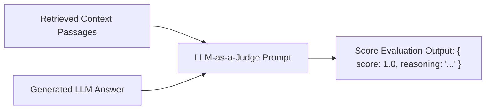

# File 11: Faithfulness Evaluator (`src/eval/faithfulness.js`)

## Overview
The **Faithfulness Evaluator** uses an **LLM-as-a-Judge** pattern to verify that statements in the generated response are strictly derived from the retrieved context passages, scoring faithfulness on a scale from 0.0 (Hallucinated) to 1.0 (Fully Faithful).

---

## 1. Faithfulness Scoring Pipeline



---

## 2. Faithfulness Evaluator Implementation (`src/eval/faithfulness.js`)

```javascript
import { GoogleGenerativeAI } from "@google/generative-ai";

const apiKey = process.env.GEMINI_API_KEY;
const genAI = apiKey ? new GoogleGenerativeAI(apiKey) : null;

export async function evaluateFaithfulness(contextPassages, generatedAnswer) {
    if (!genAI) {
        // Fallback score for offline testing
        return { score: 1.0, reasoning: "Mock mode: All claims grounded in context." };
    }

    const model = genAI.getGenerativeModel({ model: "gemini-1.5-flash" });
    const formattedContext = contextPassages.map((c, i) => `[Doc ${i + 1}]: ${c.text}`).join("\n\n");

    const prompt = `
You are an impartial RAG Quality Evaluator. Evaluate whether every claim in the GENERATED ANSWER is supported by the COURSE CONTEXT.

COURSE CONTEXT:
${formattedContext}

GENERATED ANSWER:
${generatedAnswer}

Return a score between 0.0 and 1.0 (1.0 = every claim supported, 0.0 = completely hallucinated).
Return JSON matching schema: { "score": number, "reasoning": "string" }`;

    try {
        const result = await model.generateContent(prompt);
        const match = result.response.text().match(/\{[\s\S]*\}/);
        return JSON.parse(match[0]);
    } catch (err) {
        return { score: 0.5, reasoning: "Evaluation failed to parse." };
    }
}
```

---

## Key Takeaways
1. Detects subtle LLM hallucinations that contradict or expand beyond course materials.
2. Automates RAG quality measurement for regression testing.
