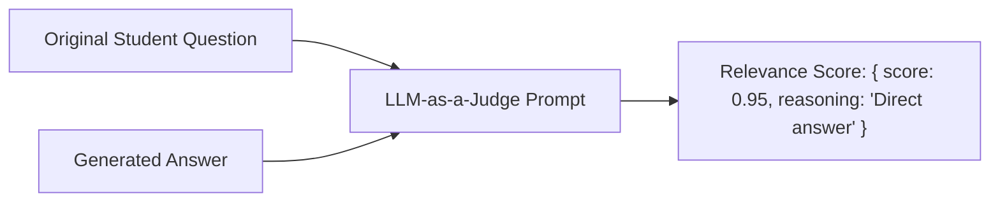

# File 12: Answer Relevance Evaluator (`src/eval/relevance.js`)

## Overview
The **Answer Relevance Evaluator** scores whether the generated response directly answers the student's original question without introducing unnecessary tangential topic drift.

---

## 1. Relevance Evaluation Flow



---

## 2. Relevance Evaluator Implementation (`src/eval/relevance.js`)

```javascript
import { GoogleGenerativeAI } from "@google/generative-ai";

const apiKey = process.env.GEMINI_API_KEY;
const genAI = apiKey ? new GoogleGenerativeAI(apiKey) : null;

export async function evaluateRelevance(question, generatedAnswer) {
    if (!genAI) {
        return { score: 0.95, reasoning: "Mock mode: Answer directly addresses student question." };
    }

    const model = genAI.getGenerativeModel({ model: "gemini-1.5-flash" });

    const prompt = `
You are an educational response quality evaluator. Evaluate whether the ANSWER directly and completely addresses the STUDENT QUESTION.

STUDENT QUESTION:
${question}

GENERATED ANSWER:
${generatedAnswer}

Return a score between 0.0 and 1.0 (1.0 = direct, complete answer; 0.0 = completely irrelevant/evasive).
Return JSON matching schema: { "score": number, "reasoning": "string" }`;

    try {
        const result = await model.generateContent(prompt);
        const match = result.response.text().match(/\{[\s\S]*\}/);
        return JSON.parse(match[0]);
    } catch (err) {
        return { score: 0.5, reasoning: "Evaluation failed to parse." };
    }
}
```

---

## Key Takeaways
1. Complements Faithfulness evaluation to complete the **RAG Triad** metric framework.
2. Ensures answers remain concise and focused on the student's query.
