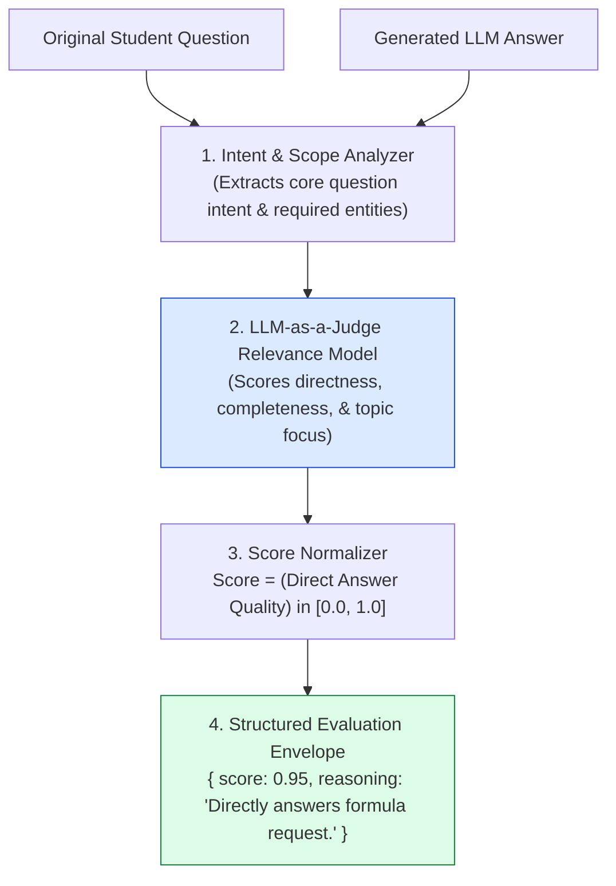
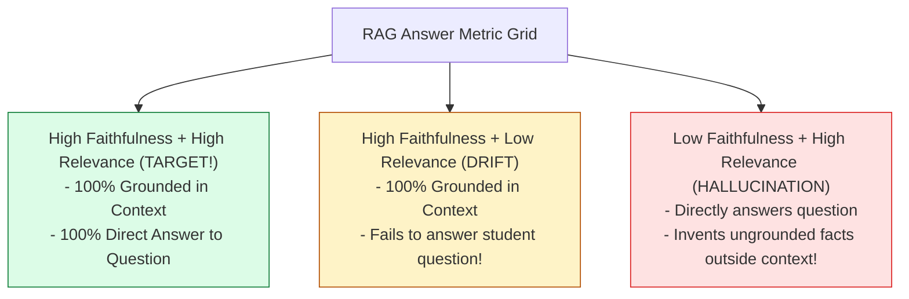
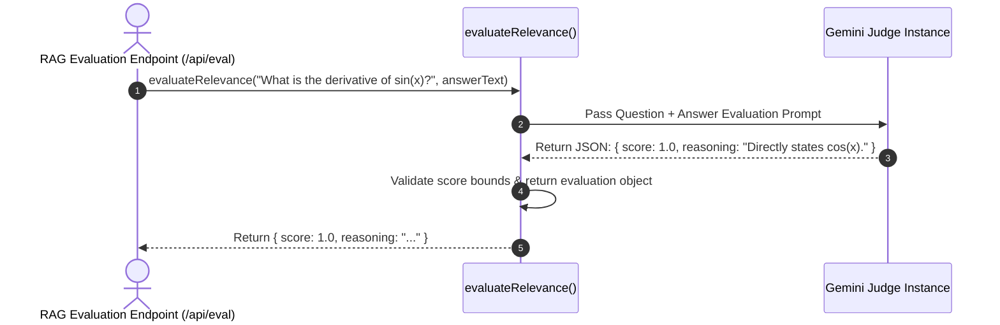

# Module 12: Answer Relevance Evaluator & Intent Alignment (`src/eval/relevance.js`)

## Overview

A RAG system can produce a response that is $100\%$ faithful to retrieved context passages while failing completely to answer the student's actual question (e.g. a student asks *"How do I solve $\int x e^x dx$?"* and the system outputs a 3-page history of Isaac Newton). **Answer Relevance Evaluation** measures whether a generated answer directly addresses the intent and specifics of the student's question without introducing irrelevant tangential topics or evasive non-answers.

Understanding **Intent-to-Response Semantic Alignment**, **Tangential Drift Detection**, **RAG Triad Triangulation**, and **Automated Score Boundaries** is essential for educational UX.

---

## 1. Answer Relevance Evaluation Topology



---

## 2. Faithfulness vs. Answer Relevance Metric Grid



### Answer Relevance Metric Reference Matrix

| Metric Dimension | Target Score | Operational Function |
| :--- | :--- | :--- |
| **Directness** | $> 0.90$ | Measures if the response gets straight to the point without filler prose. |
| **Completeness** | $> 0.85$ | Verifies all sub-questions in the query were addressed. |
| **Topic Concentration** | $> 0.90$ | Penalizes inclusion of off-topic history, tangential rants, or non-sequiturs. |

---

## 3. Asynchronous Relevance Judging Sequence



---

## 4. Code Walkthrough (`src/eval/relevance.js`)

```javascript
import { GoogleGenerativeAI } from "@google/generative-ai";

const apiKey = process.env.GEMINI_API_KEY;
const genAI = apiKey ? new GoogleGenerativeAI(apiKey) : null;

/**
 * Evaluates the Answer Relevance score of a RAG answer relative to the student question
 * @param {string} question - Student academic question
 * @param {string} generatedAnswer - Generated RAG answer text
 * @returns {Promise<Object>} Object containing numerical score (0.0 to 1.0) and reasoning
 */
export async function evaluateRelevance(question, generatedAnswer) {
  if (!question || !generatedAnswer) {
    return { score: 0.0, reasoning: "MISSING_QUESTION_OR_ANSWER" };
  }

  if (!genAI) {
    console.warn("⚠️ [RELEVANCE EVAL] GEMINI_API_KEY missing. Returning mock offline score (0.95).");
    return { score: 0.95, reasoning: "Offline mock mode: Answer directly addresses student question." };
  }

  console.log(`⚡ [RELEVANCE EVAL] Evaluating intent alignment for question: "${question.substring(0, 40)}..."`);
  const model = genAI.getGenerativeModel({ model: "gemini-1.5-flash" });

  const prompt = `You are an expert RAG Response Quality Evaluator. Your job is to measure the ANSWER RELEVANCE of the GENERATED ANSWER relative to the STUDENT QUESTION.

ANSWER RELEVANCE DEFINITION:
Answer Relevance measures whether the answer directly and completely answers the student question without introducing unnecessary tangential topics, evasive non-answers, or off-topic information.

STUDENT QUESTION:
"${question}"

GENERATED ANSWER TO EVALUATE:
"${generatedAnswer}"

Instructions:
1. Analyze the core intent of the student question.
2. Evaluate if the answer directly provides the requested information.
3. Deduct points if the answer goes off-topic, is evasive, or answers a different question.
4. Assign a score between 0.0 (Completely Off-Topic/Evasive) and 1.0 (Direct, Complete Answer).
5. Return ONLY a valid JSON object matching this exact schema:
{
  "score": number,
  "reasoning": "Detailed explanation of intent alignment and any tangential drift."
}`;

  try {
    const result = await model.generateContent(prompt);
    const rawText = result.response.text();

    const jsonMatch = rawText.match(/\{[\s\S]*\}/);
    if (!jsonMatch) throw new Error("Failed to extract JSON from relevance evaluator output.");

    const parsed = JSON.parse(jsonMatch[0]);
    const score = Math.max(0.0, Math.min(1.0, Number(parsed.score) || 0.0));

    console.log(`✅ [RELEVANCE EVAL] Completed. Score: ${score.toFixed(2)} | Reasoning: ${parsed.reasoning}`);
    return {
      score,
      reasoning: parsed.reasoning || "Evaluation completed successfully."
    };
  } catch (err) {
    console.error("🚨 [RELEVANCE EVAL ERROR] Evaluation pass failed:", err.message);
    return { score: 0.5, reasoning: `Evaluation error: ${err.message}` };
  }
}

// Execution Verification Example
const sampleQ = "What is the formula for integration by parts?";
const sampleA = "Integration by parts formula is integral(u dv) = u v - integral(v du) [Doc 1].";

evaluateRelevance(sampleQ, sampleA).then((res) => {
  console.log("Relevance Evaluation Output:\n", res);
});
```

---

## Key Production Takeaways

1. **Completes the RAG Triad Framework**: Pairing Answer Relevance with Faithfulness evaluation provides full visibility into both hallucination risk and user intent satisfaction.
2. **Detects Tangential Topic Drift**: Identifies when models output excessive boilerplate or irrelevant historical context instead of directly answering the student's question.
3. **Automated Quality Telemetry**: Run `/api/eval` periodically against stored production Q&A logs to catch degradation in model performance.
4. **Resilient JSON Response Extraction**: Use Regex matching (`/\{[\s\S]*\}/`) to robustly parse JSON from evaluator LLM completions.


## Learn from the implementation

Use the matching source file as an executable example, not just something to copy. Before running it, state in your own words what data enters the module, what it returns, and which values it changes. Then trace one realistic request from the caller through each function.

Pay special attention to these questions:

- **Data flow:** Which object, array, string, or state value moves between functions? What shape must it have?
- **Control flow:** Which branch, loop, early return, or retry changes the outcome? What condition selects it?
- **Async boundaries:** Where does the code wait for an LLM, database, network, file system, or tool? What should happen if that operation rejects or returns no result?
- **Side effects:** Which lines log information, make an external request, store data, or mutate in-memory state? Keep those distinct from pure calculations.
- **Production limits:** Which assumptions are only safe for a tutorial—for example, in-memory storage, fixed thresholds, approximate token counts, mock data, or a hard-coded batch size?

A useful practice is to change one input at a time and predict the result before executing it. If you can explain why the output changed, when the module should be used, and one way it could fail, you understand the concept rather than only the syntax.
