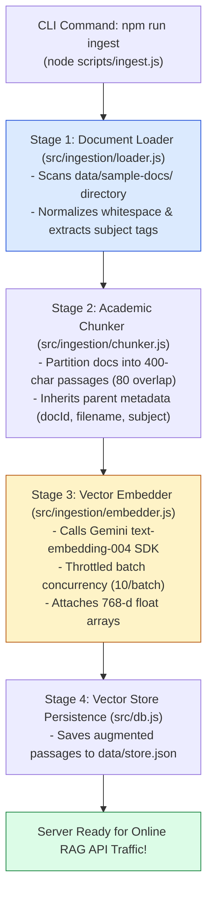
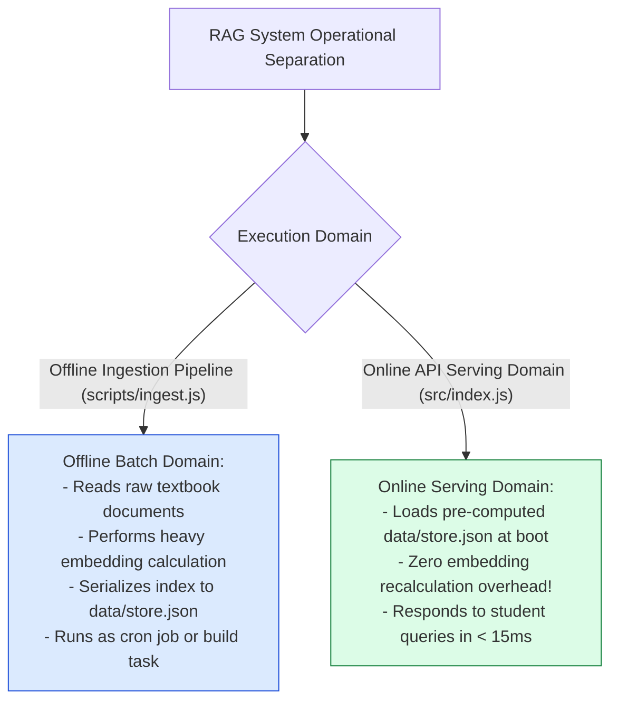
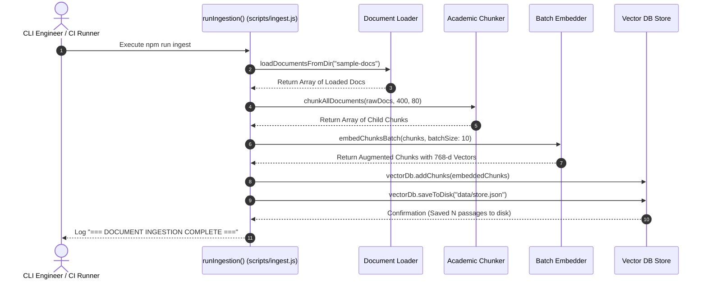

# Module 13: Document Ingestion Orchestrator & CLI Runner (`scripts/ingest.js`)

## Overview

In enterprise RAG architectures, document loading, chunking, and embedding are executed offline as part of a automated batch ingestion pipeline rather than on-demand during web API requests. The **Document Ingestion CLI Script (`scripts/ingest.js`)** orchestrates the 4-stage offline ingestion lifecycle: scanning document directories (`data/sample-docs/`), partitioning text into recursive passage chunks (400 characters, 80 overlap), generating normalized 768-d vector embeddings (`text-embedding-004`), and persisting the vector database index to disk (`data/store.json`).

Understanding **4-Stage Ingestion Pipeline Orchestration**, **Batch Processing Telemetry**, **Disk Persistence Serialization**, and **Error Recovery Guards** is essential for MLOps.

---

## 1. Document Ingestion Pipeline Orchestration Topology



---

## 2. Offline Ingestion vs. Online Query Serving Architecture



### Ingestion Pipeline Stage Telemetry Reference

| Ingestion Stage | Module Handler | Input / Output Payload | Latency Benchmark |
| :--- | :--- | :--- | :--- |
| **1. File Load** | `loadDocumentsFromDir()` | Local Files $\rightarrow$ Raw Document Objects | $< 10\text{ms}$ |
| **2. Chunking** | `chunkAllDocuments()` | Raw Documents $\rightarrow$ 400-char Chunk Passages | $< 15\text{ms}$ |
| **3. Vector Embedding** | `embedChunksBatch()` | Passages $\rightarrow$ 768-d Vector Augmented Chunks | $\sim 500\text{ms} / \text{batch}$ |
| **4. Disk Store** | `vectorDb.saveToDisk()` | Augmented Chunks $\rightarrow$ `data/store.json` | $< 20\text{ms}$ |

---

## 3. Ingestion Lifecycle Execution Sequence



---

## 4. Code Walkthrough (`scripts/ingest.js`)

```javascript
import path from "path";
import { loadDocumentsFromDir } from "../src/ingestion/loader.js";
import { chunkAllDocuments } from "../src/ingestion/chunker.js";
import { embedChunksBatch } from "../src/ingestion/embedder.js";
import { vectorDb } from "../src/db.js";

/**
 * Main Orchestration Function for Offline Document Ingestion Pipeline
 */
async function runIngestion() {
  console.log("=================================================");
  console.log("🚀 [INGESTION] STARTING VIDYA RAG DOCUMENT INGESTION");
  console.log("=================================================");
  const startTime = Date.now();

  const sampleDocsDir = path.join(process.cwd(), "sample-docs");

  // Step 1: Load and normalize raw text files from disk
  console.log(`\n📂 [STAGE 1] Loading raw files from '${sampleDocsDir}'...`);
  const rawDocs = loadDocumentsFromDir(sampleDocsDir);
  console.log(`   Loaded ${rawDocs.length} raw textbook files.`);

  // Step 2: Recursively partition documents into child passage chunks
  console.log(`\n✂️ [STAGE 2] Chunking documents into passages (Size: 400, Overlap: 80)...`);
  const chunks = chunkAllDocuments(rawDocs, 400, 80);
  console.log(`   Generated ${chunks.length} total child passage chunks.`);

  // Step 3: Compute 768-dimensional vector embeddings with batch throttling
  console.log(`\n🧠 [STAGE 3] Generating 768-d vector embeddings via Gemini text-embedding-004...`);
  const embeddedChunks = await embedChunksBatch(chunks, 10);

  // Step 4: Index into vector database store and serialize to disk
  console.log(`\n💾 [STAGE 4] Persisting augmented passage index to disk...`);
  vectorDb.clear();
  vectorDb.addChunks(embeddedChunks);
  vectorDb.saveToDisk("data/store.json");

  const durationMs = Date.now() - startTime;
  console.log("\n=================================================");
  console.log(`✅ [INGESTION COMPLETE] Successfully indexed ${embeddedChunks.length} passages in ${(durationMs / 1000).toFixed(2)}s.`);
  console.log("=================================================\n");
}

// Execute CLI script and catch top-level errors
runIngestion().catch((err) => {
  console.error("🚨 [INGESTION FATAL ERROR]:", err);
  process.exit(1);
});
```

---

## Key Production Takeaways

1. **Decouple Heavy Ingestion from Web API Serving**: Execute document ingestion offline (`npm run ingest`) so user-facing web servers never spend CPU cycles processing multi-page textbook files.
2. **Track Pipeline Telemetry Metrics**: Log start time, step progress, and total execution duration (`durationMs`) to monitor batch processing performance.
3. **Persist Standardized JSON Persistence Files**: Save output to `data/store.json` so web API servers can load pre-computed vector embeddings in $< 15\text{ms}$ at boot.
4. **Enforce Non-Zero Exit Codes on Failure**: Call `process.exit(1)` when ingestion errors occur so automated CI/CD deployment pipelines fail cleanly.


## Learn from the implementation

Use the matching source file as an executable example, not just something to copy. Before running it, state in your own words what data enters the module, what it returns, and which values it changes. Then trace one realistic request from the caller through each function.

Pay special attention to these questions:

- **Data flow:** Which object, array, string, or state value moves between functions? What shape must it have?
- **Control flow:** Which branch, loop, early return, or retry changes the outcome? What condition selects it?
- **Async boundaries:** Where does the code wait for an LLM, database, network, file system, or tool? What should happen if that operation rejects or returns no result?
- **Side effects:** Which lines log information, make an external request, store data, or mutate in-memory state? Keep those distinct from pure calculations.
- **Production limits:** Which assumptions are only safe for a tutorial—for example, in-memory storage, fixed thresholds, approximate token counts, mock data, or a hard-coded batch size?

A useful practice is to change one input at a time and predict the result before executing it. If you can explain why the output changed, when the module should be used, and one way it could fail, you understand the concept rather than only the syntax.
