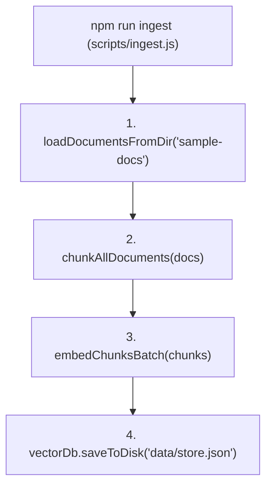

# File 13: Document Ingestion CLI Script (`scripts/ingest.js`)

## Overview
The **Document Ingestion CLI Script** orchestrates the offline ingestion pipeline: loading raw text files from `sample-docs/`, splitting them into chunks, generating 768-dimensional vector embeddings, and saving the index to `data/store.json`.

---

## 1. Document Ingestion Pipeline Flow



---

## 2. Ingestion Script Implementation (`scripts/ingest.js`)

```javascript
import path from "path";
import { loadDocumentsFromDir } from "../src/ingestion/loader.js";
import { chunkAllDocuments } from "../src/ingestion/chunker.js";
import { embedChunksBatch } from "../src/ingestion/embedder.js";
import { vectorDb } from "../src/db.js";

async function runIngestion() {
    console.log("=== STARTING VIDYA RAG DOCUMENT INGESTION ===");
    const sampleDocsDir = path.join(process.cwd(), "sample-docs");

    // 1. Load Raw Files
    const rawDocs = loadDocumentsFromDir(sampleDocsDir);

    // 2. Chunk Documents
    const chunks = chunkAllDocuments(rawDocs, 400, 80);

    // 3. Generate Vector Embeddings
    const embeddedChunks = await embedChunksBatch(chunks);

    // 4. Save to Vector Store
    vectorDb.addChunks(embeddedChunks);
    vectorDb.saveToDisk("data/store.json");

    console.log("=== DOCUMENT INGESTION COMPLETE ===");
}

runIngestion().catch(console.error);
```

---

## Key Takeaways
1. Run `npm run ingest` to prepare the local vector store prior to launching the API server.
2. Persists output to `data/store.json` for fast server boot loading.
