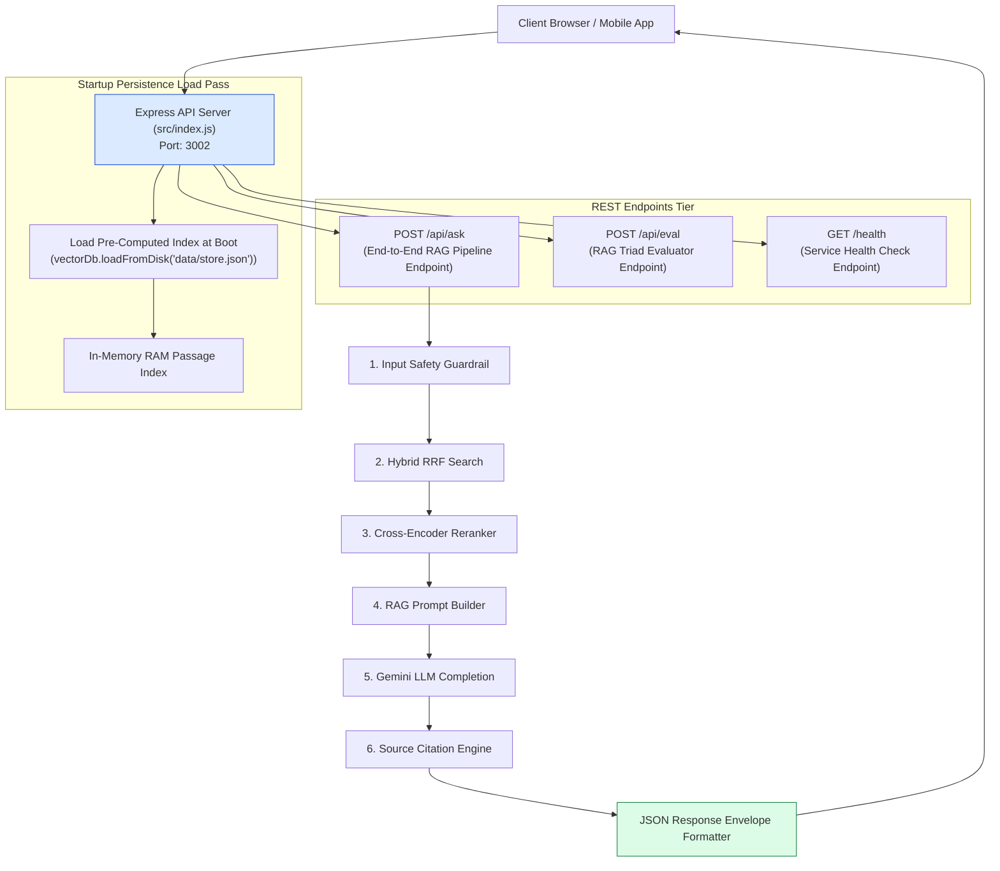
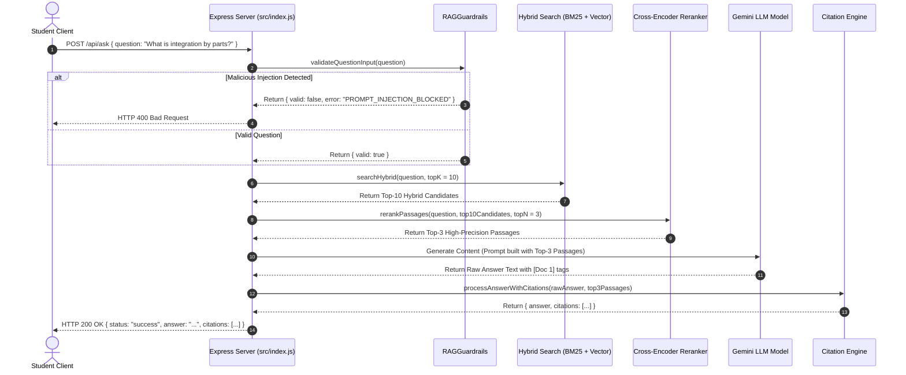

# Module 14: Vidya RAG Express API Server & Pipeline Orchestration (`src/index.js` & `src/server.js`)

## Overview

The **Vidya RAG Express API Server** is the production HTTP microservice entry point for the educational Q&A system. On startup, the server loads pre-computed passage embeddings from `data/store.json` into RAM in $< 15\text{ms}$, exposing REST endpoints (`POST /api/ask`, `POST /api/eval`, `GET /health`) that execute the complete 5-stage RAG pipeline: **Input Safety Guardrails** $\rightarrow$ **Hybrid Search RRF** $\rightarrow$ **Cross-Encoder Reranking** $\rightarrow$ **Prompt Contract Compilation** $\rightarrow$ **LLM Generation** $\rightarrow$ **Inline Citation Parsing**.

Understanding **Full-Pipeline Request Dispatching**, **Startup Index Loading**, **Response Envelope Serialization**, and **Error Middleware Interception** is essential for AI microservices.

---

## 1. Vidya RAG Express Server Architecture Topology



---

## 2. End-to-End `POST /api/ask` Request Lifecycle Sequence



### Vidya RAG REST API Endpoint Reference Matrix

| Route Endpoint | HTTP Method | Input Body Envelope | Output Payload Envelope | Primary Technical Purpose |
| :--- | :--- | :--- | :--- | :--- |
| `/api/ask` | `POST` | `{ question: string, course?: string }` | `200 OK` + Answer + Citations Array | Full 5-stage RAG query execution pipeline. |
| `/api/eval` | `POST` | `{ question: string, answer: string, context?: array }` | `200 OK` + Faithfulness & Relevance Scores | Evaluates RAG Triad quality metrics. |
| `/health` | `GET` | None | `200 OK` + Index Count + Service Status | Service readiness & health monitor. |

---

## 3. RAG Quality Evaluation Pipeline (`POST /api/eval`)

```mermaid
flowchart TD
    EvalReq[POST /api/eval { question, answer, context }] --> FanOutEval["Parallel Evaluator Fan-Out"]

    subgraph Parallel Judge Evaluation
        FanOutEval --> FaithEval["evaluateFaithfulness(context, answer)<br/>(Checks Context Grounding)"]
        FanOutEval --> RelEval["evaluateRelevance(question, answer)<br/>(Checks Intent Alignment)"]
    end

    FaithEval --> AggregateResults["Aggregate Scores: { faithfulness, relevance }"]
    RelEval --> AggregateResults

    AggregateResults --> EvalResponse[Return JSON Evaluation Summary]

    style AggregateResults fill:#dcfce7,stroke:#15803d
```

---

## 4. Code Walkthrough (`src/index.js`)

```javascript
import express from "express";
import { GoogleGenerativeAI } from "@google/generative-ai";
import { vectorDb } from "./db.js";
import { searchHybrid } from "./retrieval/hybrid-search.js";
import { rerankPassages } from "./retrieval/reranker.js";
import { buildRAGPrompt } from "./generation/prompt-builder.js";
import { processAnswerWithCitations } from "./generation/citation-engine.js";
import { RAGGuardrails } from "./generation/guardrails.js";
import { evaluateFaithfulness } from "./eval/faithfulness.js";
import { evaluateRelevance } from "./eval/relevance.js";

const app = express();
app.use(express.json());

const apiKey = process.env.GEMINI_API_KEY || "MOCK_KEY";
const genAI = new GoogleGenerativeAI(apiKey);
const model = genAI.getGenerativeModel({ model: "gemini-1.5-flash" });

// Load vector store from disk on startup
vectorDb.loadFromDisk("data/store.json");

/**
 * Health Check Endpoint
 */
app.get("/health", (req, res) => {
  res.status(200).json({
    status: "UP",
    service: "vidya-rag-api",
    indexedPassages: vectorDb.size()
  });
});

/**
 * 1. End-to-End Educational RAG Endpoint
 * POST /api/ask
 */
app.post("/api/ask", async (req, res, next) => {
  try {
    const { question } = req.body;
    if (!question || typeof question !== "string") {
      return res.status(400).json({ error: "INVALID_REQUEST", message: "Property 'question' is required." });
    }

    const startTime = Date.now();

    // Step 1: Input Guardrail Check
    const inputCheck = RAGGuardrails.validateQuestionInput(question);
    if (!inputCheck.valid) {
      return res.status(400).json({ error: "SAFETY_REFUSAL", message: inputCheck.error });
    }

    // Step 2: Hybrid Search (Dense Vector + Sparse BM25 via RRF)
    const candidateChunks = await searchHybrid(question, 10);

    // Step 3: Cross-Encoder Reranking
    const topPassages = await rerankPassages(question, candidateChunks, 3);

    // Step 4: Build RAG Prompt & Call Gemini LLM
    const ragPrompt = buildRAGPrompt(question, topPassages);
    const result = await model.generateContent(ragPrompt);
    const rawAnswerText = result.response.text();

    // Step 5: Output Guardrail Check & Process Source Citations
    const outputCheck = RAGGuardrails.validateGeneratedAnswer(rawAnswerText, topPassages);
    const responsePayload = processAnswerWithCitations(rawAnswerText, topPassages);

    const durationMs = Date.now() - startTime;

    return res.status(200).json({
      status: "success",
      executionTimeMs: durationMs,
      question,
      answer: responsePayload.answer,
      citations: responsePayload.citations,
      isVerifiable: responsePayload.isVerifiable,
      retrievedCount: topPassages.length,
      outputGuardrail: outputCheck
    });
  } catch (err) {
    next(err);
  }
});

/**
 * 2. Automated RAG Quality Evaluation Endpoint
 * POST /api/eval
 */
app.post("/api/eval", async (req, res, next) => {
  try {
    const { question, answer, context = [] } = req.body;
    if (!question || !answer) {
      return res.status(400).json({ error: "INVALID_REQUEST", message: "Properties 'question' and 'answer' are required." });
    }

    const startTime = Date.now();

    // Run Faithfulness and Answer Relevance evaluators concurrently
    const [faithfulness, relevance] = await Promise.all([
      evaluateFaithfulness(context, answer),
      evaluateRelevance(question, answer)
    ]);

    const durationMs = Date.now() - startTime;

    return res.status(200).json({
      status: "success",
      executionTimeMs: durationMs,
      scores: {
        faithfulness: faithfulness.score,
        faithfulnessReasoning: faithfulness.reasoning,
        relevance: relevance.score,
        relevanceReasoning: relevance.reasoning
      }
    });
  } catch (err) {
    next(err);
  }
});

/**
 * Centralized Express Error Handling Middleware
 */
app.use((err, req, res, next) => {
  console.error("🚨 [SERVER ERROR]:", err.stack);
  res.status(500).json({ error: "INTERNAL_SERVER_ERROR", message: err.message });
});

const PORT = process.env.PORT || 3002;
app.listen(PORT, () => {
  console.log(`🚀 [SERVER STARTED] Vidya RAG API listening on http://localhost:${PORT}`);
  console.log(`📦 Loaded ${vectorDb.size()} pre-indexed passages from disk.`);
});
```

---

## Key Production Takeaways

1. **Load Pre-Computed Embeddings at Boot**: Call `vectorDb.loadFromDisk("data/store.json")` during server boot to ensure student query requests execute immediately without waiting for disk reads.
2. **Execute Full 5-Stage RAG Pipeline**: Orchestrate Input Guardrails $\rightarrow$ Hybrid RRF Search $\rightarrow$ Reranker $\rightarrow$ LLM Generation $\rightarrow$ Citation Engine inside the `/api/ask` route handler.
3. **Expose Automated Quality Evaluation (`/api/eval`)**: Provide dedicated quality evaluation routes so platform administrators can audit Faithfulness and Answer Relevance continuously.
4. **Log Telemetry Latency Metrics**: Monitor overall request execution durations (`executionTimeMs`) to verify sub-500ms total end-to-end response SLAs.


## Learn from the implementation

Use the matching source file as an executable example, not just something to copy. Before running it, state in your own words what data enters the module, what it returns, and which values it changes. Then trace one realistic request from the caller through each function.

Pay special attention to these questions:

- **Data flow:** Which object, array, string, or state value moves between functions? What shape must it have?
- **Control flow:** Which branch, loop, early return, or retry changes the outcome? What condition selects it?
- **Async boundaries:** Where does the code wait for an LLM, database, network, file system, or tool? What should happen if that operation rejects or returns no result?
- **Side effects:** Which lines log information, make an external request, store data, or mutate in-memory state? Keep those distinct from pure calculations.
- **Production limits:** Which assumptions are only safe for a tutorial—for example, in-memory storage, fixed thresholds, approximate token counts, mock data, or a hard-coded batch size?

A useful practice is to change one input at a time and predict the result before executing it. If you can explain why the output changed, when the module should be used, and one way it could fail, you understand the concept rather than only the syntax.
