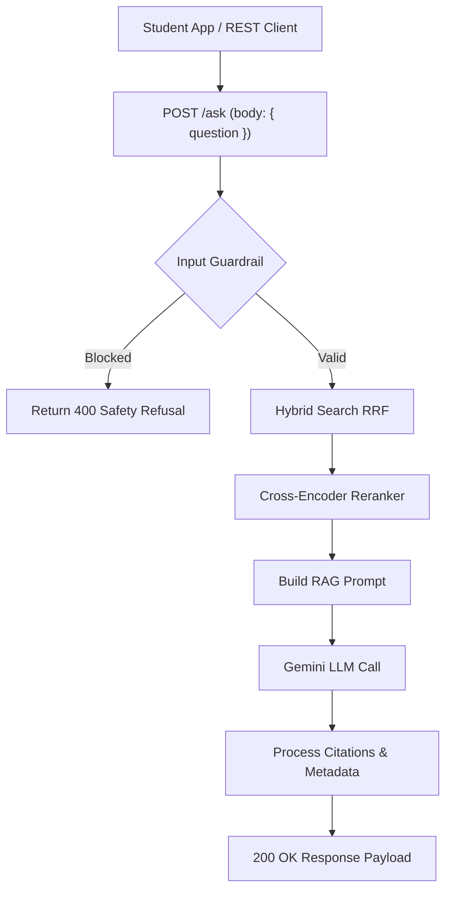

# File 14: Vidya RAG Express API Server (`src/index.js`)

## Overview
The **Vidya RAG Express API Server** exposes HTTP REST endpoints (`POST /ask`, `POST /eval`) to handle student academic questions, execute hybrid search and re-ranking pipelines, generate cited answers, and return evaluation metrics.

---

## 1. Request Handling Lifecycle



---

## 2. API Server Implementation (`src/index.js`)

```javascript
import express from "express";
import { GoogleGenerativeAI } from "@google/generative-ai";
import { vectorDb } from "./db.js";
import { searchHybrid } from "./retrieval/hybrid-search.js";
import { rerankPassages } from "./retrieval/reranker.js";
import { buildRAGPrompt } from "./generation/prompt-builder.js";
import { processAnswerWithCitations } from "./generation/citation-engine.js";
import { RAGGuardrails } from "./generation/guardrails.js";
import { evaluateFaithfulness } from "./eval/faithfulness.js";
import { evaluateRelevance } from "./eval/relevance.js";

const app = express();
app.use(express.json());

const apiKey = process.env.GEMINI_API_KEY || "MOCK_KEY";
const genAI = new GoogleGenerativeAI(apiKey);
const model = genAI.getGenerativeModel({ model: "gemini-1.5-flash" });

// Load vector store from disk on startup
vectorDb.loadFromDisk("data/store.json");

// 1. POST /ask (RAG Endpoint)
app.post("/ask", async (req, res) => {
    const { question } = req.body;
    if (!question) return res.status(400).json({ error: "Question is required" });

    // Step 1: Input Guardrail
    const inputCheck = RAGGuardrails.validateQuestionInput(question);
    if (!inputCheck.valid) {
        return res.status(400).json({ error: "SAFETY_REFUSAL", message: inputCheck.error });
    }

    // Step 2: Hybrid Search (Vector + BM25)
    const candidateChunks = await searchHybrid(question, 10);

    // Step 3: Re-rank Passages
    const topPassages = await rerankPassages(question, candidateChunks, 3);

    // Step 4: Build RAG Prompt & Call LLM
    const ragPrompt = buildRAGPrompt(question, topPassages);
    const result = await model.generateContent(ragPrompt);
    const rawAnswer = result.response.text();

    // Step 5: Process Citations
    const responseData = processAnswerWithCitations(rawAnswer, topPassages);

    res.status(200).json({
        status: "success",
        question,
        answer: responseData.answer,
        citations: responseData.citations,
        retrievedCount: topPassages.length
    });
});

// 2. POST /eval (Evaluation Endpoint)
app.post("/eval", async (req, res) => {
    const { question, answer, context } = req.body;
    const [faithfulness, relevance] = await Promise.all([
        evaluateFaithfulness(context || [], answer),
        evaluateRelevance(question, answer)
    ]);

    res.status(200).json({
        status: "success",
        scores: { faithfulness, relevance }
    });
});

app.listen(3002, () => console.log("Vidya RAG API running on http://localhost:3002"));
```

---

## Key Takeaways
1. Complete integration of **Advanced RAG**: Guardrails $\rightarrow$ Hybrid Search $\rightarrow$ Reranker $\rightarrow$ Citations Engine.
2. Exposes **`POST /eval`** for continuous evaluation of RAG faithfulness and answer relevance.
