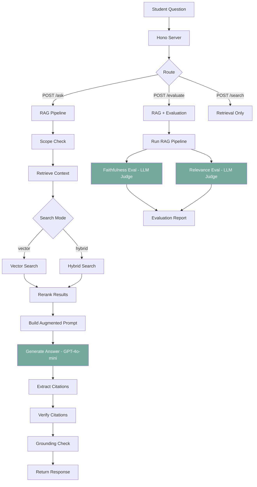
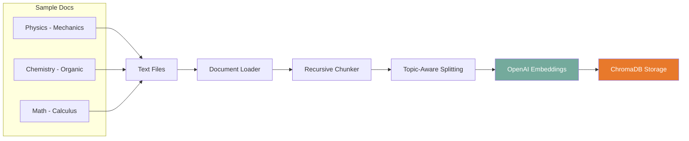
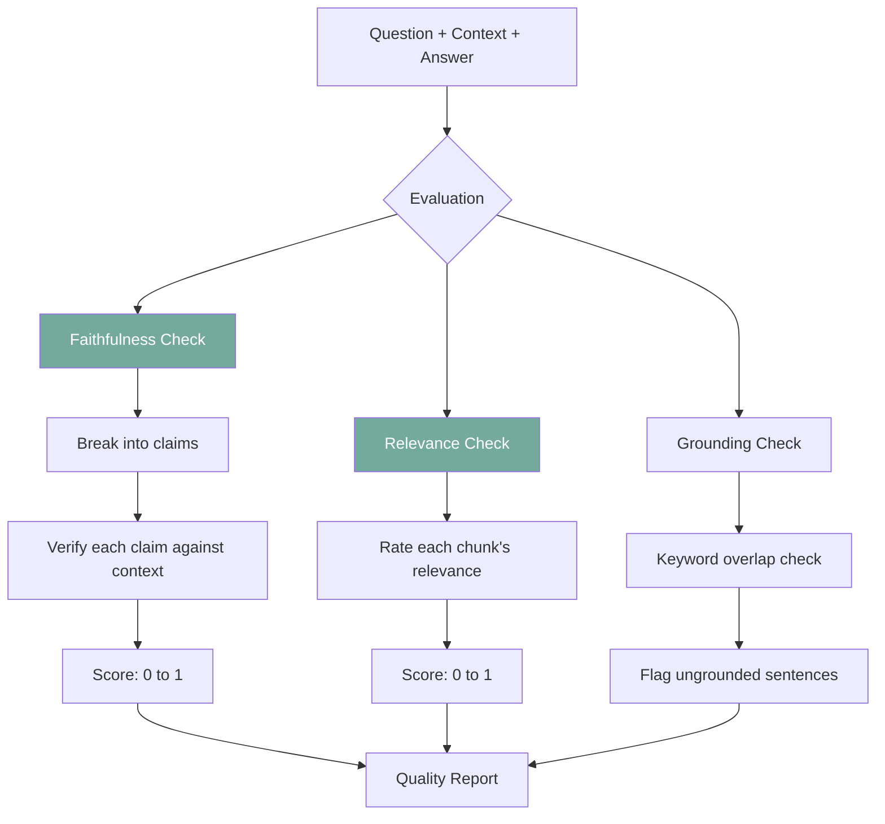

# VidyaPath - RAG-Based AI Tutor for JEE/NEET

**Client:** VidyaPath, Kota - EdTech platform for JEE/NEET preparation with an AI tutor that answers strictly from study material.

**Tech:** OpenAI (GPT-4o-mini + text-embedding-3-small), Hono, ChromaDB

## Architecture



## Ingestion Pipeline



## RAG Evaluation Flow



## Setup

```bash
npm install

# Set up environment
cp .env.example .env
# Add your OpenAI API key to .env

# Start ChromaDB (required)
docker run -p 8000:8000 chromadb/chroma

# Ingest study material into ChromaDB
npm run ingest

# Start the server
npm run dev
```

## API Endpoints

### POST /ask
```bash
curl -X POST http://localhost:3002/ask \
  -H "Content-Type: application/json" \
  -d '{"question": "Explain Newton third law with an example", "subject": "physics"}'
```

### POST /evaluate
```bash
curl -X POST http://localhost:3002/evaluate \
  -H "Content-Type: application/json" \
  -d '{"question": "What is Markovnikov rule?", "subject": "chemistry"}'
```

### POST /search
```bash
curl -X POST http://localhost:3002/search \
  -H "Content-Type: application/json" \
  -d '{"query": "integration by parts", "topK": 3, "mode": "hybrid"}'
```

## Key Concepts

1. **RAG** - Retrieval Augmented Generation: ground LLM answers in actual source material
2. **Chunking with Overlap** - Split documents at topic boundaries with overlap for context continuity
3. **Hybrid Search** - Combine vector similarity with keyword matching for better retrieval
4. **Reranking** - Re-score results using both semantic and keyword signals
5. **Citations** - Track which sources were used, verify they match actual context
6. **Guardrails** - Detect hallucinations by checking if claims are grounded in context
7. **RAG Evaluation** - Use LLM-as-judge to score faithfulness and relevance


## Learning path

Read the numbered module notes in order before changing the application. Each note explains one responsibility and points to the matching implementation. For each module, follow one input through the code, identify its output and side effects, then run a small example. This builds understanding of the system boundaries before you combine them.
