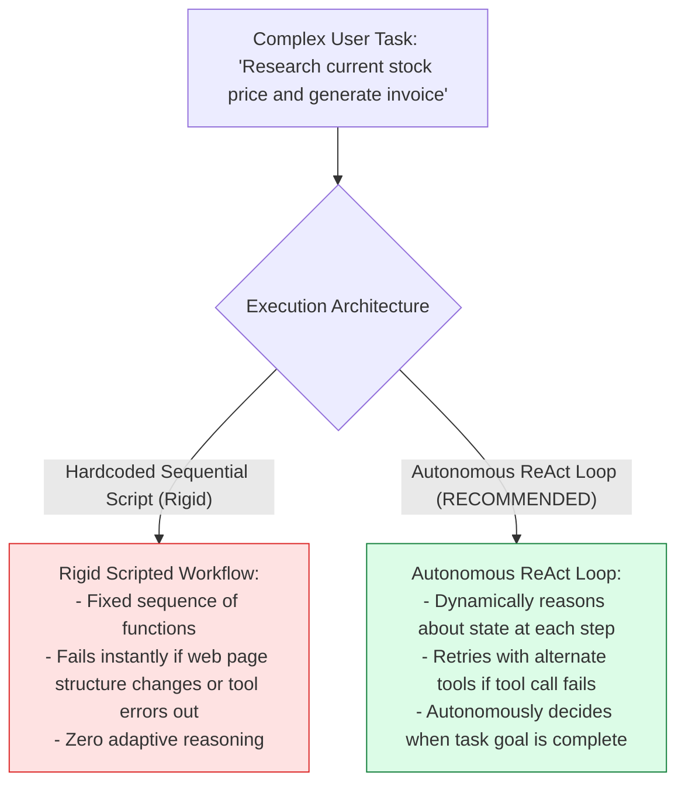
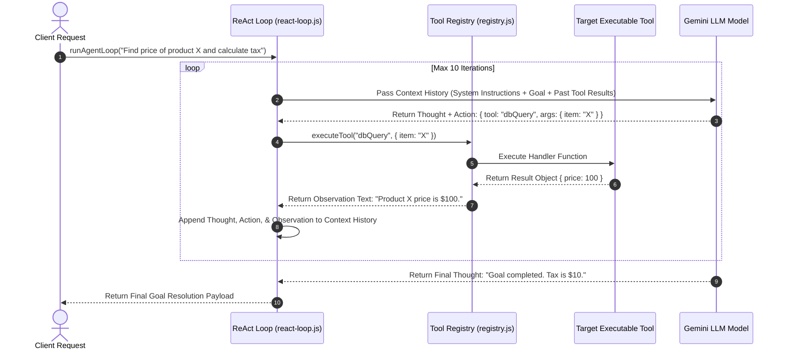

# Module 00: Autonomous AI Agent System Overview & Enterprise Architecture

## Overview

High-level AI agent frameworks (such as LangChain or CrewAI) often hide crucial execution mechanics under heavy abstractions, making token budgeting, tool execution state management, and memory pruning difficult to inspect and control in production environments. **Jugaad Agent** is a production-grade **Autonomous AI Agent System** built completely from scratch in vanilla Node.js without third-party agent framework abstractions. It implements an autonomous **ReAct (Reasoning + Acting) Loop Engine**, **Dynamic Tool Registry**, **Multi-Tier Memory Architecture (Short-Term Conversation Buffer, Vector Long-Term Memory, MongoDB Persistence)**, **Sliding Token Budget Manager**, and **Input/Output Safety Guardrails**.

Understanding **ReAct State Machines**, **Tool Execution Dispatchers**, **Multi-Tier Memory Retrieval**, **Token Window Pruning**, and **Infinite Loop Guards** is essential for AI systems engineering.

---

## 1. Autonomous Agent System Architecture Topology

```mermaid
flowchart TD
    UserGoal[User Goal / Task Request] --> InputGuard["1. Input Safety Guardrail<br/>(Sanitizes prompt injection & jailbreak patterns)"]

    InputGuard --> AgentPlanner["2. Goal Planner (src/agent/planner.js)<br/>(Decomposes task into sub-goals array)"]

    AgentPlanner --> ContextManager["3. Context & Token Manager (src/agent/context-manager.js)<br/>(Enforces token budget limits & prunes history)"]

    subgraph ReAct Execution Core Loop (src/agent/react-loop.js)
        ContextManager --> Thought["4. THOUGHT: LLM reasons about current state & plans action"]
        Thought --> Action["5. ACTION: Generate structured tool invocation payload"]
        Action --> ToolDispatcher["6. Tool Registry Dispatcher (src/tools/registry.js)<br/>Validates schema & executes local tool"]

        subgraph Integrated Agent Toolset (src/tools/toolsets.js)
            ToolDispatcher --> WebSearchTool["Web Search Tool"]
            ToolDispatcher --> CalculatorTool["Calculator Tool"]
            ToolDispatcher --> DBQueryTool["Database Query Tool"]
            ToolDispatcher --> FileReaderTool["File Reader Tool"]
            ToolDispatcher --> InvoiceTool["Invoice Generator Tool"]
        end

        WebSearchTool & CalculatorTool & DBQueryTool & FileReaderTool & InvoiceTool --> Observation["7. OBSERVATION: Capture tool output & append to context history"]

        Observation --> ContextManager
    end

    ContextManager --> MultiTierMemory["8. Multi-Tier Memory Store<br/>(Short-Term Buffer + Vector Long-Term + MongoDB)"]

    Thought -- Task Goal Completed --> OutputGuard["9. Output Safety Guardrail<br/>(Redacts PII & verifies response payload)"]

    OutputGuard --> FinalOutput[Deliver Final Goal Resolution Payload]

    style InputGuard fill:#dbeafe,stroke:#1d4ed8
    style ToolDispatcher fill:#fef3c7,stroke:#b45309
    style FinalOutput fill:#dcfce7,stroke:#15803d
```

---

## 2. Hardcoded Workflow vs. Autonomous ReAct Agent



### Jugaad Agent Component Architecture Reference Matrix

| Subsystem Component | File Path | Core Engineering Responsibility |
| :--- | :--- | :--- |
| **ReAct Loop Engine** | `src/agent/react-loop.js` | Autonomous state machine loop (Thought $\rightarrow$ Action $\rightarrow$ Observation). |
| **Agent Goal Planner** | `src/agent/planner.js` | Breaks complex multi-step user tasks into structured sub-goal arrays. |
| **Context Manager** | `src/agent/context-manager.js` | Enforces sliding window context buffers and prunes history when near budget. |
| **Token Budget Tracker** | `src/agent/token-budget.js` | Tracks cumulative token consumption and prevents infinite loops ($MAX\_STEPS = 10$). |
| **Tool Definitions** | `src/tools/definitions.js` | JSON Schema declarations passed to LLM for native function calling. |
| **Tool Registry** | `src/tools/registry.js` | Dynamic registry mapping tool names to executable JavaScript handlers. |
| **Multi-Tier Memory** | `src/memory/` | Short-term buffer, vector semantic memory, and MongoDB persistence. |
| **Safety Guardrails** | `src/safety/` | Dual-stage guardrails for prompt injection defense and PII redaction. |

---

## 3. ReAct Step Execution Sequence



---

## Key Production Takeaways

1. **Build Agent Engines from Scratch**: Building ReAct execution loops without framework abstractions provides complete visibility into context windows, token consumption, and tool execution state.
2. **Cap Agent Loop Steps to Prevent Infinite Execution**: Always enforce a strict maximum step threshold ($MAX\_STEPS = 10$) to prevent runaway agent loops from consuming infinite LLM API credits.
3. **Decouple Tools via Dynamic Registries**: Use a decoupled tool registry pattern (`src/tools/registry.js`) so new tools can be added cleanly without modifying the core ReAct execution loop.
4. **Implement Multi-Tier Memory Systems**: Combine short-term conversation buffers for active dialog with vector long-term memory for semantic document recall across user sessions.

