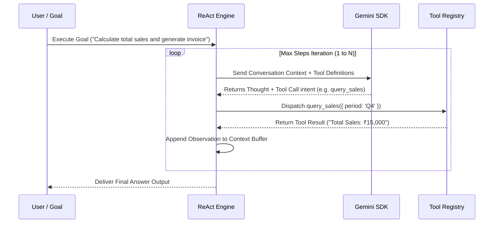

# File 01: ReAct Execution Loop Engine (`src/agent/react-loop.js`)

## Overview
The **ReAct Execution Loop Engine** drives autonomous problem-solving by repeatedly evaluating model output, extracting **Thought** reasoning and **Action** tool call intents, executing requested tools via the Tool Registry, and appending **Observation** results back into the conversation context.

---

## 1. ReAct Execution Step Cycle



---

## 2. ReAct Engine Implementation (`src/agent/react-loop.js`)

```javascript
import { toolRegistry } from "../tools/registry.js";
import { TOOL_DEFINITIONS } from "../tools/definitions.js";

export class ReActAgentEngine {
    constructor(model, maxSteps = 10) {
        this.model = model;
        this.maxSteps = maxSteps;
    }

    async run(goal, contextManager) {
        console.log(`[AGENT RUN] Processing Goal: "${goal}"`);
        contextManager.addMessage("user", goal);

        for (let step = 1; step <= this.maxSteps; step++) {
            console.log(`\n=== ReAct Iteration ${step}/${this.maxSteps} ===`);

            // 1. Call LLM with current context & tool declarations
            const response = await this.model.generateContent({
                contents: contextManager.getMessages(),
                tools: [{ functionDeclarations: Object.values(TOOL_DEFINITIONS) }]
            });

            const candidate = response.response.candidates[0];
            const functionCalls = candidate.content.parts.filter(p => p.functionCall);

            // 2. Check if model decided to call a tool (Action)
            if (functionCalls.length > 0) {
                const call = functionCalls[0].functionCall;
                console.log(`[ACTION SELECTED] Tool: ${call.name}, Args: ${JSON.stringify(call.args)}`);

                // Execute tool via Registry
                const toolResult = await toolRegistry.execute(call.name, call.args);
                console.log(`[OBSERVATION] Result: ${JSON.stringify(toolResult)}`);

                // Append Action & Observation to context history
                contextManager.addToolCallAndResponse(call.name, call.args, toolResult);
            } else {
                // No function call returned -> Model arrived at Final Answer!
                const textOutput = candidate.content.parts.map(p => p.text).join("");
                console.log(`[FINAL ANSWER] Goal completed.`);
                contextManager.addMessage("model", textOutput);
                return textOutput;
            }
        }

        throw new Error(`[AGENT ERROR] Exceeded maximum step limit of ${this.maxSteps}`);
    }
}
```

---

## Key Takeaways
1. Interleaves **Reasoning (Thought)**, **Action (Tool Call)**, and **Feedback (Observation)**.
2. Stops automatically when the model generates text without requesting further tool calls.
3. Protected by a **`maxSteps` safety limit**.
