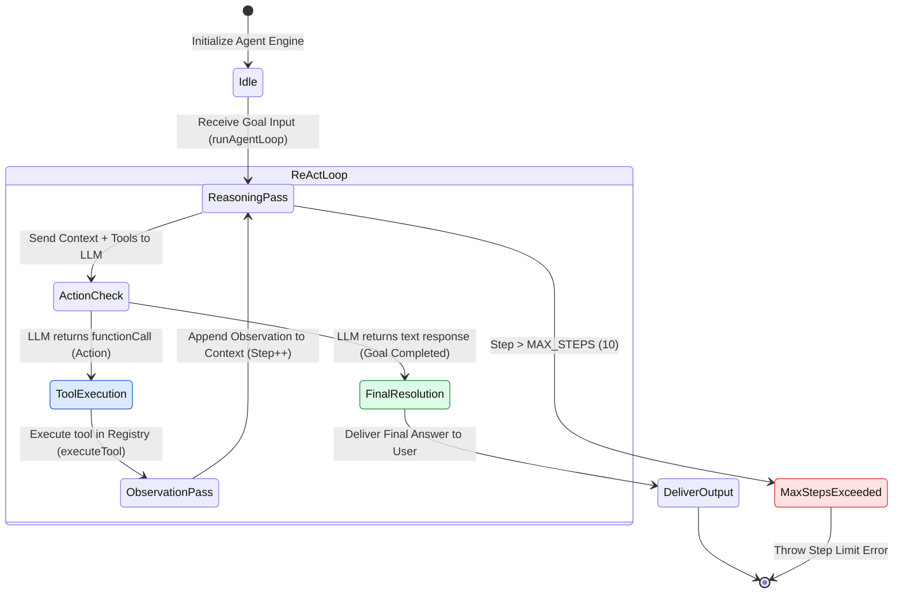
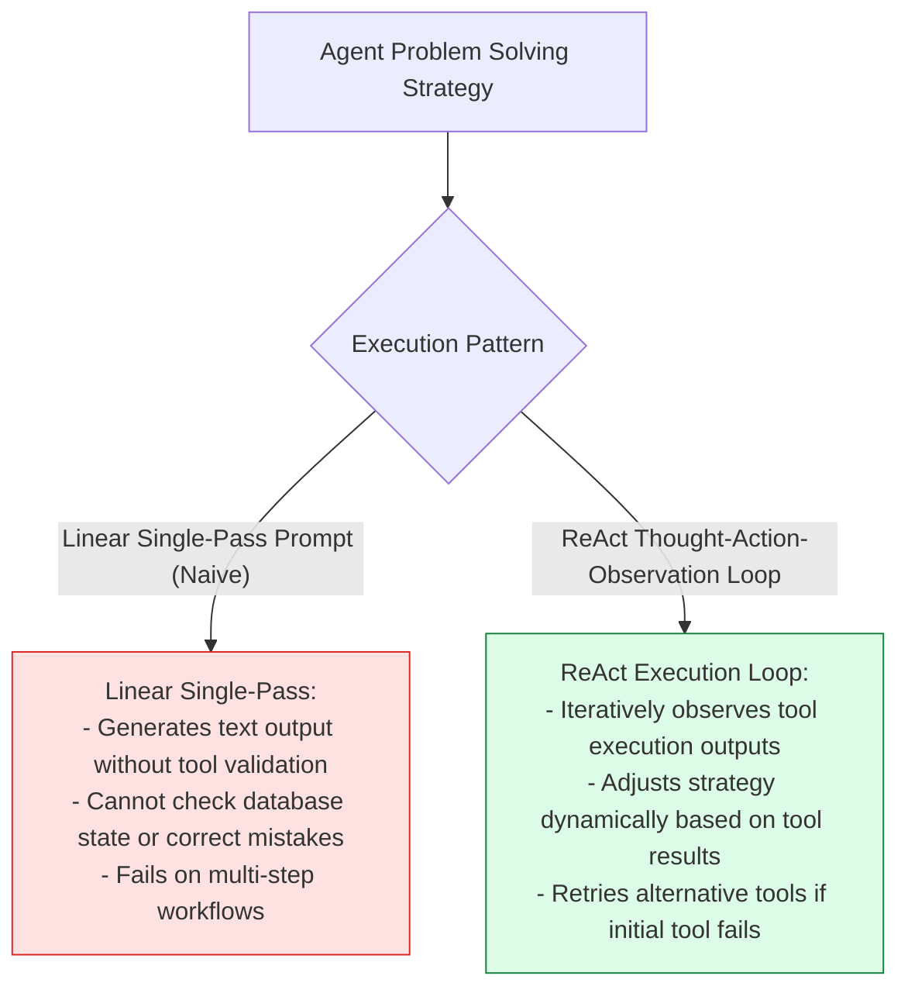
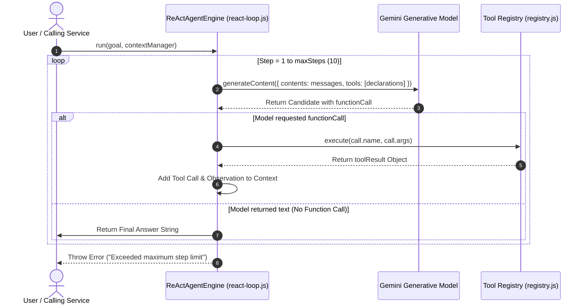

# Module 01: ReAct Execution Loop Engine & State Machine (`src/agent/react-loop.js`)

## Overview

Autonomous AI agents achieve complex problem-solving capabilities by dynamically interleaving natural language reasoning with tool execution. The **ReAct Execution Loop Engine** drives autonomous problem-solving by repeatedly evaluating model output, extracting **Thought** reasoning and **Action** tool call intents (`functionCall`), executing requested tools via the **Tool Registry**, and appending **Observation** results back into the conversation context history until a final resolution is reached.

Understanding **ReAct State Transitions**, **Function Call Extraction Mechanics**, **Observation Context Appending**, and **Infinite Loop Guards (`maxSteps`)** is essential for backend engineering.

---

## 1. ReAct Execution Loop State Machine Topology



---

## 2. Linear Script vs. ReAct Dynamic Feedback Cycle



### ReAct Execution Loop State Transition Matrix

| Loop State | Input Signal | Processing Action | Output State Transition |
| :--- | :--- | :--- | :--- |
| **`REASONING`** | Context History + Goal | Calls LLM with function declarations payload. | Passes candidate to `ACTION_CHECK`. |
| **`ACTION_CHECK`** | Candidate Response Parts | Scans parts for `functionCall` objects. | `TOOL_EXECUTION` if tool requested; `FINAL` if text. |
| **`TOOL_EXECUTION`** | Function Name + Args | Dispatches tool call via `toolRegistry.execute()`. | Passes raw result to `OBSERVATION`. |
| **`OBSERVATION`** | Tool Result Payload | Appends Tool Call + Result to Context Manager. | Loops back to `REASONING` (Step + 1). |

---

## 3. Asynchronous ReAct Iteration Sequence



---

## 4. Code Walkthrough (`src/agent/react-loop.js`)

```javascript
import { toolRegistry } from "../tools/registry.js";
import { TOOL_DEFINITIONS } from "../tools/definitions.js";

/**
 * Autonomous ReAct (Reasoning + Acting) Execution Loop Engine
 */
export class ReActAgentEngine {
  /**
   * @param {Object} model - Gemini GenerativeAI Model instance
   * @param {number} maxSteps - Maximum allowed execution iterations (default: 10)
   */
  constructor(model, maxSteps = 10) {
    this.model = model;
    this.maxSteps = maxSteps;
  }

  /**
   * Runs the autonomous ReAct problem-solving loop to accomplish a user goal
   * @param {string} goal - Target user task string
   * @param {Object} contextManager - Context Manager instance tracking conversation history
   * @returns {Promise<string>} Final goal resolution text
   */
  async run(goal, contextManager) {
    if (!goal || typeof goal !== "string") {
      throw new Error("[REACT AGENT ERROR] Goal string is required.");
    }

    console.log(`🚀 [AGENT ENGINE RUN] Initiating goal execution: "${goal}"`);
    contextManager.addMessage("user", goal);

    for (let step = 1; step <= this.maxSteps; step++) {
      console.log(`\n=================================================`);
      console.log(`⚡ [ReAct Iteration ${step} / ${this.maxSteps}] Evaluating current state...`);
      console.log(`=================================================`);

      // 1. Call Gemini LLM with current context history & registered tool declarations
      const response = await this.model.generateContent({
        contents: contextManager.getMessages(),
        tools: [{ functionDeclarations: Object.values(TOOL_DEFINITIONS) }]
      });

      const candidate = response.response.candidates[0];
      if (!candidate || !candidate.content) {
        throw new Error("[REACT AGENT ERROR] Received invalid candidate from LLM.");
      }

      // Extract native function calls from candidate parts
      const functionCalls = candidate.content.parts.filter((p) => p.functionCall);

      // 2. State Branch A: Model selected a Tool Action
      if (functionCalls.length > 0) {
        const call = functionCalls[0].functionCall;
        console.log(`🛠️ [ACTION SELECTED] Tool Name: '${call.name}'`);
        console.log(`   Arguments: ${JSON.stringify(call.args)}`);

        // Execute tool via Registry Dispatcher
        const toolResult = await toolRegistry.execute(call.name, call.args);
        console.log(`👁️ [OBSERVATION] Exec Output: ${JSON.stringify(toolResult)}`);

        // Append Thought Action & Observation Result into Context Manager
        contextManager.addToolCallAndResponse(call.name, call.args, toolResult);
      } else {
        // State Branch B: No function calls returned -> Model completed the task!
        const textOutput = candidate.content.parts.map((p) => p.text).join("").trim();
        console.log(`\n🎉 [FINAL ANSWER RELEASING] Goal successfully resolved.`);
        contextManager.addMessage("model", textOutput);
        return textOutput;
      }
    }

    // Loop Guard Failure: Exceeded max steps without reaching final answer
    throw new Error(`🚨 [AGENT REACTION TIMEOUT] Exceeded maximum step limit of ${this.maxSteps} iterations without goal completion.`);
  }
}
```

---

## Key Production Takeaways

1. **Interleave Thought, Action, & Observation**: Ensure every tool invocation output is immediately appended as an `Observation` back into context so the model can evaluate state before taking the next action.
2. **Enforce `maxSteps` Safeguards**: Always set a strict `maxSteps` loop threshold ($MAX\_STEPS = 10$) to prevent infinite loops from draining API token budgets if a tool continuously returns unexpected errors.
3. **Automatic Task Completion Detection**: Detect goal resolution when the LLM returns plain text without requesting further function calls (`functionCalls.length === 0`).
4. **Decouple Function Declarations from Handlers**: Pass clean JSON schema declarations to `tools: [...]` while dispatching execution to a decoupled Registry instance.


## Learn from the implementation

Use the matching source file as an executable example, not just something to copy. Before running it, state in your own words what data enters the module, what it returns, and which values it changes. Then trace one realistic request from the caller through each function.

Pay special attention to these questions:

- **Data flow:** Which object, array, string, or state value moves between functions? What shape must it have?
- **Control flow:** Which branch, loop, early return, or retry changes the outcome? What condition selects it?
- **Async boundaries:** Where does the code wait for an LLM, database, network, file system, or tool? What should happen if that operation rejects or returns no result?
- **Side effects:** Which lines log information, make an external request, store data, or mutate in-memory state? Keep those distinct from pure calculations.
- **Production limits:** Which assumptions are only safe for a tutorial—for example, in-memory storage, fixed thresholds, approximate token counts, mock data, or a hard-coded batch size?

A useful practice is to change one input at a time and predict the result before executing it. If you can explain why the output changed, when the module should be used, and one way it could fail, you understand the concept rather than only the syntax.
