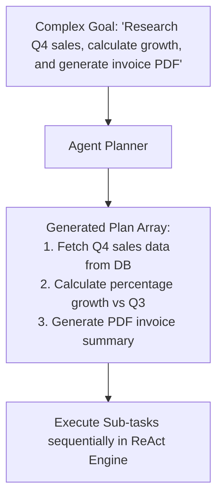

# File 02: Goal Planner & Decomposition Engine (`src/agent/planner.js`)

## Overview
The **Goal Planner** breaks complex user requests into a structured, sequential **Execution Plan** consisting of discrete sub-tasks prior to launching the ReAct loop engine.

---

## 1. Goal Decomposition Flow



---

## 2. Agent Planner Implementation (`src/agent/planner.js`)

```javascript
export class AgentPlanner {
    constructor(model) {
        this.model = model;
    }

    async createPlan(userGoal) {
        console.log(`[PLANNER] Decomposing goal: "${userGoal}"...`);

        const planningPrompt = `
You are an expert AI task planner. Break the following complex user goal into a clear sequence of 2-5 discrete sub-tasks.

GOAL: "${userGoal}"

Return JSON matching schema: { "plan": ["Step 1 description", "Step 2 description", ...] }`;

        try {
            const response = await this.model.generateContent(planningPrompt);
            const text = response.response.text();
            const match = text.match(/\{[\s\S]*\}/);
            const parsed = JSON.parse(match[0]);
            
            console.log(`[PLANNER CREATED] Plan with ${parsed.plan.length} steps.`);
            return parsed.plan;
        } catch (err) {
            console.warn("[PLANNER FALLBACK] Defaulting to single-step execution plan.");
            return [userGoal];
        }
    }
}
```

---

## Key Takeaways
1. Decomposing goals reduces agent drift on multi-step complex tasks.
2. Formats outputs as structured JSON arrays for step-by-step tracking.
