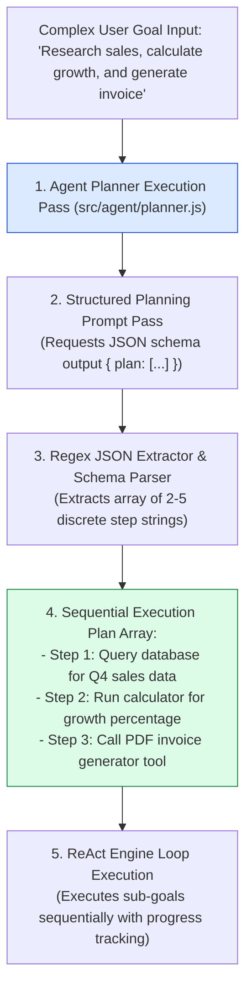
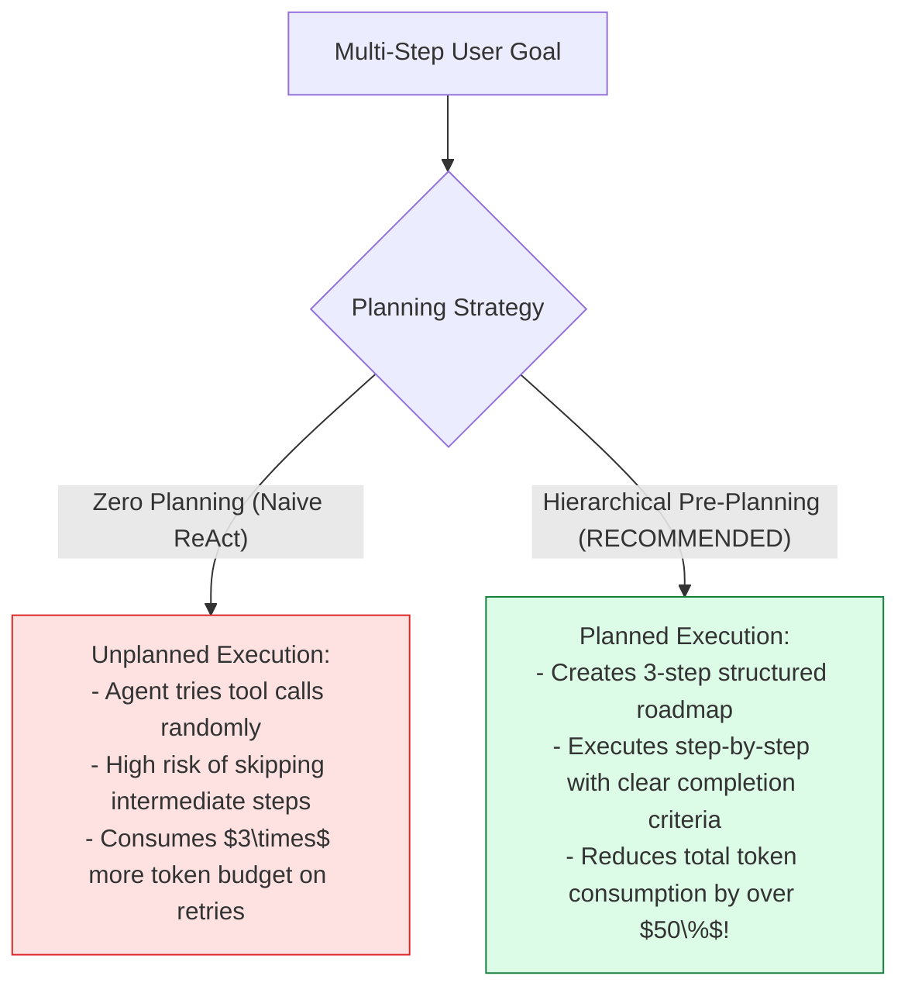
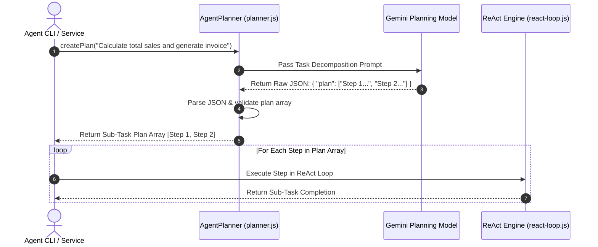

# Module 02: Goal Planner & Task Decomposition Engine (`src/agent/planner.js`)

## Overview

When an autonomous agent receives an ambiguous or multi-step prompt (e.g. *"Audit our database for unpaid invoices, compute total interest, and email summary reports to accounting"*), launching directly into tool execution without prior planning leads to unorganized tool calls, context drift, and wasted tokens. The **Goal Planner** acts as a pre-execution task compiler, calling an LLM planning pass to decompose complex user requests into a structured, sequential **Sub-Task Execution Plan** before passing control to the ReAct execution loop.

Understanding **Hierarchical Task Decomposition**, **JSON Plan Schema Output Envelopes**, **Plan Tracking State**, and **Single-Step Fallback Mechanics** is essential for multi-tool agents.

---

## 1. Goal Planner Task Decomposition Topology



---

## 2. Unplanned Reactive Loops vs. Planned Hierarchical Execution



### Agent Goal Planner Output Schema Specification

| Plan Envelope Field | Data Type | Sample Output Value | Operational Function |
| :--- | :--- | :--- | :--- |
| **`plan`** | `Array<String>` | `["Fetch sales", "Calculate tax", "Gen PDF"]` | Sequential sub-task instructions for ReAct loop. |
| **`stepCount`** | `Number` | `3` | Total number of decomposed sub-goals. |
| **`isDecomposed`** | `Boolean` | `true` | Indicates whether goal was split into multiple sub-tasks. |

---

## 3. Asynchronous Planning & Execution Sequence



---

## 4. Code Walkthrough (`src/agent/planner.js`)

```javascript
/**
 * Goal Planner & Task Decomposition Engine
 */
export class AgentPlanner {
  /**
   * @param {Object} model - Gemini GenerativeAI Model instance
   */
  constructor(model) {
    this.model = model;
  }

  /**
   * Decomposes a complex user goal into a sequential array of discrete sub-tasks
   * @param {string} userGoal - Raw user goal request string
   * @returns {Promise<Array<string>>} Array of sequential sub-task instructions
   */
  async createPlan(userGoal) {
    if (!userGoal || typeof userGoal !== "string") {
      throw new Error("[PLANNER ERROR] User goal string is required.");
    }

    console.log(`⚡ [PLANNER] Decomposing complex user goal: "${userGoal}"...`);

    const planningPrompt = `You are a senior AI System Task Planner. Your job is to break a complex user goal into a clear, logical sequence of 2 to 5 discrete, actionable sub-tasks.

USER GOAL TO DECOMPOSE:
"${userGoal}"

Rules:
1. Each step must be a concise, self-contained sub-goal instruction.
2. Steps must be ordered in logical sequential dependency.
3. Return ONLY a valid JSON object matching this exact schema:
{
  "plan": [
    "Step 1: Description of first sub-task",
    "Step 2: Description of second sub-task"
  ]
}`;

    try {
      const response = await this.model.generateContent(planningPrompt);
      const rawText = response.response.text();

      // Extract JSON object using regex
      const jsonMatch = rawText.match(/\{[\s\S]*\}/);
      if (!jsonMatch) throw new Error("Failed to extract JSON object from planner response.");

      const parsed = JSON.parse(jsonMatch[0]);

      if (!Array.isArray(parsed.plan) || parsed.plan.length === 0) {
        throw new Error("Parsed plan does not contain a valid non-empty 'plan' array.");
      }

      console.log(`✅ [PLANNER] Decomposed goal into ${parsed.plan.length} sequential sub-tasks:`);
      parsed.plan.forEach((step, idx) => console.log(`   Step ${idx + 1}: ${step}`));

      return parsed.plan;
    } catch (err) {
      console.warn("⚠️ [PLANNER FALLBACK] Decomposition pass failed. Falling back to single-step execution:", err.message);
      // Fallback: Treat original goal as a single-step plan
      return [userGoal.trim()];
    }
  }
}
```

---

## Key Production Takeaways

1. **Pre-Decompose Multi-Step Goals**: Run an initial planning pass (`createPlan()`) for complex tasks to generate a structured 2-5 step roadmap before invoking heavy tool-calling loops.
2. **Improves Goal Completion Reliability**: Breaking goals into distinct sub-tasks prevents agents from missing intermediate requirements or getting trapped in tool loops.
3. **Resilient JSON Output Extraction**: Use Regex matching (`/\{[\s\S]*\}/`) to parse JSON plan arrays cleanly from LLM completion text.
4. **Implement Single-Step Fallbacks**: If the planner pass fails or returns invalid JSON, fall back gracefully to treating the original user request as a single-step plan.


## Learn from the implementation

Use the matching source file as an executable example, not just something to copy. Before running it, state in your own words what data enters the module, what it returns, and which values it changes. Then trace one realistic request from the caller through each function.

Pay special attention to these questions:

- **Data flow:** Which object, array, string, or state value moves between functions? What shape must it have?
- **Control flow:** Which branch, loop, early return, or retry changes the outcome? What condition selects it?
- **Async boundaries:** Where does the code wait for an LLM, database, network, file system, or tool? What should happen if that operation rejects or returns no result?
- **Side effects:** Which lines log information, make an external request, store data, or mutate in-memory state? Keep those distinct from pure calculations.
- **Production limits:** Which assumptions are only safe for a tutorial—for example, in-memory storage, fixed thresholds, approximate token counts, mock data, or a hard-coded batch size?

A useful practice is to change one input at a time and predict the result before executing it. If you can explain why the output changed, when the module should be used, and one way it could fail, you understand the concept rather than only the syntax.
