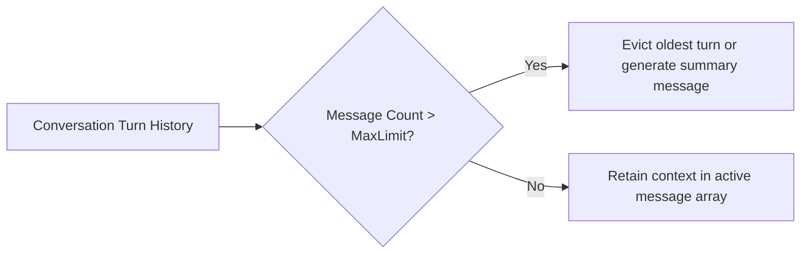

# File 03: Context Manager & Sliding Window (`src/agent/context-manager.js`)

## Overview
The **Context Manager** maintains the in-context conversation turn history sent to the LLM, managing message roles (`user`, `model`, `function`), enforcing **Sliding Window Capacity**, and compacting old messages to prevent Context Window overflows.

---

## 1. Sliding Window Context Compaction



---

## 2. Context Manager Implementation (`src/agent/context-manager.js`)

```javascript
export class ContextManager {
    constructor(maxMessages = 15) {
        this.messages = [];
        this.maxMessages = maxMessages;
    }

    addMessage(role, content) {
        this.messages.push({
            role: role === "model" ? "model" : "user",
            parts: [{ text: content }]
        });
        this._trimContext();
    }

    addToolCallAndResponse(toolName, args, result) {
        // Append Tool Call Intent
        this.messages.push({
            role: "model",
            parts: [{ functionCall: { name: toolName, args } }]
        });

        // Append Tool Response Observation
        this.messages.push({
            role: "user",
            parts: [{ functionResponse: { name: toolName, response: { output: result } } }]
        });
        this._trimContext();
    }

    _trimContext() {
        if (this.messages.length > this.maxMessages) {
            console.log(`[CONTEXT TRIM] Evicting oldest message turn to maintain sliding window.`);
            this.messages.splice(0, 2); // Evict pair of old turns
        }
    }

    getMessages() {
        return this.messages;
    }
}
```

---

## Key Takeaways
1. Formats messages into the exact multi-part structure expected by the Gemini SDK.
2. Trims message turns to stay within model limits.
