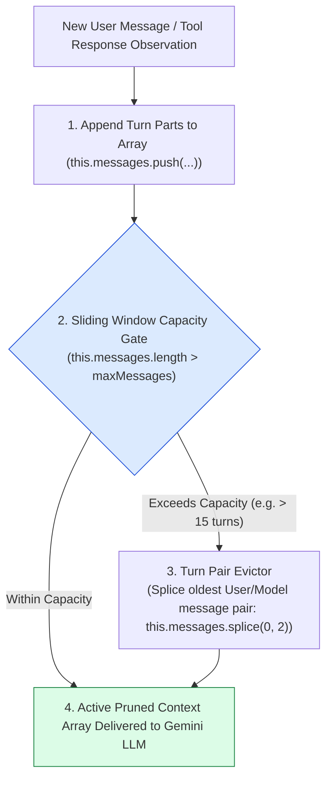
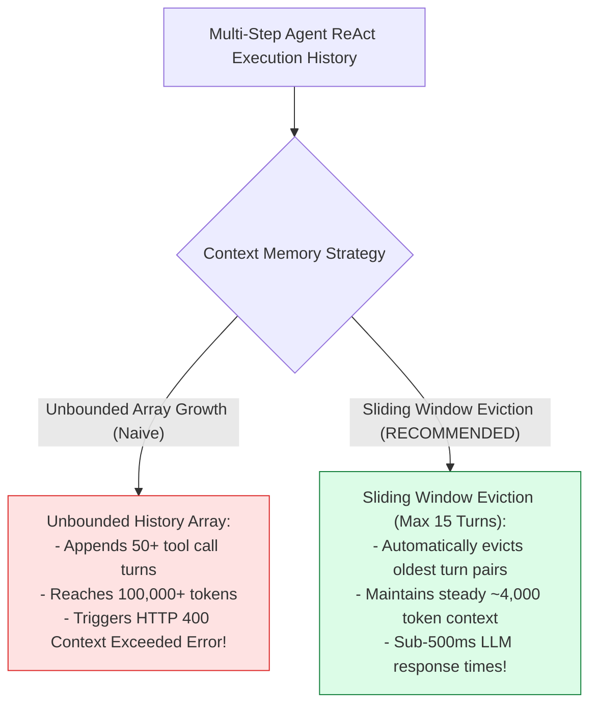
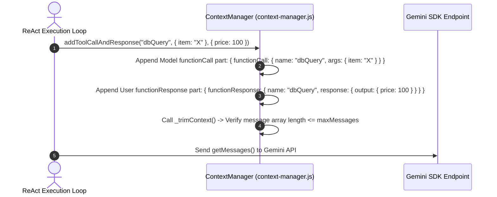

# Module 03: Context Manager & Sliding Window Compaction (`src/agent/context-manager.js`)

## Overview

During multi-step ReAct execution loops, an agent generates long conversation histories containing system prompts, user goals, intermediate thoughts, tool calls (`functionCall`), and tool observations (`functionResponse`). Allowing context histories to grow indefinitely causes token window overflows and increases LLM latency. The **Context Manager** maintains the active conversation turn history, formats parts into the Gemini SDK schema (`user`, `model`, `functionCall`, `functionResponse`), and enforces **Sliding Window Turn Eviction** to keep context size within token budgets.

Understanding **SDK Multi-Part Schema Formatting**, **Tool Call & Response Pairing**, **Turn Pair Eviction Mechanics**, and **Context Window Summarization** is essential for production agents.

---

## 1. Context Manager Sliding Window Topology



---

## 2. Unbounded Context Growth vs. Sliding Window Eviction



### Context Manager Message Part Schema Matrix

| Part Type | SDK Role Tag | Internal Payload Structure | Purpose in ReAct Pipeline |
| :--- | :--- | :--- | :--- |
| **User Message** | `"user"` | `parts: [{ text: "Goal or prompt text" }]` | Input user request or prompt. |
| **Model Response** | `"model"` | `parts: [{ text: "Thought reasoning" }]` | Final answer text from agent. |
| **Tool Action Intent** | `"model"` | `parts: [{ functionCall: { name, args } }]` | LLM tool execution request. |
| **Tool Observation** | `"user"` | `parts: [{ functionResponse: { name, response } }]` | Executed tool result returned to LLM. |

---

## 3. Asynchronous Tool Pair Appending Sequence



---

## 4. Code Walkthrough (`src/agent/context-manager.js`)

```javascript
/**
 * Context Manager & Sliding Window Compaction Engine
 */
export class ContextManager {
  /**
   * @param {number} maxMessages - Maximum allowed message turns in active window (default: 15)
   */
  constructor(maxMessages = 15) {
    this.messages = []; // Internal array of Gemini SDK message objects
    this.maxMessages = maxMessages;
  }

  /**
   * Appends a text message turn (user or model) into the context history
   */
  addMessage(role, content) {
    if (!content || typeof content !== "string") return;

    this.messages.push({
      role: role === "model" ? "model" : "user",
      parts: [{ text: content.trim() }]
    });

    this._trimContext();
  }

  /**
   * Appends paired Tool Action (functionCall) and Observation (functionResponse) turns
   * @param {string} toolName - Name of the executed tool
   * @param {Object} args - Arguments passed to the tool
   * @param {Object} result - Execution output returned by the tool
   */
  addToolCallAndResponse(toolName, args, result) {
    // Step 1: Append Tool Action Intent from Model
    this.messages.push({
      role: "model",
      parts: [{ functionCall: { name: toolName, args: args || {} } }]
    });

    // Step 2: Append Tool Observation Result from User/Tool environment
    this.messages.push({
      role: "user",
      parts: [
        {
          functionResponse: {
            name: toolName,
            response: { output: result }
          }
        }
      ]
    });

    this._trimContext();
  }

  /**
   * Enforces sliding window turn eviction when message count exceeds maxMessages limit
   */
  _trimContext() {
    if (this.messages.length > this.maxMessages) {
      console.log(`🧹 [CONTEXT MANAGER] Trimming context history (${this.messages.length} > ${this.maxMessages}). Evicting oldest turn pair.`);
      // Evict oldest user-model message pair to preserve conversation turn alignment
      this.messages.splice(0, 2);
    }
  }

  /**
   * Returns current formatted message array for Gemini SDK generation requests
   */
  getMessages() {
    return this.messages;
  }

  /**
   * Returns message count in active context window
   */
  size() {
    return this.messages.length;
  }

  /**
   * Clears context history
   */
  clear() {
    this.messages = [];
  }
}
```

---

## Key Production Takeaways

1. **Format Tool Calls Exactly to Gemini SDK Specifications**: Ensure `functionCall` turns use `role: "model"` and `functionResponse` observations use `role: "user"` to prevent API payload validation errors.
2. **Evict Messages in Even Turn Pairs**: Always evict messages in pairs (`this.messages.splice(0, 2)`) to maintain strict user-model conversational alignment.
3. **Cap Context Length with Sliding Windows**: Use sliding window caps (`maxMessages = 15`) to keep active LLM requests fast and within model context token budgets.
4. **Decouple Context Tracking from Agent Engine**: Maintain a dedicated `ContextManager` class to cleanly isolate message formatting and history pruning from core execution loops.


## Learn from the implementation

Use the matching source file as an executable example, not just something to copy. Before running it, state in your own words what data enters the module, what it returns, and which values it changes. Then trace one realistic request from the caller through each function.

Pay special attention to these questions:

- **Data flow:** Which object, array, string, or state value moves between functions? What shape must it have?
- **Control flow:** Which branch, loop, early return, or retry changes the outcome? What condition selects it?
- **Async boundaries:** Where does the code wait for an LLM, database, network, file system, or tool? What should happen if that operation rejects or returns no result?
- **Side effects:** Which lines log information, make an external request, store data, or mutate in-memory state? Keep those distinct from pure calculations.
- **Production limits:** Which assumptions are only safe for a tutorial—for example, in-memory storage, fixed thresholds, approximate token counts, mock data, or a hard-coded batch size?

A useful practice is to change one input at a time and predict the result before executing it. If you can explain why the output changed, when the module should be used, and one way it could fail, you understand the concept rather than only the syntax.
