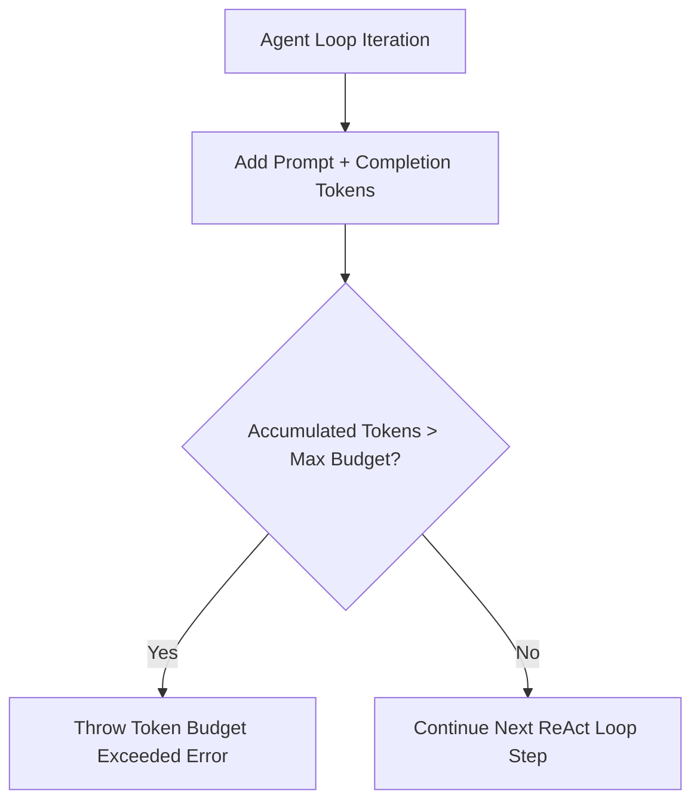

# File 04: Token Budget Manager (`src/agent/token-budget.js`)

## Overview
The **Token Budget Manager** tracks accumulated token consumption across an agent execution session, enforcing strict max token budgets to prevent runaway financial costs or infinite loop traps.

---

## 1. Token Budget Execution Interception



---

## 2. Token Budget Manager Implementation (`src/agent/token-budget.js`)

```javascript
export class TokenBudgetManager {
    constructor(maxTokenBudget = 20000) {
        this.maxTokenBudget = maxTokenBudget;
        this.usedTokens = 0;
    }

    recordUsage(inputTokens, outputTokens) {
        const costThisStep = inputTokens + outputTokens;
        this.usedTokens += costThisStep;
        console.log(`[TOKEN BUDGET] Used ${costThisStep} tokens. Total: ${this.usedTokens}/${this.maxTokenBudget}`);

        if (this.usedTokens > this.maxTokenBudget) {
            throw new Error(`[BUDGET EXCEEDED] Session exceeded token budget limit of ${this.maxTokenBudget} tokens.`);
        }
    }

    getRemainingBudget() {
        return Math.max(0, this.maxTokenBudget - this.usedTokens);
    }
}
```

---

## Key Takeaways
1. Hard safety limit protecting against infinite loops or runaway API charges.
2. Intercepts execution before exceeding predefined token limits.
