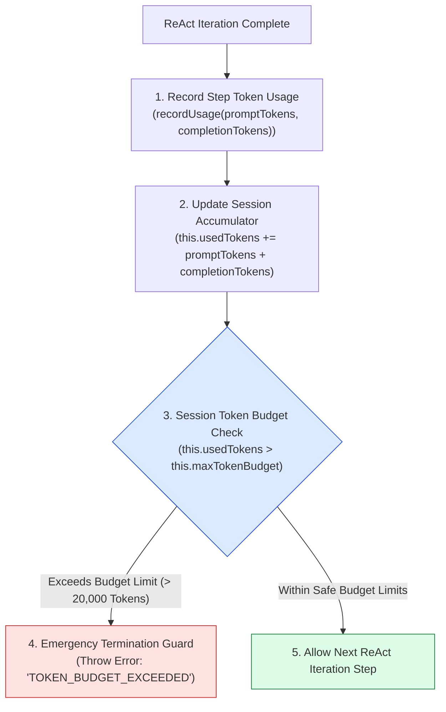
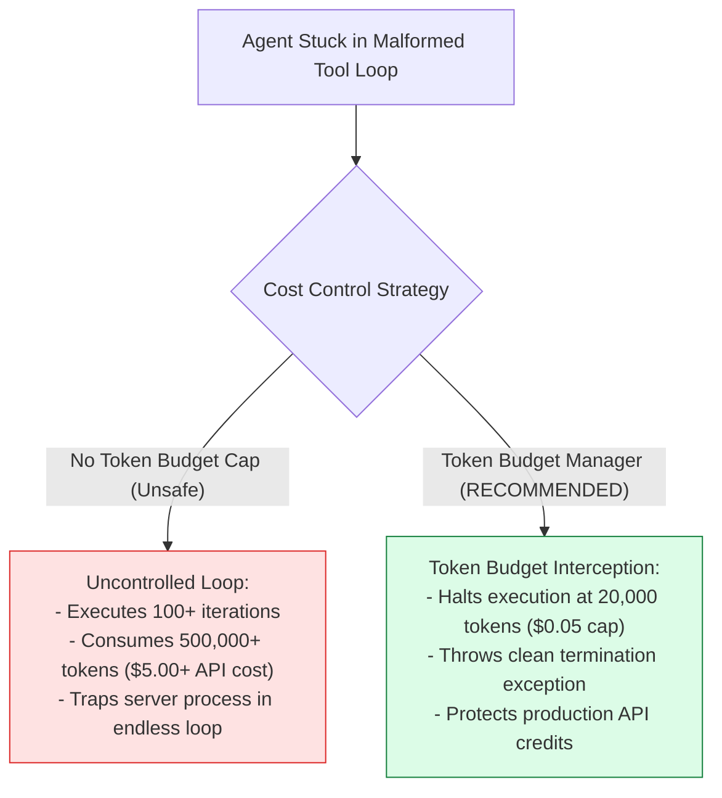
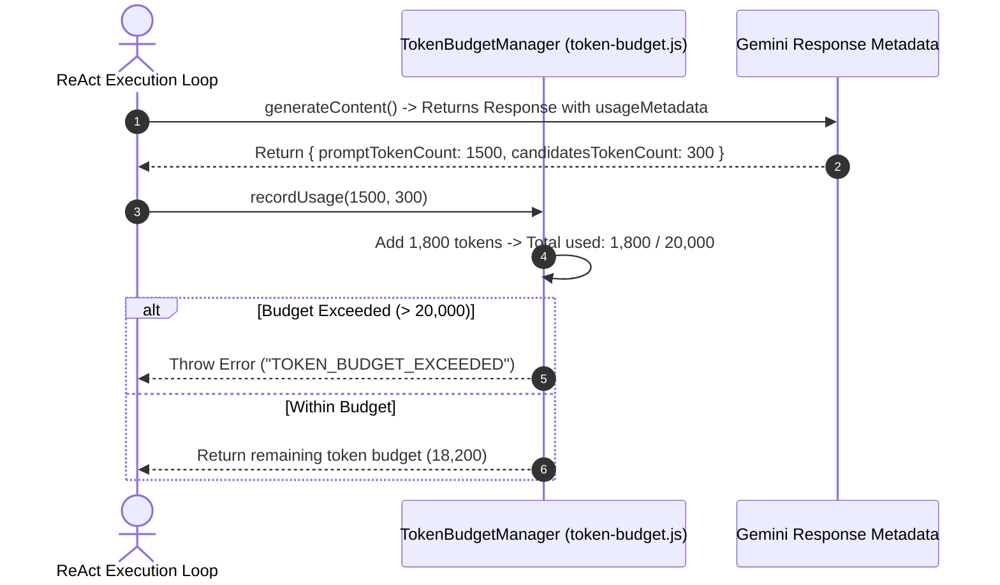

# Module 04: Token Budget Manager & Financial Cost Controls (`src/agent/token-budget.js`)

## Overview

In autonomous agent systems, a model stuck in a retry loop (e.g. attempting to parse a malformed web page or broken tool response) can execute hundreds of iterations, consuming hundreds of thousands of tokens in minutes. The **Token Budget Manager** tracks cumulative input (prompt) and output (completion) token usage across an agent's execution session, enforcing a strict **Session Token Budget Cap** (e.g. 20,000 tokens) that throws an emergency termination exception if the budget is breached.

Understanding **Cumulative Token Accumulation**, **Session Cost Caps**, **Proactive Budget Warnings**, and **Graceful Loop Interception** is essential for financial cost control.

---

## 1. Token Budget Interception Topology



---

## 2. Uncontrolled Agent Loop vs. Token Budget Interception



### Token Budget Manager Metric Reference

| Tracking Metric | Data Type | Default Threshold | Technical Purpose |
| :--- | :--- | :--- | :--- |
| **`maxTokenBudget`** | `Number` | `20,000 Tokens` | Maximum cumulative token allowance for an agent session. |
| **`usedTokens`** | `Number` | Monotonically Increasing | Total prompt + completion tokens consumed so far. |
| **`remainingBudget`** | `Number` | `maxTokenBudget - usedTokens` | Remaining token buffer available for next steps. |
| **`warningThreshold`** | `Number` | $80\%$ of budget | Triggers warning log when context approaches budget limit. |

---

## 3. Asynchronous Token Usage Tracking Sequence



---

## 4. Code Walkthrough (`src/agent/token-budget.js`)

```javascript
/**
 * Token Budget Manager & Financial Cost Control System
 */
export class TokenBudgetManager {
  /**
   * @param {number} maxTokenBudget - Session token limit cap (default: 20000)
   */
  constructor(maxTokenBudget = 20000) {
    this.maxTokenBudget = maxTokenBudget;
    this.usedTokens = 0;
  }

  /**
   * Records prompt and completion token usage for an execution step
   * @param {number} inputTokens - Prompt tokens consumed
   * @param {number} outputTokens - Completion tokens generated
   */
  recordUsage(inputTokens = 0, outputTokens = 0) {
    const costThisStep = Number(inputTokens) + Number(outputTokens);
    this.usedTokens += costThisStep;

    const remaining = this.getRemainingBudget();
    const usagePct = ((this.usedTokens / this.maxTokenBudget) * 100).toFixed(1);

    console.log(`📊 [TOKEN BUDGET] Step Cost: +${costThisStep} tokens | Total Used: ${this.usedTokens} / ${this.maxTokenBudget} (${usagePct}%) | Remaining: ${remaining}`);

    // Warning check at 80% capacity
    if (this.usedTokens >= this.maxTokenBudget * 0.8 && this.usedTokens < this.maxTokenBudget) {
      console.warn(`⚠️ [TOKEN BUDGET WARNING] Agent has consumed ${usagePct}% of its total session token budget.`);
    }

    // Hard emergency termination guard
    if (this.usedTokens > this.maxTokenBudget) {
      console.error(`🚨 [TOKEN BUDGET EXCEEDED] Session breached limit of ${this.maxTokenBudget} tokens.`);
      throw new Error(`[TOKEN_BUDGET_EXCEEDED] Agent session breached maximum token budget limit of ${this.maxTokenBudget} tokens.`);
    }
  }

  /**
   * Returns remaining available token budget
   */
  getRemainingBudget() {
    return Math.max(0, this.maxTokenBudget - this.usedTokens);
  }

  /**
   * Resets session token tracker
   */
  reset() {
    this.usedTokens = 0;
  }
}
```

---

## Key Production Takeaways

1. **Enforce Hard Session Token Caps**: Always track cumulative token consumption (`usedTokens`) across agent iterations to prevent runaway loops from incurring unexpected cloud API costs.
2. **Throw Immediate Termination Exceptions**: Throw an explicit error (`TOKEN_BUDGET_EXCEEDED`) when session limits are breached to instantly halt execution loops.
3. **Issue Early Warning Telemetry Logs**: Log warning alerts when token usage crosses $80\%$ of budget capacity to warn developers during development testing.
4. **Expose Remaining Budget Metrics**: Use `getRemainingBudget()` to inform context compaction logic when token space is running low.


## Learn from the implementation

Use the matching source file as an executable example, not just something to copy. Before running it, state in your own words what data enters the module, what it returns, and which values it changes. Then trace one realistic request from the caller through each function.

Pay special attention to these questions:

- **Data flow:** Which object, array, string, or state value moves between functions? What shape must it have?
- **Control flow:** Which branch, loop, early return, or retry changes the outcome? What condition selects it?
- **Async boundaries:** Where does the code wait for an LLM, database, network, file system, or tool? What should happen if that operation rejects or returns no result?
- **Side effects:** Which lines log information, make an external request, store data, or mutate in-memory state? Keep those distinct from pure calculations.
- **Production limits:** Which assumptions are only safe for a tutorial—for example, in-memory storage, fixed thresholds, approximate token counts, mock data, or a hard-coded batch size?

A useful practice is to change one input at a time and predict the result before executing it. If you can explain why the output changed, when the module should be used, and one way it could fail, you understand the concept rather than only the syntax.
