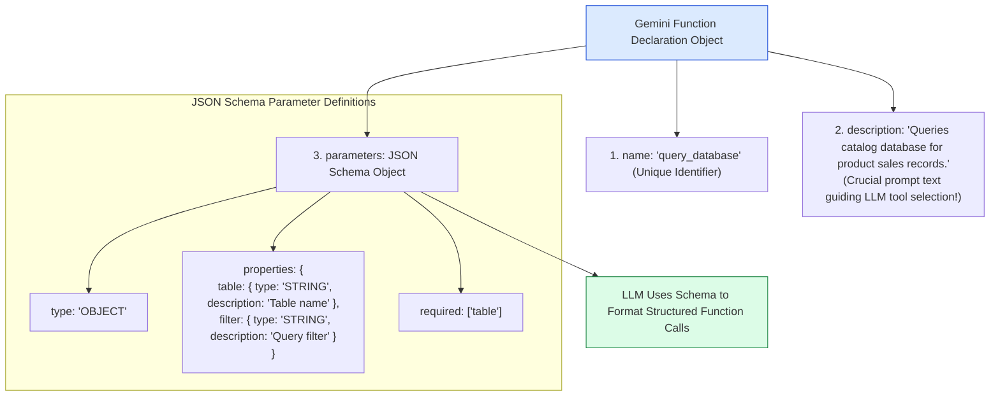
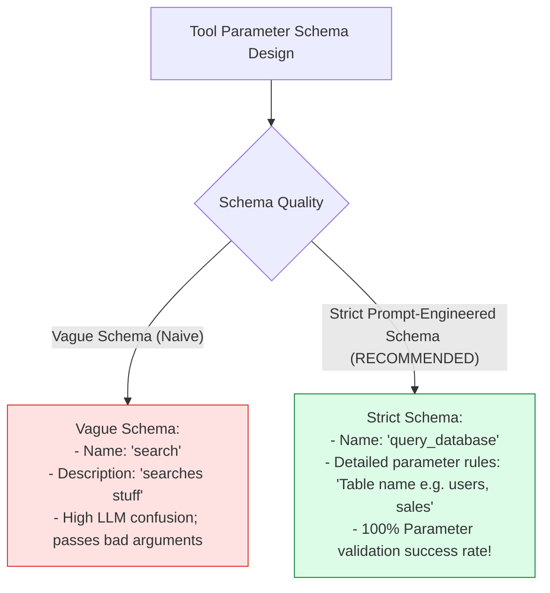
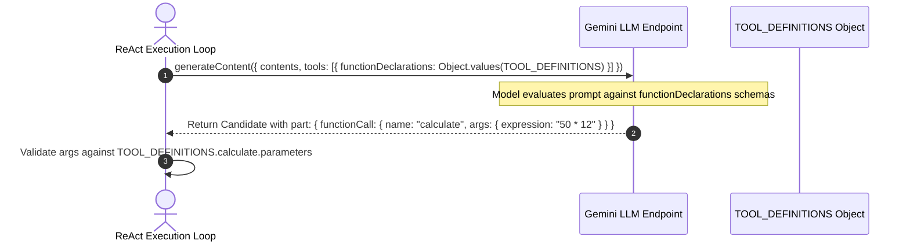

# Module 05: Tool Declarations & OpenAPI Function Schemas (`src/tools/definitions.js`)

## Overview

For an LLM to accurately decide when and how to call external code functions, it requires precise structural metadata describing each tool's name, functional purpose, expected parameter data types, and required properties. **Tool Definitions** provide JSON Schema declarations for functions exposed to the LLM (including `web_search`, `calculate`, `query_database`, `read_file`, and `create_invoice`), defining exact parameter bounds so the Gemini model can construct valid function call objects (`functionCall`).

Understanding **Gemini Function Declaration Schemas**, **OpenAPI Type Mapping**, **Prompt Engineering in Parameter Descriptions**, and **Required Parameter Constraints** is essential for agent reliability.

---

## 1. Tool Declaration JSON Schema Topology



---

## 2. Weak Schema Descriptions vs. Strict Prompt-Engineered Schemas



### Agent Toolset Parameter Declaration Matrix

| Tool Name | Parameter Keys | Data Type | Required? | Parameter Description |
| :--- | :--- | :--- | :--- | :--- |
| **`web_search`** | `query` | `STRING` | Yes | Realtime Google web search query string. |
| **`calculate`** | `expression` | `STRING` | Yes | Mathematical arithmetic expression string (`"150 * 0.18"`). |
| **`query_database`** | `table`, `filter` | `STRING` | Table Yes | Target database table name and filter clause. |
| **`read_file`** | `filePath` | `STRING` | Yes | Path to local text document file on disk. |
| **`create_invoice`** | `customerName`, `amount` | `STRING`, `NUMBER` | Both Yes | Customer billing name and total amount float. |

---

## 3. Schema Declaration to Function Call Resolution Sequence



---

## 4. Code Walkthrough (`src/tools/definitions.js`)

```javascript
/**
 * OpenAPI-Compliant JSON Schema Declarations for Agent Toolset
 * Passed directly to Gemini SDK's `tools: [{ functionDeclarations: [...] }]`
 */
export const TOOL_DEFINITIONS = {
  web_search: {
    name: "web_search",
    description: "Search Google and web search engines for realtime news, current prices, or factual web information.",
    parameters: {
      type: "OBJECT",
      properties: {
        query: {
          type: "STRING",
          description: "Search query keywords (e.g. 'current USD to INR rate' or 'latest tech news')"
        }
      },
      required: ["query"]
    }
  },

  calculate: {
    name: "calculate",
    description: "Evaluates mathematical arithmetic expressions using standard operations (+, -, *, /, %).",
    parameters: {
      type: "OBJECT",
      properties: {
        expression: {
          type: "STRING",
          description: "Valid mathematical expression string (e.g. '150 * 0.18' or '(1200 + 450) / 2')"
        }
      },
      required: ["expression"]
    }
  },

  query_database: {
    name: "query_database",
    description: "Queries the local enterprise database collection for sales, customer, or inventory records.",
    parameters: {
      type: "OBJECT",
      properties: {
        table: {
          type: "STRING",
          description: "Target database collection name (e.g. 'products', 'users', 'sales')"
        },
        filter: {
          type: "STRING",
          description: "Optional key-value filter string (e.g. 'category=electronics' or 'status=active')"
        }
      },
      required: ["table"]
    }
  },

  read_file: {
    name: "read_file",
    description: "Reads the raw UTF-8 text contents of a local document file from disk.",
    parameters: {
      type: "OBJECT",
      properties: {
        filePath: {
          type: "STRING",
          description: "Relative or absolute file path to read (e.g. 'data/sample-docs/calculus.txt')"
        }
      },
      required: ["filePath"]
    }
  },

  create_invoice: {
    name: "create_invoice",
    description: "Generates a structured customer billing invoice record and calculates taxes.",
    parameters: {
      type: "OBJECT",
      properties: {
        customerName: {
          type: "STRING",
          description: "Full billing name of the customer"
        },
        amount: {
          type: "NUMBER",
          description: "Total invoice billing amount float in USD"
        },
        items: {
          type: "STRING",
          description: "Comma-separated list of purchased item names"
        }
      },
      required: ["customerName", "amount"]
    }
  }
};
```

---

## Key Production Takeaways

1. **Write Detailed Parameter Descriptions**: Parameter descriptions serve as inline prompt text for the LLM; include concrete examples (`e.g. '150 * 0.18'`) to guide accurate formatting.
2. **Strict Parameter Data Typing**: Specify exact OpenAPI schema types (`STRING`, `NUMBER`, `BOOLEAN`, `ARRAY`) so the LLM casts argument types properly.
3. **Explicit Required Properties Array**: Always populate the `required: [...]` array so the LLM never omits mandatory arguments required by local JavaScript handlers.
4. **Decouple Declarations from Execution Logic**: Store schema declarations in a dedicated file (`src/tools/definitions.js`) so both the LLM call setup and Registry schema validators use the same source of truth.


## Learn from the implementation

Use the matching source file as an executable example, not just something to copy. Before running it, state in your own words what data enters the module, what it returns, and which values it changes. Then trace one realistic request from the caller through each function.

Pay special attention to these questions:

- **Data flow:** Which object, array, string, or state value moves between functions? What shape must it have?
- **Control flow:** Which branch, loop, early return, or retry changes the outcome? What condition selects it?
- **Async boundaries:** Where does the code wait for an LLM, database, network, file system, or tool? What should happen if that operation rejects or returns no result?
- **Side effects:** Which lines log information, make an external request, store data, or mutate in-memory state? Keep those distinct from pure calculations.
- **Production limits:** Which assumptions are only safe for a tutorial—for example, in-memory storage, fixed thresholds, approximate token counts, mock data, or a hard-coded batch size?

A useful practice is to change one input at a time and predict the result before executing it. If you can explain why the output changed, when the module should be used, and one way it could fail, you understand the concept rather than only the syntax.
