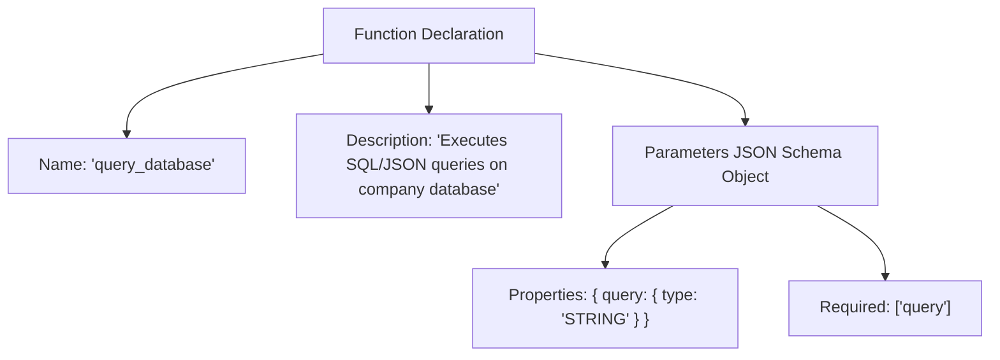

# File 05: Tool Declarations & Schemas (`src/tools/definitions.js`)

## Overview
**Tool Definitions** provide JSON Schema declarations for functions exposed to the LLM (e.g. `web_search`, `calculate`, `query_database`, `read_file`, `create_invoice`), defining parameter names, types, descriptions, and required fields.

---

## 1. Tool Declaration JSON Schema Structure



---

## 2. Tool Definitions Implementation (`src/tools/definitions.js`)

```javascript
export const TOOL_DEFINITIONS = {
    web_search: {
        name: "web_search",
        description: "Search Google/Web for realtime information or news",
        parameters: {
            type: "OBJECT",
            properties: {
                query: { type: "STRING", description: "Search query string" }
            },
            required: ["query"]
        }
    },
    calculate: {
        name: "calculate",
        description: "Perform mathematical calculations (evaluates arithmetic expressions)",
        parameters: {
            type: "OBJECT",
            properties: {
                expression: { type: "STRING", description: "Mathematical expression e.g. '150 * 0.18'" }
            },
            required: ["expression"]
        }
    },
    query_database: {
        name: "query_database",
        description: "Query company database for customer or sales records",
        parameters: {
            type: "OBJECT",
            properties: {
                table: { type: "STRING", description: "Table name e.g. 'users', 'sales'" },
                filter: { type: "STRING", description: "Filter criteria e.g. 'status=active'" }
            },
            required: ["table"]
        }
    },
    read_file: {
        name: "read_file",
        description: "Read text contents of a local file",
        parameters: {
            type: "OBJECT",
            properties: {
                filePath: { type: "STRING", description: "Relative or absolute file path" }
            },
            required: ["filePath"]
        }
    },
    create_invoice: {
        name: "create_invoice",
        description: "Generate a PDF invoice for a customer order",
        parameters: {
            type: "OBJECT",
            properties: {
                customerName: { type: "STRING" },
                amount: { type: "NUMBER" },
                items: { type: "STRING", description: "Comma-separated list of items" }
            },
            required: ["customerName", "amount"]
        }
    }
};
```

---

## Key Takeaways
1. Formatted according to OpenAPI / Gemini function declaration schemas.
2. Clear parameter descriptions are essential for guiding accurate LLM tool call selection.
