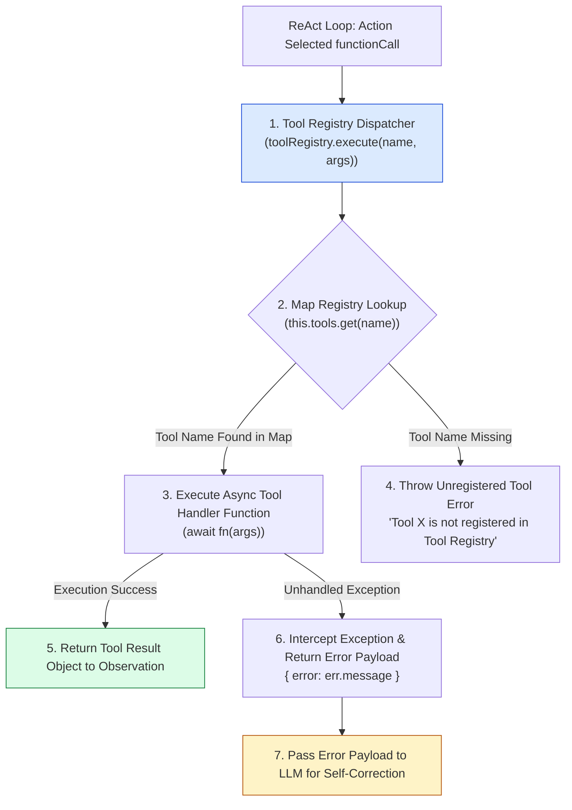
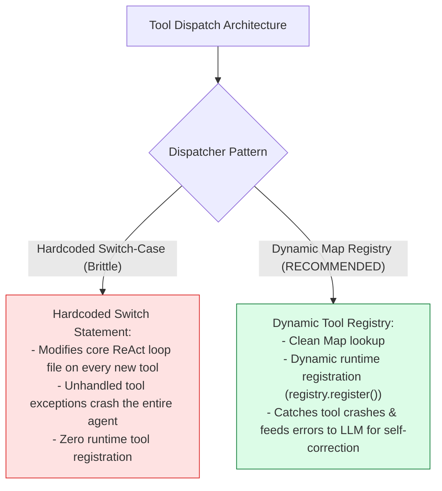
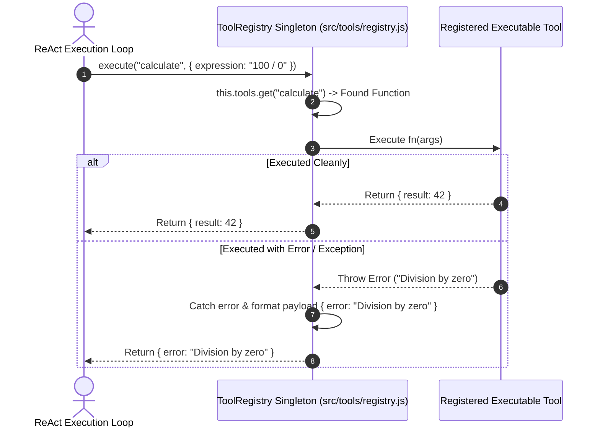

# Module 06: Tool Registry & Dynamic Dispatcher Pattern (`src/tools/registry.js`)

## Overview

In enterprise agent systems, hardcoding conditional `switch-case` branches for every executable tool directly inside the core ReAct loop creates brittle, unmaintainable code. The **Tool Registry** implements a centralized **Dispatcher Pattern** that maps string tool names to JavaScript execution handlers (`Map<string, Function>`), validating arguments, intercepting execution errors, and returning structured error payloads to the LLM for self-correction.

Understanding **Dynamic Tool Registration**, **Map Dispatch Lookups**, **Async Exception Interception**, and **LLM Self-Correction Feedback** is essential for extensible agents.

---

## 1. Tool Registry Dispatcher Topology



---

## 2. Hardcoded Switch Statements vs. Dynamic Registry Pattern



### Tool Registry Operational Feature Reference

| Registry Capability | Technical Implementation | Engineering Benefit |
| :--- | :--- | :--- |
| **Tool Registration** | `this.tools.set(name, fn)` | Registers local JavaScript handlers dynamically at boot. |
| **Fast Lookup** | `this.tools.get(name)` | Instant $O(1)$ tool handler lookup performance. |
| **Exception Catching** | `try { ... } catch (err)` | Prevents external tool failures from crashing the agent process. |
| **Self-Correction Feedback** | `{ error: err.message }` | Allows the LLM to inspect the error and retry with valid arguments. |

---

## 3. Asynchronous Tool Dispatch Sequence



---

## 4. Code Walkthrough (`src/tools/registry.js`)

```javascript
/**
 * Centralized Tool Registry & Dispatcher Class
 */
class ToolRegistry {
  constructor() {
    this.tools = new Map(); // Internal map mapping tool name strings to handler functions
  }

  /**
   * Registers a tool execution handler function under a unique name
   * @param {string} name - Unique tool name string (must match definition schema name)
   * @param {Function} fn - Async execution handler function
   */
  register(name, fn) {
    if (!name || typeof fn !== "function") {
      throw new Error(`[TOOL REGISTRY ERROR] Invalid registration arguments for tool '${name}'.`);
    }

    this.tools.set(name, fn);
    console.log(`🔧 [TOOL REGISTRY] Registered tool function: '${name}'`);
  }

  /**
   * Dispatches and executes a registered tool function with arguments
   * @param {string} name - Name of the tool to execute
   * @param {Object} args - Arguments object supplied by the LLM
   * @returns {Promise<Object>} Execution result object or caught error payload
   */
  async execute(name, args = {}) {
    const fn = this.tools.get(name);

    if (!fn) {
      console.warn(`🚨 [TOOL REGISTRY REJECT] Requested tool '${name}' is not registered in Tool Registry.`);
      return {
        error: `Tool '${name}' is not registered in Tool Registry. Available tools: ${Array.from(this.tools.keys()).join(", ")}`
      };
    }

    try {
      console.log(`⚡ [TOOL EXECUTION START] Executing '${name}' with args: ${JSON.stringify(args)}`);
      const startTime = Date.now();

      const result = await fn(args);

      const durationMs = Date.now() - startTime;
      console.log(`✅ [TOOL EXECUTION SUCCESS] '${name}' completed in ${durationMs}ms.`);
      return result;
    } catch (err) {
      console.error(`🚨 [TOOL EXECUTION ERROR] '${name}' threw exception:`, err.message);
      // Return error payload to LLM so it can attempt self-correction in next iteration
      return {
        error: `Tool '${name}' failed during execution: ${err.message}`,
        toolName: name
      };
    }
  }

  /**
   * Returns list of registered tool names
   */
  getRegisteredTools() {
    return Array.from(this.tools.keys());
  }
}

// Export shared singleton instance
export const toolRegistry = new ToolRegistry();
```

---

## Key Production Takeaways

1. **Decouple Tool Handlers from Core ReAct Engine**: Use a central `ToolRegistry` instance to isolate tool execution logic from the main ReAct loop engine.
2. **Catch Tool Exceptions for Self-Correction**: Always wrap tool execution in `try-catch` blocks and return formatted error payloads (`{ error: err.message }`) so the LLM can inspect what went wrong and retry.
3. **Export a Shared Singleton Instance**: Export `export const toolRegistry = new ToolRegistry()` to ensure tool definitions registered across modules are available system-wide.
4. **Log Detailed Telemetry Timings**: Log tool execution start times, argument payloads, and completion durations (`durationMs`) for operational monitoring.


## Learn from the implementation

Use the matching source file as an executable example, not just something to copy. Before running it, state in your own words what data enters the module, what it returns, and which values it changes. Then trace one realistic request from the caller through each function.

Pay special attention to these questions:

- **Data flow:** Which object, array, string, or state value moves between functions? What shape must it have?
- **Control flow:** Which branch, loop, early return, or retry changes the outcome? What condition selects it?
- **Async boundaries:** Where does the code wait for an LLM, database, network, file system, or tool? What should happen if that operation rejects or returns no result?
- **Side effects:** Which lines log information, make an external request, store data, or mutate in-memory state? Keep those distinct from pure calculations.
- **Production limits:** Which assumptions are only safe for a tutorial—for example, in-memory storage, fixed thresholds, approximate token counts, mock data, or a hard-coded batch size?

A useful practice is to change one input at a time and predict the result before executing it. If you can explain why the output changed, when the module should be used, and one way it could fail, you understand the concept rather than only the syntax.
