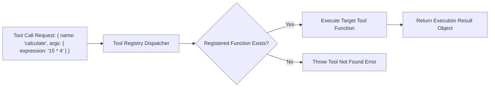

# File 06: Tool Registry & Dispatcher (`src/tools/registry.js`)

## Overview
The **Tool Registry** is a centralized dispatcher pattern that maps string tool names to JavaScript execution functions, validating arguments before execution.

---

## 1. Tool Registry Dispatch Flow



---

## 2. Tool Registry Implementation (`src/tools/registry.js`)

```javascript
class ToolRegistry {
    constructor() {
        this.tools = new Map();
    }

    register(name, fn) {
        this.tools.set(name, fn);
        console.log(`[TOOL REGISTRY] Registered tool function: '${name}'`);
    }

    async execute(name, args) {
        const fn = this.tools.get(name);
        if (!fn) {
            throw new Error(`Tool '${name}' is not registered in Tool Registry.`);
        }

        try {
            console.log(`[TOOL EXECUTION START] ${name}(${JSON.stringify(args)})`);
            const result = await fn(args);
            console.log(`[TOOL EXECUTION SUCCESS] ${name}`);
            return result;
        } catch (err) {
            console.error(`[TOOL EXECUTION ERROR] ${name}: ${err.message}`);
            return { error: err.message };
        }
    }
}

export const toolRegistry = new ToolRegistry();
```

---

## Key Takeaways
1. Decouples tool execution logic from the core ReAct agent loop.
2. Catches tool execution errors gracefully, returning error payloads to the LLM for self-correction.
