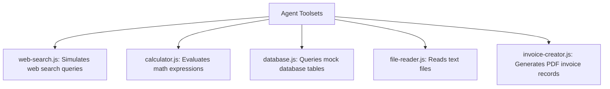

# File 07: Agent Toolsets & Handlers (`src/tools/`)

## Overview
The **Agent Toolsets** contain individual JavaScript handlers for web search (`web-search.js`), mathematical evaluation (`calculator.js`), database queries (`database.js`), file reading (`file-reader.js`), and invoice generation (`invoice-creator.js`).

---

## 1. Toolset Functions Architecture



---

## 2. Toolset Handlers Implementation (`src/tools/`)

### Calculator (`src/tools/calculator.js`)
```javascript
export async function calculateHandler({ expression }) {
    // Safe evaluation of mathematical expressions
    const sanitized = expression.replace(/[^0-9+\-*/(). ]/g, "");
    const result = Function(`"use strict"; return (${sanitized})`)();
    return { expression, result };
}
```

### Database Query (`src/tools/database.js`)
```javascript
import { queryDatabaseMock } from "../db.js";

export async function databaseHandler({ table, filter }) {
    const records = queryDatabaseMock(table, filter);
    return { table, count: records.length, records };
}
```

### Web Search (`src/tools/web-search.js`)
```javascript
export async function webSearchHandler({ query }) {
    return {
        query,
        results: [
            { title: "Search Result 1", snippet: `Information regarding ${query}` },
            { title: "Search Result 2", snippet: `Additional details about ${query}` }
        ]
    };
}
```

---

## Key Takeaways
1. Individual tool handlers are small, focused, pure async functions.
2. Registered with `toolRegistry.register(name, fn)` during application boot.
