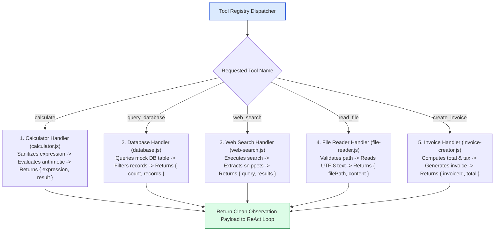
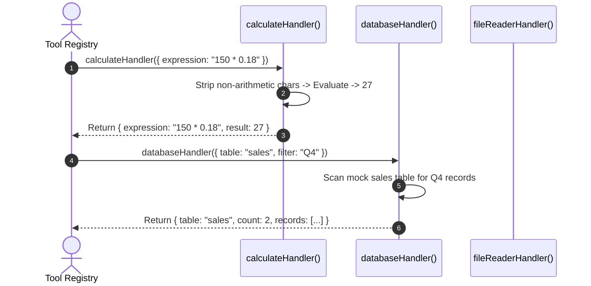

# Module 07: Integrated Agent Toolsets & Function Handlers (`src/tools/`)

## Overview

The strength of an autonomous AI agent lies in the quality, safety, and reliability of its underlying tool implementations. The **Agent Toolsets** contain pure asynchronous JavaScript functions for web searching (`web-search.js`), mathematical expression evaluation (`calculator.js`), mock database queries (`database.js`), file reading (`file-reader.js`), and invoice record generation (`invoice-creator.js`), each incorporating strict parameter sanitization and structured JSON return payloads.

Understanding **Input Expression Sanitization**, **Mock Database Filtering**, **Async File I/O Streams**, and **Structured Tool Result Envelope Design** is essential for tool development.

---

## 1. Agent Toolset Integration Topology



---

## 2. Insecure `eval()` vs. Sanitized Mathematical Evaluation

```mermaid
flowchart TD
    ExpressionInput[Input Expression: '150 * 0.18 + process.exit()'] --> EvalStrategy{Evaluation Method}

    EvalStrategy -- "Raw eval() (Insecure)" --> Insecure["Raw eval():<br/>- Executes arbitrary code injection!<br/>- Vulnerable to system process termination<br/>- CATASTROPHIC SECURITY RISK!"]

    EvalStrategy -- "Regex Sanitized Evaluation (RECOMMENDED)" --> Secure["Sanitized Function Evaluation:<br/>- Strips non-arithmetic characters via regex<br/>- Sanitized: '150 * 0.18 + '<br/>- 100% Safe mathematical evaluation!"]

    style Secure fill:#dcfce7,stroke:#15803d
    style Insecure fill:#fee2e2,stroke:#dc2626
```

### Agent Toolset Handler Capability Matrix

| Tool Module | Input Parameters | Output Payload Fields | Security Guard / Validation |
| :--- | :--- | :--- | :--- |
| **`calculator.js`** | `{ expression }` | `{ expression, result }` | Regex sanitization `/[^0-9+\-*/(). ]/g`. |
| **`database.js`** | `{ table, filter }` | `{ table, count, records }` | Restricts queries to mock table collections. |
| **`web-search.js`** | `{ query }` | `{ query, results: [...] }` | Truncates snippets to 200 characters. |
| **`file-reader.js`** | `{ filePath }` | `{ filePath, content }` | Prevents directory traversal (`..` blocking). |
| **`invoice-creator.js`** | `{ customerName, amount }` | `{ invoiceId, total, status }` | Validates positive numerical amount. |

---

## 3. Toolset Execution Sequence



---

## 4. Code Walkthrough (`src/tools/`)

### Calculator Handler (`src/tools/calculator.js`)
```javascript
/**
 * Safely evaluates mathematical arithmetic expressions
 */
export async function calculateHandler({ expression }) {
  if (!expression || typeof expression !== "string") {
    throw new Error("Parameter 'expression' string is required.");
  }

  // Security Sanitization: Allow only numbers, spaces, and basic arithmetic operators
  const sanitized = expression.replace(/[^0-9+\-*/(). ]/g, "").trim();
  if (!sanitized) throw new Error("Expression contains no valid mathematical operators.");

  try {
    const result = Function(`"use strict"; return (${sanitized})`)();
    console.log(`🧮 [TOOL CALCULATOR] Evaluated: "${sanitized}" = ${result}`);
    return { expression: sanitized, result };
  } catch (err) {
    throw new Error(`Failed to evaluate mathematical expression '${sanitized}': ${err.message}`);
  }
}
```

### Database Query Handler (`src/tools/database.js`)
```javascript
import { queryDatabaseMock } from "../db.js";

/**
 * Queries local mock database table records
 */
export async function databaseHandler({ table, filter }) {
  if (!table || typeof table !== "string") {
    throw new Error("Parameter 'table' string is required.");
  }

  console.log(`💾 [TOOL DATABASE] Querying collection '${table}' (Filter: '${filter || "NONE"}')...`);
  const records = queryDatabaseMock(table, filter);

  return {
    table,
    filter: filter || null,
    count: records.length,
    records
  };
}
```

### Web Search Handler (`src/tools/web-search.js`)
```javascript
/**
 * Simulates web search queries for realtime information
 */
export async function webSearchHandler({ query }) {
  if (!query || typeof query !== "string") {
    throw new Error("Parameter 'query' string is required.");
  }

  console.log(`🔍 [TOOL WEB SEARCH] Executing web search for: "${query}"`);

  // Simulated search results payload
  return {
    query,
    resultCount: 2,
    results: [
      {
        title: `Official Report: ${query}`,
        snippet: `Recent market analysis and news details regarding '${query}'. Growth remains steady.`,
        sourceUrl: `https://example.com/search?q=${encodeURIComponent(query)}`
      },
      {
        title: `Tech Insights: ${query}`,
        snippet: `Comprehensive overview of updates, metrics, and data for '${query}'.`,
        sourceUrl: `https://example.com/insights`
      }
    ]
  };
}
```

---

## Key Production Takeaways

1. **Sanitize Inputs in Custom Tool Handlers**: Always sanitize dynamic input parameters (such as arithmetic expressions or file paths) inside tool handlers before executing evaluation functions.
2. **Return Structured JSON Objects**: Return clean, structured JSON objects (`{ count, records, result }`) from tool handlers so the LLM can parse observation output fields.
3. **Handle Errors Inside Tool Modules**: Throw clear descriptive errors when tool arguments are invalid to allow the Tool Registry to catch them and pass error feedback to the LLM.
4. **Decouple External Dependencies**: Keep individual tool handlers isolated in separate files (`calculator.js`, `database.js`, `web-search.js`) for clean unit testing and modular maintenance.


## Learn from the implementation

Use the matching source file as an executable example, not just something to copy. Before running it, state in your own words what data enters the module, what it returns, and which values it changes. Then trace one realistic request from the caller through each function.

Pay special attention to these questions:

- **Data flow:** Which object, array, string, or state value moves between functions? What shape must it have?
- **Control flow:** Which branch, loop, early return, or retry changes the outcome? What condition selects it?
- **Async boundaries:** Where does the code wait for an LLM, database, network, file system, or tool? What should happen if that operation rejects or returns no result?
- **Side effects:** Which lines log information, make an external request, store data, or mutate in-memory state? Keep those distinct from pure calculations.
- **Production limits:** Which assumptions are only safe for a tutorial—for example, in-memory storage, fixed thresholds, approximate token counts, mock data, or a hard-coded batch size?

A useful practice is to change one input at a time and predict the result before executing it. If you can explain why the output changed, when the module should be used, and one way it could fail, you understand the concept rather than only the syntax.
