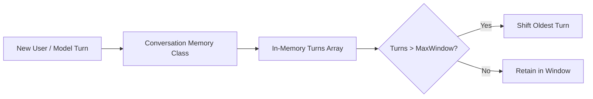

# File 08: Short-Term Conversation Memory (`src/memory/conversation.js`)

## Overview
**Short-Term Conversation Memory** maintains in-memory chat history across multiple user turns within an active session, managing sliding window eviction and summary generation.

---

## 1. Conversation Memory Buffer Flow



---

## 2. Conversation Memory Implementation (`src/memory/conversation.js`)

```javascript
export class ConversationMemory {
    constructor(maxTurns = 10) {
        this.turns = [];
        this.maxTurns = maxTurns;
    }

    addTurn(userText, modelResponse) {
        this.turns.push({
            timestamp: new Date().toISOString(),
            userText,
            modelResponse
        });

        if (this.turns.length > this.maxTurns) {
            this.turns.shift(); // Evict oldest turn
        }
    }

    getHistory() {
        return this.turns;
    }

    clear() {
        this.turns = [];
    }
}
```

---

## Key Takeaways
1. Manages short-term state across user chat turns.
2. Prevents infinite memory growth in active user sessions.
