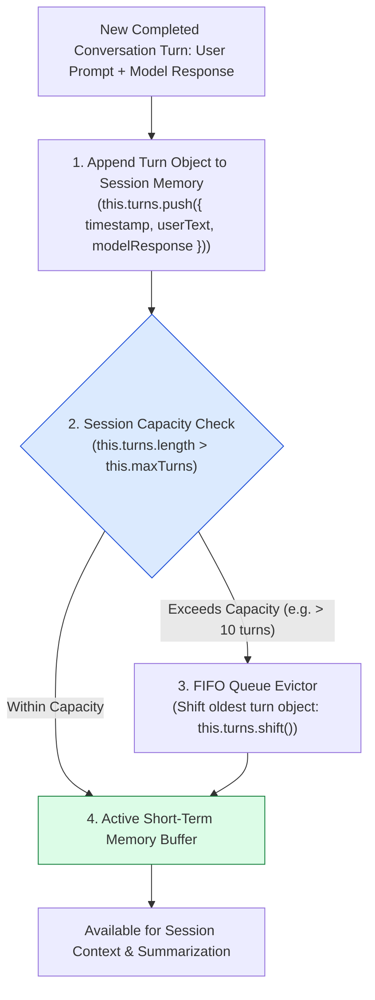
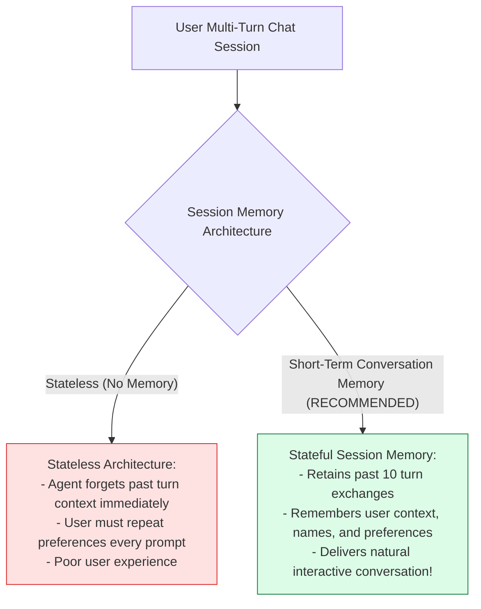
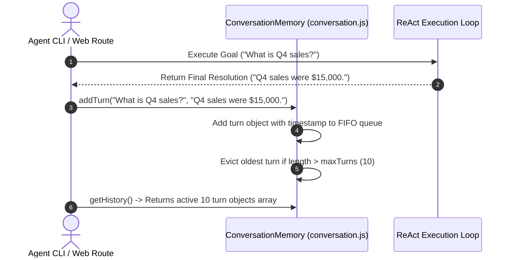

# Module 08: Short-Term Conversation Memory & Session Buffer (`src/memory/conversation.js`)

## Overview

While context managers handle the active multi-part messages sent to an LLM during a single ReAct step loop, an agent must also maintain multi-turn chat memory across a user's entire interactive session. **Short-Term Conversation Memory** maintains in-memory chat turn history across multiple user turns within an active session, storing timestamps, user prompts, and final model resolutions while managing **FIFO Queue Eviction** to keep memory clean.

Understanding **Session Turn Buffers**, **FIFO Eviction Queues**, **Session State Serialization**, and **Turn Summarization Pipelines** is essential for interactive agents.

---

## 1. Short-Term Conversation Memory Topology



---

## 2. Statemode Execution vs. Stateful Session Memory



### Conversation Memory Parameter Reference

| Memory Metric / Key | Data Type | Default Setting | Technical Purpose |
| :--- | :--- | :--- | :--- |
| **`maxTurns`** | `Number` | `10 Turns` | Maximum number of complete Q&A turns stored in RAM. |
| **`timestamp`** | `String` | ISO 8601 String | Audit timestamp tracking when turn completed. |
| **`userText`** | `String` | Raw String | Original user prompt input. |
| **`modelResponse`** | `String` | Raw String | Final model answer resolution. |

---

## 3. Asynchronous Turn Ingestion & History Access Sequence



---

## 4. Code Walkthrough (`src/memory/conversation.js`)

```javascript
/**
 * Short-Term Conversation Memory & Session Buffer Manager
 */
export class ConversationMemory {
  /**
   * @param {number} maxTurns - Maximum conversation turn exchanges to retain in RAM (default: 10)
   */
  constructor(maxTurns = 10) {
    this.turns = []; // Internal FIFO queue of conversation turn objects
    this.maxTurns = maxTurns;
  }

  /**
   * Appends a completed user-model turn exchange into short-term memory
   * @param {string} userText - User prompt input
   * @param {string} modelResponse - Final model response string
   */
  addTurn(userText, modelResponse) {
    if (!userText || !modelResponse) return;

    const turn = {
      turnId: `turn_${Date.now()}`,
      timestamp: new Date().toISOString(),
      userText: userText.trim(),
      modelResponse: modelResponse.trim()
    };

    this.turns.push(turn);
    console.log(`🧠 [CONVERSATION MEMORY] Recorded turn '${turn.turnId}'. Total turns in session: ${this.turns.length}`);

    // FIFO Queue Eviction
    if (this.turns.length > this.maxTurns) {
      const evicted = this.turns.shift();
      console.log(`🧹 [CONVERSATION MEMORY] Evicted oldest session turn '${evicted.turnId}'.`);
    }
  }

  /**
   * Returns copy of active session turn history
   */
  getHistory() {
    return [...this.turns];
  }

  /**
   * Formats active conversation turns into a clean text block for LLM prompt context
   */
  getFormattedHistory() {
    if (this.turns.length === 0) return "NO_PREVIOUS_CONVERSATION_HISTORY";

    return this.turns
      .map((t, idx) => `Turn ${idx + 1} (${t.timestamp}):\nUser: ${t.userText}\nAgent: ${t.modelResponse}`)
      .join("\n\n---\n\n");
  }

  /**
   * Returns current turn count
   */
  size() {
    return this.turns.length;
  }

  /**
   * Resets short-term session memory
   */
  clear() {
    this.turns = [];
  }
}
```

---

## Key Production Takeaways

1. **Maintain Session State Across Multi-Turn Dialogs**: Use `ConversationMemory` to track user prompts and agent responses across interactive chat sessions.
2. **Implement FIFO Queue Eviction**: Use a FIFO queue (`this.turns.shift()`) to evict old turns when memory exceeds capacity (`maxTurns = 10`).
3. **Format History as Human-Readable Text**: Provide a helper (`getFormattedHistory()`) to compile past turn exchanges into clean context blocks for LLM prompts.
4. **Isolate Short-Term from Long-Term Memory**: Keep short-term session buffer logic separate from vector and database persistent storage modules.

