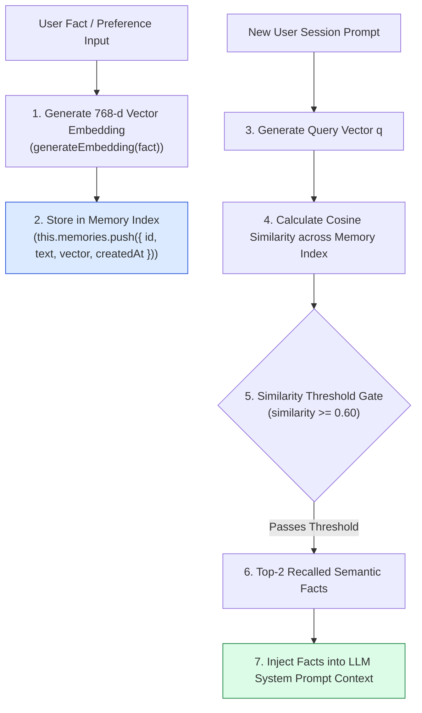
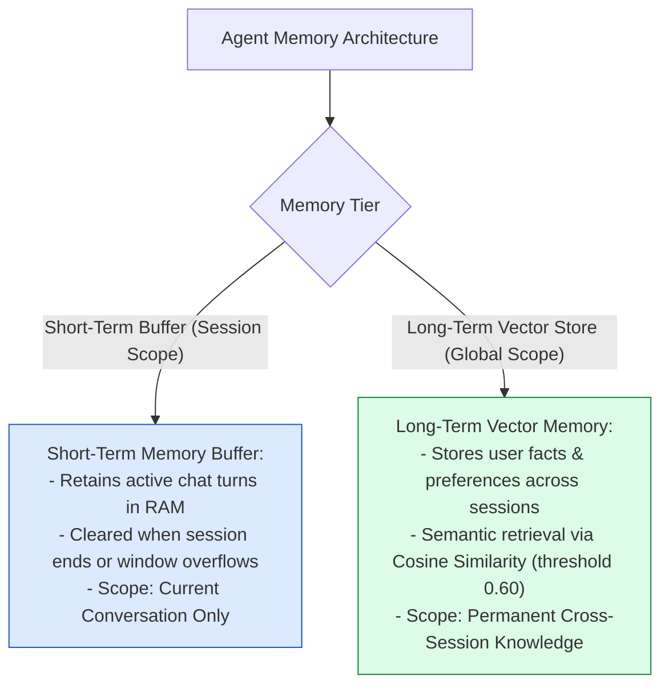
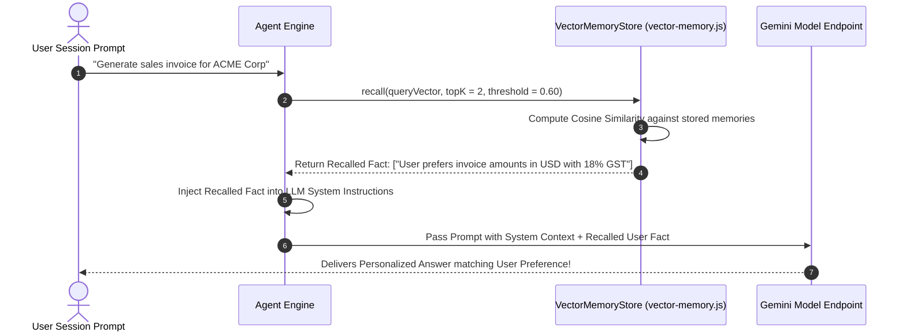

# Module 09: Long-Term Semantic Vector Memory Store (`src/memory/vector-memory.js`)

## Overview

Short-term conversation buffers lose context when sessions end or when turns are evicted. To deliver personalized multi-session agent behavior, an agent requires a persistent memory engine to store user preferences (*"User prefers concise executive summaries"*), historical facts, and past task trajectories across days or months. **Long-Term Vector Memory** embeds user facts into 768-dimensional vectors, executing Cosine Similarity search during new prompt passes to recall relevant historical memories ($\text{threshold} \ge 0.60$) and inject them into system prompts.

Understanding **Cross-Session Vector Persistence**, **Semantic Memory Recall**, **Similarity Threshold Filtering ($\tau = 0.60$)**, and **Dynamic System Prompt Injection** is essential for personalized agents.

---

## 1. Long-Term Vector Memory Topology



---

## 2. Short-Term Buffer vs. Long-Term Semantic Memory



### Vector Memory Store Parameter Reference

| Metric / Parameter | Data Type | Default Threshold | Technical Purpose |
| :--- | :--- | :--- | :--- |
| **`memories`** | `Array<Object>` | RAM Memory Array | Holds `{ id, text, vector, createdAt }` memory records. |
| **`threshold`** | `Number` | `0.60` | Minimum Cosine Similarity score required to trigger memory recall. |
| **`topK`** | `Number` | `2 Memories` | Maximum number of recalled memories injected per prompt. |

---

## 3. Asynchronous Memory Recall & System Prompt Injection Sequence



---

## 4. Code Walkthrough (`src/memory/vector-memory.js`)

```javascript
/**
 * Long-Term Semantic Vector Memory Store
 */
export class VectorMemoryStore {
  constructor() {
    this.memories = []; // Array of memory objects: { id, text, vector, createdAt }
  }

  /**
   * Appends a new fact or preference vector object to long-term memory
   */
  addMemory(id, text, vector) {
    if (!id || !text || !vector) return;

    this.memories.push({
      id,
      text: text.trim(),
      vector,
      createdAt: new Date().toISOString()
    });

    console.log(`🧠 [VECTOR MEMORY] Stored long-term memory '${id}': "${text.substring(0, 40)}..."`);
  }

  /**
   * Calculates Cosine Similarity between query vector and memory vector
   */
  _cosineSimilarity(vecA, vecB) {
    if (!vecA || !vecB || vecA.length !== vecB.length) return 0.0;

    let dot = 0.0;
    let normA = 0.0;
    let normB = 0.0;

    for (let i = 0; i < vecA.length; i++) {
      const a = vecA[i];
      const b = vecB[i];
      dot += a * b;
      normA += a * a;
      normB += b * b;
    }

    if (normA === 0 || normB === 0) return 0.0;
    return dot / (Math.sqrt(normA) * Math.sqrt(normB));
  }

  /**
   * Recalls top-K semantically relevant memories matching query vector
   * @param {Array<number>} queryVector - 768-d query vector array
   * @param {number} topK - Maximum memories to recall (default: 2)
   * @param {number} threshold - Minimum Cosine Similarity score threshold (default: 0.60)
   * @returns {Array<Object>} Ranked array of recalled memory objects
   */
  recall(queryVector, topK = 2, threshold = 0.60) {
    if (!queryVector || this.memories.length === 0) return [];

    const scored = this.memories.map((m) => ({
      ...m,
      similarity: this._cosineSimilarity(queryVector, m.vector)
    }));

    // Sort descending by similarity score
    scored.sort((a, b) => b.similarity - a.similarity);

    // Filter by similarity threshold floor
    const recalled = scored.filter((m) => m.similarity >= threshold).slice(0, topK);

    if (recalled.length > 0) {
      console.log(`✅ [VECTOR MEMORY RECALL] Recalled ${recalled.length} relevant memories (Top Score: ${recalled[0].similarity.toFixed(4)}):`);
      recalled.forEach((m) => console.log(`   - "${m.text}"`));
    }

    return recalled;
  }

  /**
   * Returns memory store size
   */
  size() {
    return this.memories.length;
  }
}
```

---

## Key Production Takeaways

1. **Persist User Preferences Across Sessions**: Use vector memory to store user preferences and historical facts, ensuring the agent retains context even after server restarts.
2. **Filter Recall via Similarity Threshold Floor ($\tau = 0.60$)**: Enforce a strict similarity threshold floor ($\ge 0.60$) during recall to prevent irrelevant memories from contaminating prompt context.
3. **Inject Recalled Memories into System Prompts**: Dynamically prepend recalled memory text into system prompts to personalize agent decision-making.
4. **Decouple Vector Memory from Conversation Buffers**: Maintain long-term semantic memory in a separate module from short-term turn buffers to keep memory responsibilities clear.


## Learn from the implementation

Use the matching source file as an executable example, not just something to copy. Before running it, state in your own words what data enters the module, what it returns, and which values it changes. Then trace one realistic request from the caller through each function.

Pay special attention to these questions:

- **Data flow:** Which object, array, string, or state value moves between functions? What shape must it have?
- **Control flow:** Which branch, loop, early return, or retry changes the outcome? What condition selects it?
- **Async boundaries:** Where does the code wait for an LLM, database, network, file system, or tool? What should happen if that operation rejects or returns no result?
- **Side effects:** Which lines log information, make an external request, store data, or mutate in-memory state? Keep those distinct from pure calculations.
- **Production limits:** Which assumptions are only safe for a tutorial—for example, in-memory storage, fixed thresholds, approximate token counts, mock data, or a hard-coded batch size?

A useful practice is to change one input at a time and predict the result before executing it. If you can explain why the output changed, when the module should be used, and one way it could fail, you understand the concept rather than only the syntax.
