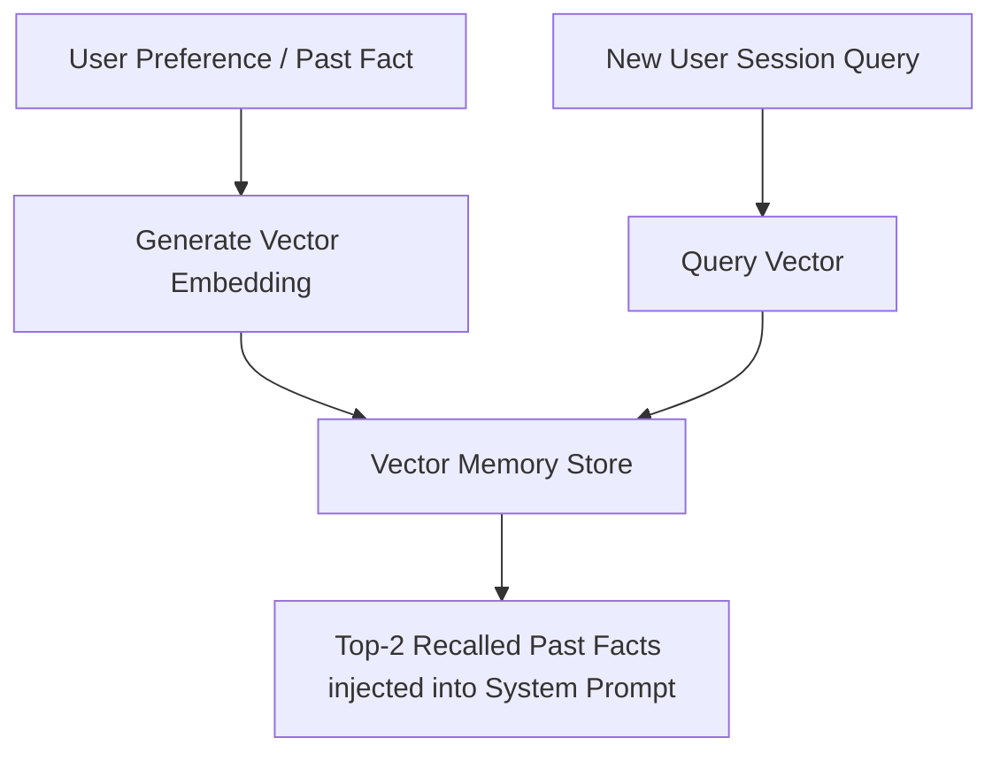

# File 09: Long-Term Vector Memory (`src/memory/vector-memory.js`)

## Overview
**Long-Term Vector Memory** stores user preferences, past task trajectories, and historical facts across sessions using **vector embeddings** and Cosine Similarity recall.

---

## 1. Vector Memory Recall Architecture



---

## 2. Vector Memory Implementation (`src/memory/vector-memory.js`)

```javascript
export class VectorMemoryStore {
    constructor() {
        this.memories = []; // { id, text, vector }
    }

    addMemory(id, text, vector) {
        this.memories.push({ id, text, vector, createdAt: new Date() });
    }

    _cosineSimilarity(vecA, vecB) {
        let dot = 0, normA = 0, normB = 0;
        for (let i = 0; i < vecA.length; i++) {
            dot += vecA[i] * vecB[i];
            normA += vecA[i] * vecA[i];
            normB += vecB[i] * vecB[i];
        }
        return dot / (Math.sqrt(normA) * Math.sqrt(normB));
    }

    recall(queryVector, topK = 2, threshold = 0.6) {
        const scored = this.memories.map(m => ({
            ...m,
            similarity: this._cosineSimilarity(queryVector, m.vector)
        }));

        scored.sort((a, b) => b.similarity - a.similarity);
        return scored.filter(m => m.similarity >= threshold).slice(0, topK);
    }
}
```

---

## Key Takeaways
1. Persists cross-session user facts and preferences.
2. Injects relevant recalled memories into the LLM system prompt dynamically.
