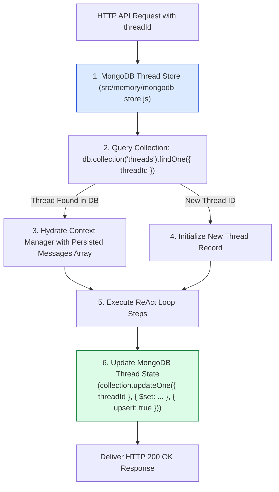
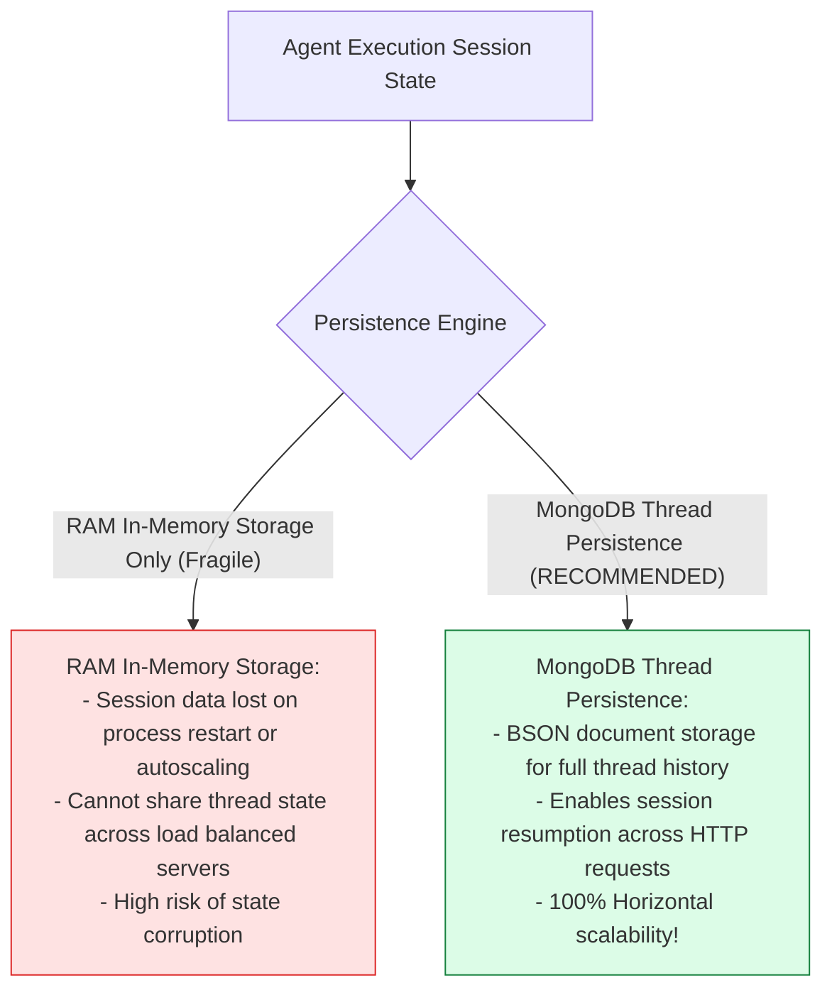
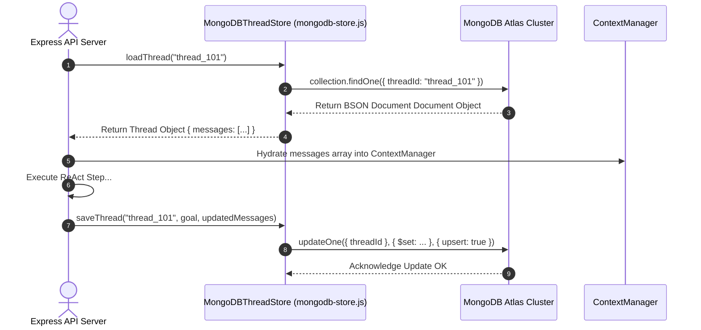

# Module 10: MongoDB Thread Store & Session Resumption (`src/memory/mongodb-store.js`)

## Overview

In multi-tenant web applications, an agent execution session may span hours or days across multiple HTTP requests. Storing conversation state purely in Node.js server RAM causes session data loss during server restarts, crashes, or horizontal autoscaling. **MongoDB Thread Store** persists agent execution threads, active conversation histories, tool invocation logs, and final goal resolutions directly into a MongoDB document collection (`threads`), enabling seamless multi-user session resumption across HTTP requests.

Understanding **BSON Thread Document Schemas**, **Transactional Upsert Operations (`updateOne` with `upsert: true`)**, **Session State Hydration**, and **Connection Pooling** is essential for cloud microservices.

---

## 1. MongoDB Thread Storage & Hydration Topology



---

## 2. Ephemeral In-Memory Sessions vs. Persistent MongoDB Threads



### MongoDB Thread BSON Schema Specification

| Field Name | BSON Data Type | Sample Document Value | Operational Purpose |
| :--- | :--- | :--- | :--- |
| **`threadId`** | `String` (Indexed) | `"thread_usr_101"` | Primary unique session lookup key. |
| **`goal`** | `String` | `"Generate Q4 sales report"` | Original user task request string. |
| **`messages`** | `Array<Object>` | `[ { role: "user", parts: [...] }, ... ]` | Gemini SDK multi-part message history array. |
| **`status`** | `String` | `"ACTIVE" \| "COMPLETED"` | Execution status flag of the agent thread. |
| **`updatedAt`** | `Date` | `ISODate("2026-08-31T09:00:00Z")` | BSON timestamp tracking last thread modification. |

---

## 3. Asynchronous Thread State Hydration Sequence



---

## 4. Code Walkthrough (`src/memory/mongodb-store.js`)

```javascript
import { MongoClient } from "mongodb";

/**
 * Persistent MongoDB Thread & Session Store
 */
export class MongoDBThreadStore {
  /**
   * @param {string} uri - MongoDB connection URI
   * @param {string} dbName - Target database name (default: "jugaad_agent")
   */
  constructor(
    uri = process.env.MONGODB_URI || "mongodb://localhost:27017",
    dbName = "jugaad_agent"
  ) {
    this.client = new MongoClient(uri);
    this.dbName = dbName;
    this.db = null;
    this.collection = null;
  }

  /**
   * Connects to MongoDB cluster and initializes thread collection index
   */
  async connect() {
    if (this.collection) return;

    try {
      console.log(`⚡ [MONGODB THREAD STORE] Connecting to database '${this.dbName}'...`);
      await this.client.connect();
      this.db = this.client.db(this.dbName);
      this.collection = this.db.collection("threads");

      // Ensure unique index on threadId for fast O(1) lookups
      await this.collection.createIndex({ threadId: 1 }, { unique: true });
      console.log("✅ [MONGODB THREAD STORE] Connected & indexed collection 'threads'.");
    } catch (err) {
      console.error("🚨 [MONGODB THREAD STORE ERROR] Connection failed:", err.message);
      throw err;
    }
  }

  /**
   * Upserts active agent thread state into MongoDB
   * @param {string} threadId - Unique session thread identifier
   * @param {string} goal - Original user task goal
   * @param {Array<Object>} messages - Active message history array from ContextManager
   * @param {string} status - Thread status ("ACTIVE" | "COMPLETED")
   */
  async saveThread(threadId, goal, messages, status = "ACTIVE") {
    if (!this.collection) await this.connect();

    console.log(`💾 [MONGODB THREAD STORE] Saving thread '${threadId}' (${messages.length} messages)...`);

    await this.collection.updateOne(
      { threadId },
      {
        $set: {
          threadId,
          goal,
          messages,
          status,
          updatedAt: new Date()
        }
      },
      { upsert: true }
    );
  }

  /**
   * Fetches persisted thread document from MongoDB
   * @param {string} threadId - Target session thread ID
   * @returns {Promise<Object|null>} Hydrated thread document or null
   */
  async loadThread(threadId) {
    if (!this.collection) await this.connect();

    console.log(`🔍 [MONGODB THREAD STORE] Loading thread state for '${threadId}'...`);
    const thread = await this.collection.findOne({ threadId });
    return thread;
  }

  /**
   * Closes database connection handle
   */
  async disconnect() {
    if (this.client) {
      await this.client.close();
      this.collection = null;
    }
  }
}

// Execution Verification Example
const threadStore = new MongoDBThreadStore();
console.log("MongoDB Thread Store helper initialized.");
```

---

## Key Production Takeaways

1. **Enable Multi-Request Session Resumption**: Store thread message arrays in MongoDB so users can resume ongoing agent tasks across different HTTP requests and web sessions.
2. **Use Transactional Upserts (`upsert: true`)**: Use `updateOne({ threadId }, { $set: ... }, { upsert: true })` to atomically create new thread records or update existing ones in a single database pass.
3. **Index `threadId` Fields**: Create a unique index on `threadId` during initialization (`createIndex({ threadId: 1 })`) to guarantee $O(1)$ thread document lookups.
4. **Hydrate Context Managers Seamlessly**: Load persisted message arrays from MongoDB directly into `ContextManager` instances at the start of a request lifecycle.


## Learn from the implementation

Use the matching source file as an executable example, not just something to copy. Before running it, state in your own words what data enters the module, what it returns, and which values it changes. Then trace one realistic request from the caller through each function.

Pay special attention to these questions:

- **Data flow:** Which object, array, string, or state value moves between functions? What shape must it have?
- **Control flow:** Which branch, loop, early return, or retry changes the outcome? What condition selects it?
- **Async boundaries:** Where does the code wait for an LLM, database, network, file system, or tool? What should happen if that operation rejects or returns no result?
- **Side effects:** Which lines log information, make an external request, store data, or mutate in-memory state? Keep those distinct from pure calculations.
- **Production limits:** Which assumptions are only safe for a tutorial—for example, in-memory storage, fixed thresholds, approximate token counts, mock data, or a hard-coded batch size?

A useful practice is to change one input at a time and predict the result before executing it. If you can explain why the output changed, when the module should be used, and one way it could fail, you understand the concept rather than only the syntax.
