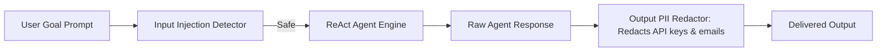

# File 11: Agent Safety & PII Guardrails (`src/safety/`)

## Overview
**Agent Safety Guardrails** provide input validation, prompt injection detection (`injection-detector.js`), and output PII redaction (`output-guard.js`) to secure agent tool execution.

---

## 1. Safety Guardrail Pipeline



---

## 2. Safety Implementation (`src/safety/`)

### Injection Detector (`src/safety/injection-detector.js`)
```javascript
export function detectPromptInjection(text) {
    const maliciousPatterns = [
        /ignore previous instructions/i,
        /override system prompt/i,
        /bypass safety/i,
        /developer mode enabled/i
    ];

    for (const pattern of maliciousPatterns) {
        if (pattern.test(text)) {
            return { safe: false, pattern: pattern.toString() };
        }
    }
    return { safe: true };
}
```

### Output PII Guard (`src/safety/output-guard.js`)
```javascript
export function sanitizeOutput(text) {
    if (!text || typeof text !== "string") return text;

    const emailRegex = /[a-zA-Z0-9._%+-]+@[a-zA-Z0-9.-]+\.[a-zA-Z]{2,}/g;
    const apiKeyRegex = /sk-[a-zA-Z0-9]{32,}/g;

    return text
        .replace(emailRegex, "[REDACTED_EMAIL]")
        .replace(apiKeyRegex, "[REDACTED_API_KEY]");
}
```

---

## Key Takeaways
1. Sanitizes PII and API keys from agent output before returning to clients.
2. Prevents malicious prompt injection attacks from altering agent behavior.
