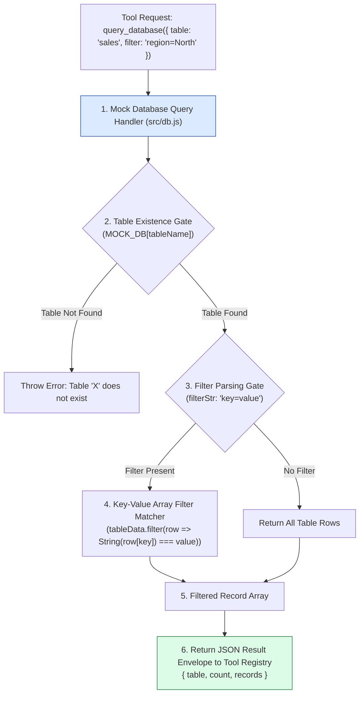
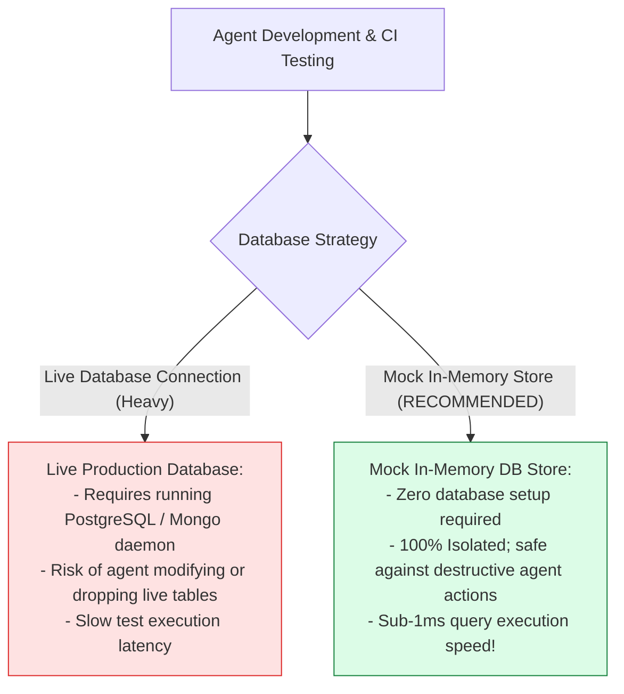
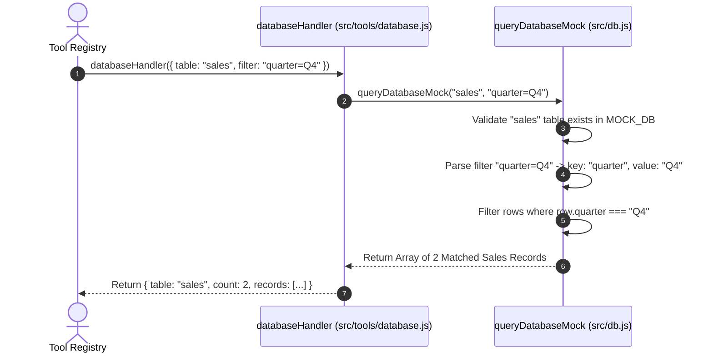

# Module 12: Mock Database Store & In-Memory Records (`src/db.js`)

## Overview

Developing and unit testing autonomous AI agents with database querying capabilities (`query_database` tool) against a live production SQL or MongoDB database during local development introduces testing friction and security hazards. The **Mock Database Store (`src/db.js`)** provides an in-memory JSON document repository simulating enterprise database collections (`users`, `sales`, `products`, `orders`) coupled with a **Key-Value Filter Query Engine** that allows agents to query records safely.

Understanding **In-Memory Table Schemas**, **Key-Value Filter Clause Parsing**, **Safe Data Access Guards**, and **Test Fixture Injection** is essential for offline agent testing.

---

## 1. Mock Database Table Query Topology



---

## 2. Live Database vs. In-Memory Mock Database Testing



### Mock Database Collection Schema Reference

| Table Name | Schema Attributes | Sample Record | Operational Function |
| :--- | :--- | :--- | :--- |
| **`users`** | `id`, `name`, `email`, `role` | `{ id: 101, name: "Priya", role: "admin" }` | Simulates user account directory. |
| **`sales`** | `id`, `quarter`, `amount`, `region` | `{ id: 1, quarter: "Q4", amount: 150000 }` | Simulates financial revenue metrics. |
| **`products`** | `id`, `name`, `price`, `stock` | `{ id: 10, name: "Laptop", price: 1200 }` | Simulates product catalog inventory. |
| **`orders`** | `id`, `userId`, `total`, `status` | `{ id: 501, userId: 101, status: "PAID" }` | Simulates customer transaction orders. |

---

## 3. Asynchronous Database Query Sequence



---

## 4. Code Walkthrough (`src/db.js`)

```javascript
/**
 * In-Memory Mock Database Repository & Query Engine
 */
const MOCK_DB = {
  users: [
    { id: 101, name: "Priya Sharma", email: "priya@example.com", role: "admin" },
    { id: 102, name: "Rahul Verma", email: "rahul@example.com", role: "user" },
    { id: 103, name: "Ananya Patel", email: "ananya@example.com", role: "user" }
  ],
  sales: [
    { id: 1, quarter: "Q1", amount: 120000, region: "North" },
    { id: 2, quarter: "Q2", amount: 145000, region: "North" },
    { id: 3, quarter: "Q3", amount: 130000, region: "South" },
    { id: 4, quarter: "Q4", amount: 185000, region: "North" }
  ],
  products: [
    { id: 201, name: "Wireless Ergonomic Mouse", category: "Electronics", price: 45.0, stock: 120 },
    { id: 202, name: "Mechanical Gaming Keyboard", category: "Electronics", price: 110.0, stock: 45 },
    { id: 203, name: "Insulated Thermal Mug", category: "Kitchenware", price: 25.0, stock: 200 }
  ]
};

/**
 * Executes a simulated query over mock database tables
 * @param {string} tableName - Target collection name ("users", "sales", "products")
 * @param {string} filterStr - Optional filter clause (e.g. "role=admin" or "quarter=Q4")
 * @returns {Array<Object>} Matched array of row objects
 */
export function queryDatabaseMock(tableName, filterStr = "") {
  if (!tableName || typeof tableName !== "string") {
    throw new Error("[MOCK DB ERROR] Table name string is required.");
  }

  const tableData = MOCK_DB[tableName.toLowerCase()];
  if (!tableData) {
    const available = Object.keys(MOCK_DB).join(", ");
    throw new Error(`[MOCK DB ERROR] Table '${tableName}' does not exist. Available tables: ${available}`);
  }

  // If no filter string is supplied, return all rows
  if (!filterStr || typeof filterStr !== "string") {
    console.log(`💾 [MOCK DB] Selected all ${tableData.length} records from '${tableName}'.`);
    return tableData;
  }

  // Parse simple key-value filter matching: e.g. "quarter=Q4" -> key = "quarter", value = "Q4"
  const parts = filterStr.split("=");
  if (parts.length === 2) {
    const key = parts[0].trim();
    const value = parts[1].trim();

    const filtered = tableData.filter((row) => String(row[key]).toLowerCase() === value.toLowerCase());
    console.log(`💾 [MOCK DB] Filtered '${tableName}' by '${key}=${value}': ${filtered.length} matches.`);
    return filtered;
  }

  console.log(`💾 [MOCK DB] Unrecognized filter format '${filterStr}'. Returning all records.`);
  return tableData;
}

// Execution Verification Example
console.log("Mock Sales Query:", queryDatabaseMock("sales", "quarter=Q4"));
```

---

## Key Production Takeaways

1. **Enable Isolated Local Testing**: Use `queryDatabaseMock()` to test agent database tool calls offline without requiring an active database server setup.
2. **Support Key-Value Filter Matching**: Support `key=value` string filter parsing to allow agents to refine queries dynamically during ReAct loops.
3. **Fail Fast on Invalid Table Requests**: Throw clear errors if the requested table does not exist, listing available table names to help the LLM self-correct.
4. **Decouple Database Mock from Tool Handlers**: Keep mock database definitions in a dedicated module (`src/db.js`) so both local tool handlers and unit test suites share the same mock dataset.

