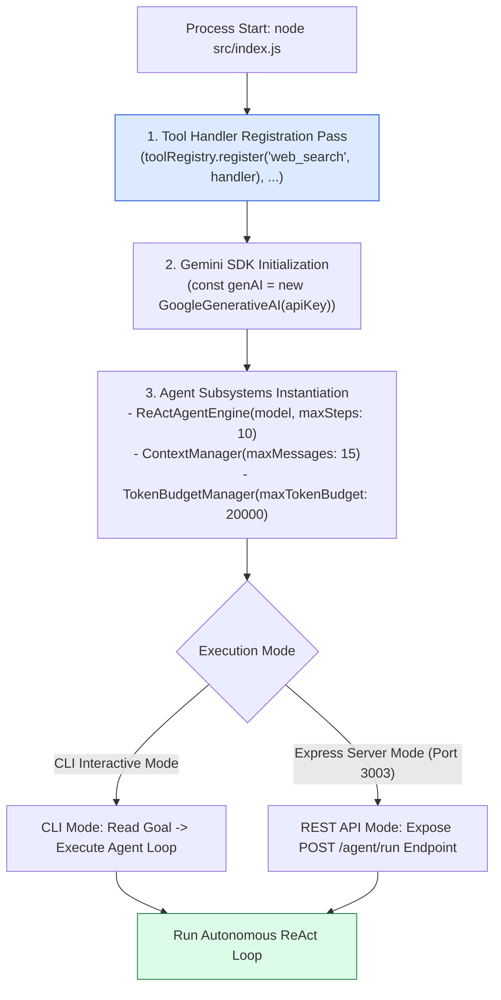
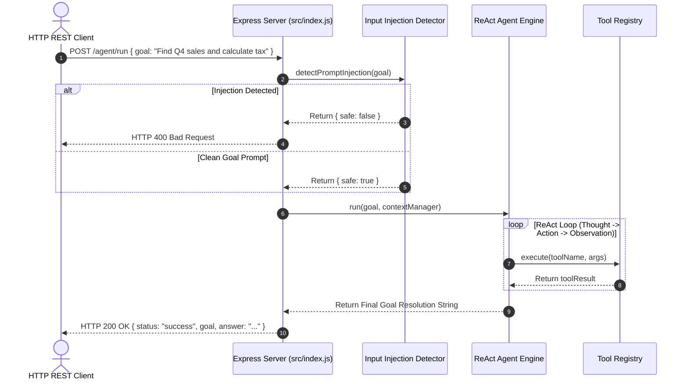
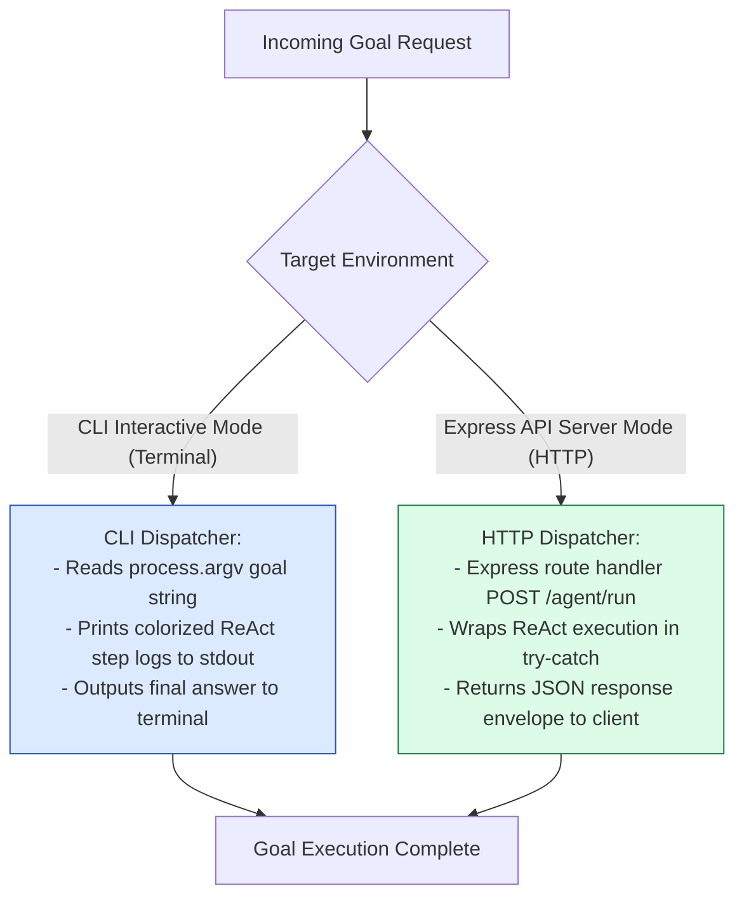

# Module 13: Jugaad Agent CLI, Express API Server & Boot Orchestrator (`src/index.js` & `src/server.js`)

## Overview

The **Jugaad Agent Boot Orchestrator (`src/index.js`)** serves as the central application bootstrap entry point. On startup, it executes a 4-step initialization sequence: registering all tool execution handlers (`web_search`, `calculate`, `query_database`, `read_file`, `create_invoice`) into the **Tool Registry**, instantiating the Gemini SDK model (`gemini-1.5-flash`), initializing the **ReAct Agent Engine** and **Context Manager**, and offering dual-mode execution interfaces for both interactive **CLI Prompt Runs** and production **Express REST API Endpoints (`POST /agent/run`)**.

Understanding **Application Bootstrap Sequences**, **Tool Handler Registration Lifecycles**, **CLI/HTTP Dual-Mode Dispatching**, and **Server Error Middleware** is essential for production deployment.

---

## 1. Agent Application Boot Topology



---

## 2. End-to-End `POST /agent/run` Request Lifecycle Sequence



### Jugaad Agent REST API Endpoint Specification

| Endpoint | HTTP Method | Request Body Schema | Output Payload Envelope | Technical Function |
| :--- | :--- | :--- | :--- | :--- |
| `/agent/run` | `POST` | `{ goal: string, maxSteps?: number }` | `200 OK` + Final Answer + Execution Telemetry | Executes full autonomous ReAct agent loop. |
| `/agent/tools` | `GET` | None | `200 OK` + Array of Registered Tools | Returns list of active tools registered in Registry. |
| `/health` | `GET` | None | `200 OK` + Service Status | Service health check monitor. |

---

## 3. Dual-Mode Execution Dispatcher Flow



---

## 4. Code Walkthrough (`src/index.js`)

```javascript
import express from "express";
import { GoogleGenerativeAI } from "@google/generative-ai";
import { toolRegistry } from "./tools/registry.js";
import { webSearchHandler } from "./tools/web-search.js";
import { calculateHandler } from "./tools/calculator.js";
import { databaseHandler } from "./tools/database.js";
import { ReActAgentEngine } from "./agent/react-loop.js";
import { ContextManager } from "./agent/context-manager.js";
import { detectPromptInjection } from "./safety/injection-detector.js";
import { sanitizeOutput } from "./safety/output-guard.js";

// Step 1: Register all tool handlers in the ToolRegistry
console.log("⚡ [BOOTSTRAP] Registering agent tool handlers in Tool Registry...");
toolRegistry.register("web_search", webSearchHandler);
toolRegistry.register("calculate", calculateHandler);
toolRegistry.register("query_database", databaseHandler);

// Step 2: Initialize Gemini GenerativeAI SDK model
const apiKey = process.env.GEMINI_API_KEY || "MOCK_KEY";
const genAI = new GoogleGenerativeAI(apiKey);
const model = genAI.getGenerativeModel({ model: "gemini-1.5-flash" });

// Step 3: Instantiate core agent subsystems
const agent = new ReActAgentEngine(model, 10);

const app = express();
app.use(express.json());

/**
 * Health Check Endpoint
 */
app.get("/health", (req, res) => {
  res.status(200).json({
    status: "UP",
    service: "jugaad-agent-api",
    registeredTools: toolRegistry.getRegisteredTools()
  });
});

/**
 * Autonomous Agent Execution Endpoint
 * POST /agent/run
 */
app.post("/agent/run", async (req, res, next) => {
  try {
    const { goal, maxSteps = 10 } = req.body;
    if (!goal || typeof goal !== "string") {
      return res.status(400).json({ error: "INVALID_REQUEST", message: "Property 'goal' is required." });
    }

    const startTime = Date.now();

    // Input Guardrail: Detect prompt injection
    const safetyCheck = detectPromptInjection(goal);
    if (!safetyCheck.safe) {
      return res.status(400).json({ error: "SAFETY_REFUSAL", message: safetyCheck.reason });
    }

    // Initialize fresh ContextManager for request
    const contextManager = new ContextManager(15);
    const customAgent = new ReActAgentEngine(model, Number(maxSteps));

    // Execute ReAct Loop
    const rawAnswer = await customAgent.run(goal, contextManager);

    // Output Guardrail: Redact PII from output
    const sanitizedAnswer = sanitizeOutput(rawAnswer);

    const durationMs = Date.now() - startTime;

    return res.status(200).json({
      status: "success",
      executionTimeMs: durationMs,
      goal,
      answer: sanitizedAnswer,
      contextTurnCount: contextManager.size()
    });
  } catch (err) {
    next(err);
  }
});

/**
 * Centralized Error Middleware
 */
app.use((err, req, res, next) => {
  console.error("🚨 [SERVER ERROR]:", err.stack);
  res.status(500).json({ error: "AGENT_EXECUTION_ERROR", message: err.message });
});

const PORT = process.env.PORT || 3003;

// Boot Mode Switch: Run HTTP API server or CLI sample run
if (process.env.SERVE_HTTP === "true") {
  app.listen(PORT, () => {
    console.log(`🚀 [SERVER STARTED] Jugaad Agent API listening on http://localhost:${PORT}`);
  });
} else {
  // Sample CLI Execution Run
  async function runSampleCLI() {
    const sampleGoal = "Query the sales table for Q4 and calculate total revenue";
    const contextManager = new ContextManager(15);
    const answer = await agent.run(sampleGoal, contextManager);
    console.log("\n=================================================");
    console.log("🎉 [FINAL AGENT RESPONSE]:\n", sanitizeOutput(answer));
    console.log("=================================================\n");
  }

  runSampleCLI().catch(console.error);
}
```

---

## Key Production Takeaways

1. **Bootstrap Tool Registrations at Startup**: Register all executable tool handlers (`toolRegistry.register(...)`) at server boot before serving HTTP requests.
2. **Expose REST API Endpoints for Agent Execution**: Expose a clean `POST /agent/run` REST endpoint so frontend web apps and microservices can execute autonomous agent tasks.
3. **Instantiate Fresh Context Managers Per Request**: Always instantiate a new `ContextManager` per HTTP request (`new ContextManager(15)`) to isolate context histories between different API users.
4. **Sanitize Final Output Before Response Delivery**: Pass raw agent answer completions through `sanitizeOutput()` before returning HTTP JSON envelopes to clients to guarantee PII protection.

