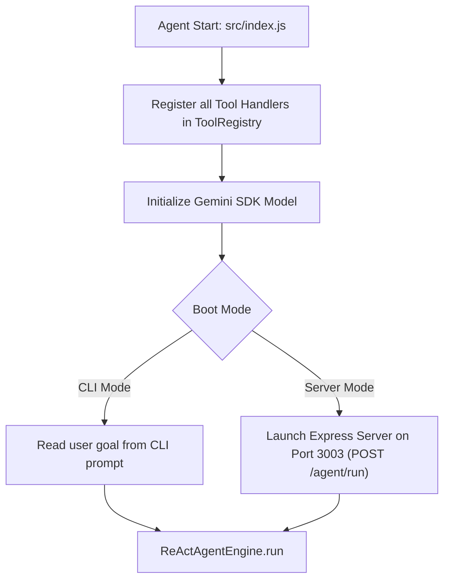

# File 13: Jugaad Agent CLI & Express API (`src/index.js`)

## Overview
**`src/index.js`** is the main entry point for the Jugaad Agent, registering tools (`web_search`, `calculate`, `query_database`, `read_file`, `create_invoice`), initializing the Gemini SDK model, and offering an **Interactive CLI Agent** interface alongside an **Express REST API Endpoint (`POST /agent/run`)**.

---

## 1. Main Agent Boot Sequence



---

## 2. Main Entry Implementation (`src/index.js`)

```javascript
import { GoogleGenerativeAI } from "@google/generative-ai";
import { toolRegistry } from "./tools/registry.js";
import { webSearchHandler } from "./tools/web-search.js";
import { calculateHandler } from "./tools/calculator.js";
import { databaseHandler } from "./tools/database.js";
import { ReActAgentEngine } from "./agent/react-loop.js";
import { ContextManager } from "./agent/context-manager.js";

// 1. Register Tools in ToolRegistry
toolRegistry.register("web_search", webSearchHandler);
toolRegistry.register("calculate", calculateHandler);
toolRegistry.register("query_database", databaseHandler);

// 2. Initialize Gemini Model SDK
const apiKey = process.env.GEMINI_API_KEY || "MOCK_KEY";
const genAI = new GoogleGenerativeAI(apiKey);
const model = genAI.getGenerativeModel({ model: "gemini-1.5-flash" });

// 3. Initialize Agent Engine & Context
const agent = new ReActAgentEngine(model, 10);
const contextManager = new ContextManager(15);

// Sample Execution
async function main() {
    const goal = "Query the users table for admin role and calculate their count";
    const answer = await agent.run(goal, contextManager);
    console.log("\nFINAL AGENT ANSWER:\n", answer);
}

main().catch(console.error);
```

---

## Key Takeaways
1. Bootstraps tools, Gemini SDK models, and context managers.
2. Supports running agent goals autonomously end-to-end.
